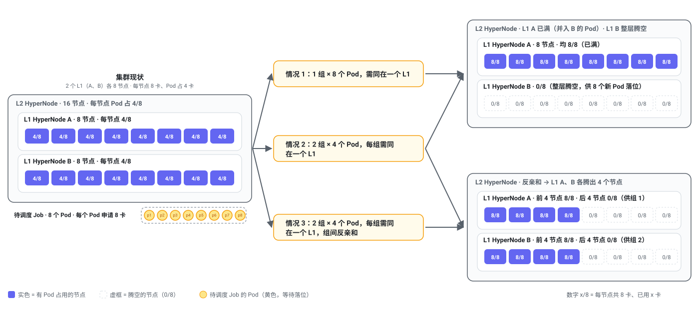
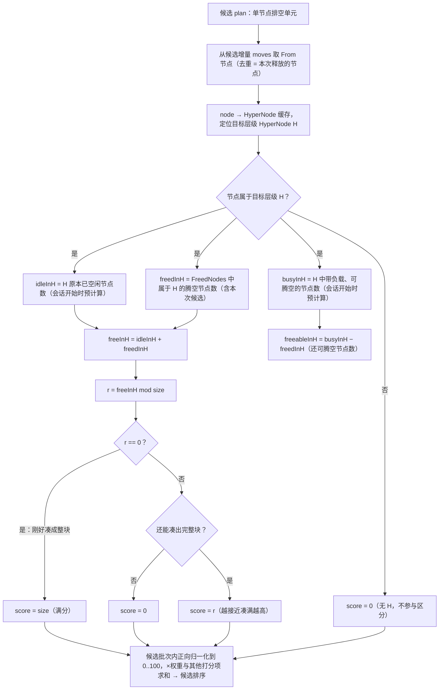
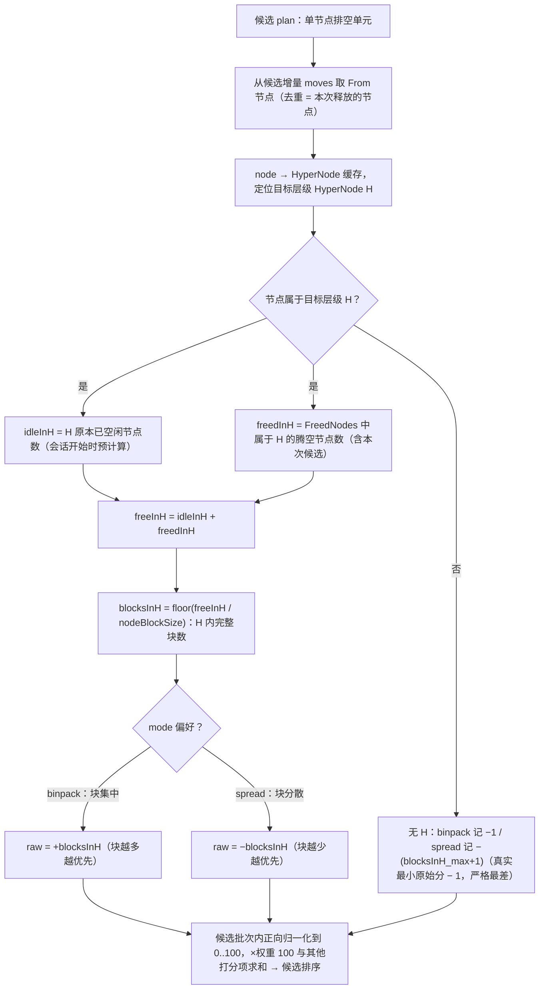
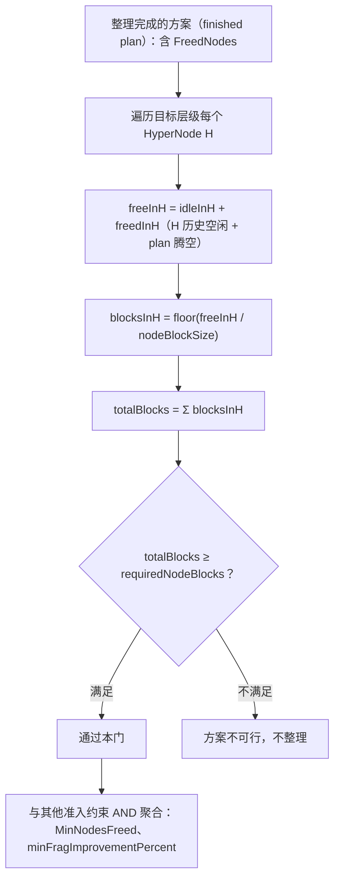
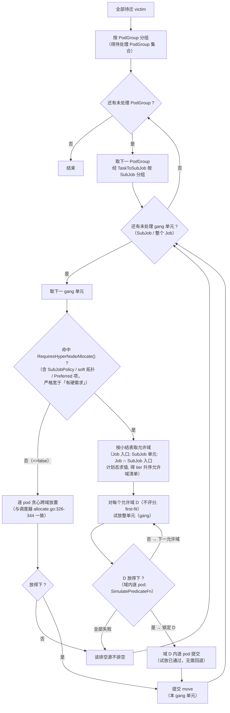

# Volcano Repack：HyperNode 拓扑感知的碎片整理设计

> 本文是对 `repack-runtime-defragmentation.md` 的一次扩展，在既有单节点级 Domain/Planner/Placement 基础上，引入超节点（HyperNode）拓扑感知能力。

## 1. Summary

本文为既有 Node 级碎片整理（`repack-runtime-defragmentation.md`）引入 **HyperNode 拓扑感知**能力。既有整理只按单节点利用率排空，不感知集群 HyperNode 拓扑：腾空的节点随机散落在不同 HyperNode、HyperNode 级碎片并未真正缓解，且方案不含任务的 HyperNode 级约束、常被真实调度拒绝（§2.1）。本文按两条 User Story（§3）扩展：

- **US-01（HyperNode 级碎片率优化，§4.1）**：`RepackRun` 新增 `spec.networkTopology`，声明目标 HyperNode 层级（`hyperNodeTier`/`hyperNodeTierName` 二选一、CEL 强制互斥）、节点块尺寸 `nodeBlockSize`、最少块数 `requiredNodeBlocks` 与块分布偏好 `mode`（binpack/spread）；新增 repack 引擎插件 `networktopologyaware`，**以约束而非新排空单元**表达「块」语义——复用 `nodeconsolidation` 的单节点单元，注册块推进打分（§4.1.3.1）、块分布打分（§4.1.3.2，仅设置 `mode` 时）、块数准入（§4.1.3.3：凑不出 `requiredNodeBlocks` 块即不整理、终止原因 `RequiredNodeBlocksNotMet`）与接收者偏好（§4.1.3.4，receiver 转向、保护各 H 的可腾空池）。`networkTopology` 未设置时插件零效果（R1），行为与既有引擎一致。
- **US-02（HyperNode 级约束保持，§4.2）**：整理方案不违背任务的 HyperNode 级硬约束——PodGroup/SubGroup 网络拓扑、Required PodGroup 反亲和、Required SubGroup 亲和/反亲和。在 `FeasibleRelocation` 内按 gang 单元复用调度器 HyperNode 梯度栈（`HyperNodeGradientForJobFn`/`ForSubJobFn`，Job 单元调 Job 入口、SubJob 单元两入口取交集、Job 入口兜底不继承的 Job 级拓扑）把接收者收窄到允许域，对命中 `RequiresHyperNodeAllocate()` 的单元做**整单元单域试放**（first-fit、不评分，域内逐 pod 与 `SimulatePredicateFn` AND）；计划态以对**真实 session 的原地改写**承载（task 落点改写 + `SyncJobAllocatedHyperNode` 重算锚点），逐 gang 单元增量提交、下一单元在更新后的计划态上重跑，关闭「双方同迁」盲点；整体腾空单元显式临时清空锚点走无锚分支，与真实调度行为一致。规划（drain）与执行（placement reconcile）同走 `FeasibleRelocation`，两侧一致（`==true` 单元的 Execute 期放置一致性——整组就绪 + 整组单域原子提交、硬约束 gang 绝不分拆，见 §4.2.4）。

**设计取舍**：候选单元恒为单节点（块语义由约束而非单元表达，§2.4）；仅支持单层 HyperNode 级碎片率优化、不腾完整 HyperNode、不支持跨 H 转移空闲节点、不求解全局最优布局（§2.3 Non-Goals）；「硬约束过滤」与「放置一致性」正交——软项（`Preferred`/soft）不参与硬过滤，但其所属 `==true` 单元仍参与整单元单域放置，保证计划-Execute 的放置结构与调度器一致。

**实现与验证状态**：两 User Story 均已实现并合入，§5 所列 UT 与 e2e 全部通过。交付后的全量检视修复合入提交 `cb018e7f2`：`gangFullyVacated` 整单元腾空判据改为集合成员相等（修正 Execute 侧 partial-evac 残留被误判为整 gang 腾空而错误清锚的 P1）、`allowedDomainsForTrial` 试放改 `defer` 恢复、调度器 job 锚点确定性 tie-break（§4.2.3 设计要点·调度器 nomination 快速路径）、独立部署安装清单补齐默认插件装配——均登记于 §7.1；经论证属设计预期或保持现状的项按 §7.2 记注记。**执行环节缺陷（本版新增 §4.2.4/R28/E21，已落地）**：全量检视发现 Execute 期 placement reconcile 逐 pod 调 `FeasibleRelocation` 把 `==true` 整组单域退化成分裂——修正为「整组就绪 + 整组单域原子提交、绝不为子集选域」规则，提交 `10f43635d` 落地。**注：wcx「PDB 重试 + eviction 截止」特性（`0893b1dc3`–`e15602086`）随后合入本需求上游，成员级 `ExpirationTime` 逃生被 run 级 `ExecutionDeadline` 截止语义取代**（§4.2.4/R28/E21 已按合并后语义改写，§7.2 记合并交互注记）；E21 待 repack e2e 验收勾销。

**文档约定**：本文件保留 R1–R28 与 e2e 场景编号作为需求与验收的稳定标识（实现注释中已移除）；概念符号（`freeInH`/`busyInH`/`blocksInH`/`hn` 等）为行文记法，与实现标识符不要求一一对应。

## 2. Motivation

### 2.1 现有 Node 级 Repack 的局限

常规装箱调度把 Pod 放到碎片最少、利用率最高的节点上之后，集群的碎片会随任务结束、扩缩容与滚动升级逐渐累积。为此，Volcano Repack 提供了 Node 级别的运行时碎片整理能力，能把零散占用收敛到部分节点，增加「完整空闲节点」的数量。然而，它只感知 Node 维度，不感知集群的 HyperNode 拓扑，导致对 AI 工作负载的真实需求匹配不足：

1. 释放节点随机分散：腾空的节点可能随机分散在不同 HyperNode 中，导致 HyperNode 级的资源碎片化问题并未真正缓解，对网络拓扑强约束的 AI 工作负载一直排队。
2. 碎片整理容易失败：分布式 AI 训练/推理任务常配置有 HyperNode 级别的网络拓扑约束或亲和/反亲和要求，但碎片整理不感知 HyperNode，容易导致碎片整理方案被真实调度所拒绝，整理失败。

因此，需要对 Repack 进行 HyperNode 拓扑感知方面的能力增强，以提升碎片整理应对 AI 工作负载的有效性和可靠性。

### 2.2 Goals

- 优化 HyperNode 级的资源碎片率，在指定 HyperNode 层级腾出符合数量要求的节点；
- 持续满足任务的 HyperNode 级网络拓扑、亲和/反亲和要求，避免碎片整理方案被真实调度所拒绝，整理失败。

**注意**：直觉上，HyperNode 级的资源碎片率优化，应是将空闲节点尽可能集中到少数 HyperNode 中，腾出完整 HyperNode，以供大作业调度。但是，实际上：

1. 一个 HyperNode 包含的节点较多，而一个大作业可能包含多个分组，并不需要一个完整的 HyperNode。因此，“腾空完整 HyperNode” 往往代价过大，而收益甚微。
2. 分布式 AI 训练/推理任务可能配置有 PodGroup/SubGroup 级反亲和约束，要求 Pod 分布到不同 HyperNode上。因此，“腾空完整 HyperNode” 可能反而导致作业无法调度。



因此，HyperNode 级碎片率优化的目标不应是简单地将空闲节点集中到少数 HyperNode 中，而应是**结合任务需要，在指定 HyperNode 层级上腾出符合数量要求的节点，以使任务尽可能调度成功。**

### 2.3 Non-Goals

1. 不以腾出完整 HyperNode 为目标。 
2. 仅支持单层 HyperNode 级资源碎片率优化：指仅在指定的单层 HyperNode 层级上腾出符合数量要求的节点，不支持多层 HyperNode。例如，当指定 HyperNode 层级为二层时，不会考虑一层或三层 HyperNode。 
3. 不支持在 HyperNode 之间转移空闲节点：例如，HyperNode A 和 B 分别有3个和1个空闲节点，不支持再将 HyperNode A 的 Pod 驱逐到 HyperNode B 的空闲节点上，以使它们分别有4个和0个空闲节点。这是因为，碎片整理不支持将 Pod 驱逐到空闲节点上，它会增加节点碎片率。 
4. 不为迁移后的替换 Pod 预留资源或强制绑定。 
5. 不修改工作负载的资源请求、parallelism 或拓扑约束（TP/EP 结构由工作负载自身声明）。 
6. 不求解全局拓扑最优布局。

### 2.4 设计约束

**US-01（碎片率优化）**

- **候选单元恒为单节点**：复用 `nodeconsolidation` 的单节点单元（`Nodes` 恰好一个、`Weight: 1`），不处理单元一次腾空多个节点的情形。这样，「块语义以约束而非单元表达」成立（每步只动一个节点、逐步凑块，并天然规避「一个单元跨多个 HyperNode、与『块不能跨 H』冲突」的矛盾）。
- **锚点即本次释放的单节点**：打分中 `FreedNodes()` 的候选部分即该单节点，`freeInH` 的「含本次候选」按 +1 计。
- **节点未归属目标层级任何 H 时，打分取该打分项下最不受偏好的值**：块推进记 0；块分布记**该模式真实候选最小原始分之下的哨兵值**——binpack 记 `−1`、spread 记 `−(blocksInH_max+1)`——不参与区分；准入中该类腾空亦不计块。
- **node → H 为函数**：节点在目标层级至多属于一个 HyperNode，否则锚点不唯一、`freeInH` 归属歧义——若未来出现 H 重叠，须先定归属再打分。
- **未来多节点单元的适配**：若某 Domain 贡献多节点单元，需同步调整 §4.1.3.1 步骤 1 的锚点与 `freeInH` 计数，且需保证单元不跨 H。

**US-02（约束保持）**

- **仅硬约束（范围决策）**：把两件事分开——**硬约束过滤**与**放置一致性**，二者正交、不矛盾。
  - **硬约束过滤（仅硬项生效）**：三类约束中 `Required` 项与硬拓扑模式构成硬过滤，逐候选硬过滤；`Preferred` 项与 `soft` 拓扑模式**不作硬过滤**——不参与收窄、也不作接收方偏好。理由：soft 模式在 scheduler 的 gradient 栈中直接 abstain（`hyperNodeGradientForJob/SubJob` 在 `!hardMode` 时返回 `HyperNodeGradientAbstain()`，`network_topology_aware.go:340-344/:362-366`，即不施加任何 HyperNode 过滤；基座另备 `SubJobInfo.ConvertToHardTopology` 将 soft 转 hard 至 ClusterTop tier、等价无过滤，当前尚未接入 session 打开路径）；Preferred 项在调度器中只是软打分（`HyperNodeOrderFn`，weight 1-100），不构成「违背导致整理失败」的来源，而 repack 不表达接收偏好（§2.3 第 6 点）。「不违背」对硬约束是必须、对软约束是偏好，US-02 只落实必须项。
  - **放置一致性（对全部 `RequiresHyperNodeAllocate()==true` 单元生效）**：单域试放是**放置结构措施、非约束过滤**——调度器对 soft / Preferred / 无硬需求 SubJob 单元同样走**单域放置**（`allocate.go:1156` 逐 HyperNode 整单元 dry-run、`selectBestHyperNodeForSubJob` 从各单域可行解中选单一域提交，`allocate.go:880-901`）。US-02 对它们**同样做单域试放**以保持计划-Execute 放置一致（§4.2.3 步骤 4 建议 (a)），而非硬过滤。`RequiresHyperNodeAllocate()` 含 `ContainsSubGroupPolicy()`（每个 SubJob 单元恒真）、`ContainsNetworkTopology()`（含 soft）、`HasPreferred*`，故「`==true` 全部单元」覆盖软项单元——**「软项不参与硬过滤」与「软项单元参与单域试放」是两个正交维度，不矛盾**。

## 3. User Stories

### 3.1 US-01：HyperNode 级碎片率优化

作为集群管理员，我希望碎片整理能感知 HyperNode 拓扑，在指定 HyperNode 层级腾出符合数量要求的节点，以便对网络拓扑强约束的 AI 工作负载能调度成功。

验收标准：

- 碎片整理可以在指定 HyperNode 层级腾出符合数量要求的节点。若无法满足要求，则判定方案不可行，不进行整理。 

### 3.2 US-02: HyperNode 级约束保持

作为集群管理员，我希望碎片整理方案不违背任务的 HyperNode 级网络拓扑和亲和/反亲和约束，以避免碎片整理因此失败。

验收标准：

- 碎片整理方案不违背任务的 PodGroup 网络拓扑约束
- 碎片整理方案不违背任务的 SubGroup 网络拓扑约束
- 碎片整理方案不违背任务的 PodGroup 反亲和约束
- 碎片整理方案不违背任务的 SubGroup 亲和和反亲和约束

## 4. Detailed Design

### 4.1 US-01：HyperNode 级碎片率优化

#### 4.1.1 目标语义

HyperNode 级碎片率优化的目的是**结合任务需要，在指定的 HyperNode 层级上腾出至少一定数量的节点空间**，使对网络拓扑强约束的 AI 工作负载能够调度成功。

与 Node 级碎片整理的区别：

- Node 级：以释放「完整空闲节点」为收益，不考虑节点归属的 HyperNode；
- HyperNode 级：以在指定 HyperNode 层级内腾出「符合数量要求的节点」为收益。腾出的节点归属于目标层级内的 HyperNode，而非在整个集群随机分散。

碎片率优化的目标**不是**将空闲节点集中到少数 HyperNode 以腾出完整 HyperNode，而是结合任务需要、按数量要求腾出节点，争取任务可调度。若无法满足要求，则不进行整理。

#### 4.1.2 RepackRun API 设计

在 `RepackRunSpec` 下新增 `networkTopology` 字段，用于指定本次碎片整理的 HyperNode 级碎片率整理目标。

字段定义（`staging/src/volcano.sh/apis/pkg/apis/repack/v1alpha1/repackrun_types.go`）：

```go
type RepackRunSpec struct {
    Mode             RepackMode        `json:"mode"`
    // NetworkTopology 可选：声明时启用 HyperNode 级碎片率优化；
    // 未填写时不做 HyperNode 级碎片率优化，仅按既有 Node 级语义整理。
    // +optional
    NetworkTopology  *NetworkTopology  `json:"networkTopology,omitempty"`
    // ... 其余既有字段
}

// NetworkTopology 指定 HyperNode 级碎片率优化的目标层级与节点块要求。
// +kubebuilder:validation:XValidation:rule="(has(self.hyperNodeTier) && !has(self.hyperNodeTierName)) || (!has(self.hyperNodeTier) && has(self.hyperNodeTierName))",message="hyperNodeTier and hyperNodeTierName are mutually exclusive; configure exactly one"
type NetworkTopology struct {
    // HyperNodeTier 为目标 HyperNode 层级（数字），对应 HyperNode.Spec.Tier。
    // 与 HyperNodeTierName 二选一、互斥（由 CEL 标记强制），二者必须恰好配置一个。
    HyperNodeTier *int `json:"hyperNodeTier,omitempty"`
    // HyperNodeTierName 为目标 HyperNode 层级名称，对应 HyperNode.Spec.TierName。
    // 与 HyperNodeTier 二选一、互斥（由 CEL 标记强制），二者必须恰好配置一个。
    HyperNodeTierName *string `json:"hyperNodeTierName,omitempty"`
    // NodeBlockSize 为每个节点块包含的节点数量。可选，默认值为 1（最小值为 1）。
    // 指针类型使「显式 0」与「省略」可区分：显式 0 会被 minimum:1 拒绝，而省略则
    // 应用 default=1——若用非指针 int + omitempty，显式 0 会被默认化静默改为 1，
    // 用户无从察觉。
    // +optional
    // +kubebuilder:default=1
    // +kubebuilder:validation:Minimum=1
    NodeBlockSize *int `json:"nodeBlockSize,omitempty"`
    // RequiredNodeBlocks 为最少需要腾出的节点块数量，可选，默认 0（最小值为 0）。
    // 碎片整理至少腾出 RequiredNodeBlocks 个大小为 NodeBlockSize 的节点块，
    // 才算达到目标；若无法满足，则判定方案不可行，不进行整理。
    // +optional
    // +kubebuilder:default=0
    // +kubebuilder:validation:Minimum=0
    RequiredNodeBlocks int `json:"requiredNodeBlocks,omitempty"`
    // Mode 表示这些块在 HyperNode 之间的分布偏好，可选，未选择时不表达任何偏好。
    // Binpack：块尽可能集中到少数 HyperNode；
    // Spread：块尽可能分散到不同 HyperNode。
    // +kubebuilder:validation:Enum=binpack;spread
    // +optional
    Mode RepackBlockMode `json:"mode,omitempty"`
}

// RepackBlockMode 表示块在 HyperNode 之间的分布偏好。
type RepackBlockMode string

const (
    // RepackBlockModeBinpack 块尽可能集中到少数 HyperNode。
    RepackBlockModeBinpack RepackBlockMode = "binpack"
    // RepackBlockModeSpread 块尽可能分散到不同 HyperNode。
    RepackBlockModeSpread RepackBlockMode = "spread"
)
```

设计要点：

- 层级标识符（`hyperNodeTier` 与 `hyperNodeTierName`）对应 HyperNode CRD 的 `tier` / `tierName` 字段，二者二选一、**互斥**，不可同时配置，也不可都不配置。互斥性在 apiserver 层用 CEL 标记强制校验（与 spec 不可变同用 `XValidation`，标记贴在下方 `NetworkTopology` 结构体上），非法组合在创建时即被拒绝，不进入控制器。**struct 级 XValidation 已有仓库先例**：`topology/v1alpha1/hypernode_types.go:115-116` 的 `MemberSelector` 即是 struct 级互斥 rule（`(has(self.exactMatch)?1:0)+…≤1`），controller-gen 支持且有生成先例；本条互斥 rule 亦已存在于生成 CRD（`config/crd/volcano/bases/repack.volcano.sh_repackruns.yaml:188` 的 `x-kubernetes-validations`，对应 `NetworkTopology` 结构体），无需再以 `make manifests` 实测可行性。落地后仍须以 §5.1.2 的 E4 在真实 apiserver 断言双设/双不设均被拒，确保 CEL 真生效而非被静默丢弃；
- **块归属边界**：一块必须完整落在同一个指定层级的 HyperNode 内，不能跨多个 HyperNode 凑齐一块。例如，`nodeBlockSize = 4` 时，目标层级上 HyperNode A 有 2 个空闲节点、HyperNode B 有 2 个空闲节点，二者合计 4 个，**但是不能算一块**，因为它们分属两个不同 HyperNode；
- **满足要求判据**：碎片整理目标为腾出**至少 `requiredNodeBlocks` 块**（× 每块 `nodeBlockSize` 个节点）；判定满足要求与否以「是否腾出至少 `requiredNodeBlocks` 个块」为准，而非「总共腾出多少个节点」；
- **mode 设置**: `binpack` 模式适用于大多数场景，`spread` 模式适用于任务有反亲和约束的场景。未设置mode时，不会对块的选择施加 HyperNode 分布偏好。
- **`requiredNodeBlocks` 软硬两用**：`requiredNodeBlocks = 0`（默认值）时，块数准入恒满足、不设硬门槛，块语义退化为**纯软引导**——仅由块推进/块分布打分偏置排空方向，不强制凑出完整块数量；`requiredNodeBlocks ≥ 1` 时才作为硬门槛，凑不出指定块数即不整理。
- **`nodeBlockSize = 1` 的退化**：默认 `nodeBlockSize = 1` 时每节点即一块——块推进打分 `freeInH mod size ≡ 0` 恒成立、有 H 候选全满分（该项不再区分候选），块数准入退化为「空闲节点总数 ≥ `requiredNodeBlocks`」的纯节点数判据；默认配置下插件近乎无效果，符合「未显式表达块语义」的预期。
- **目标可行性**：若 `requiredNodeBlocks` 过大、目标层级所有 HyperNode 的空间都凑不出该块数，块数准入将**永远拒绝**、每轮不整理——这是「无法满足则不整理」的预期后果，属正常行为而非故障；需调低块数或 `nodeBlockSize` 方能让整理生效。

示例：

```yaml
spec:
  mode: Execute
  networkTopology:
    hyperNodeTierName: "volcano.sh/hypernode" # 目标 HyperNode 层级名称
    nodeBlockSize: 4                          # 每个节点块包含的节点数
    requiredNodeBlocks: 2                     # 最少需要腾出的节点块数量
    mode: spread                              # 块在 HyperNode 之间的分布偏好：binpack（集中）/ spread（分散）
  goals:
    - resource: nvidia.com/gpu
```

#### 4.1.3 networktopologyaware 插件设计

新增 repack engine 插件 `networktopologyaware`（`pkg/repackengine/plugins/networktopologyaware/`）。它**不新增排空单元**，而是复用既有 Node 级 Domain（`nodeconsolidation`）的单节点单元，在 `RepackRun.spec.networkTopology` 已填写时，注册**两个打分函数**（块推进、块分布）、一个**块数准入函数**和一个**接收者偏好函数**，把「块」语义以**约束**而非**单元**的形式表达。未填写时无任何效果，行为与现有引擎完全一致。

插件注册与条件激活：

```go
func init() {
    framework.RegisterPlugin(Name, framework.PluginRegistration{
        Factory:  func(framework.Arguments) framework.Plugin { return &networkTopologyAwarePlugin{} },
        Requires: []framework.PluginCapability{framework.CapabilityDomain}, // 依赖 nodeconsolidation 提供单节点单元
    })
}

func (p *networkTopologyAwarePlugin) OnSessionOpen(ssn *framework.Session) {
    if ssn.Run() == nil || ssn.Run().Spec.NetworkTopology == nil {
        return // 未设置 networkTopology：不注册任何回调，行为与既有引擎一致
    }
    p.registerNodeBlockProgressScore(ssn) // 4.1.3.1 块推进打分（始终注册）
    if mode := ssn.Run().Spec.NetworkTopology.Mode; mode == repackv1alpha1.RepackBlockModeBinpack || mode == repackv1alpha1.RepackBlockModeSpread {
        p.registerNodeBlockDistributionScore(ssn) // 4.1.3.2 块分布打分（仅 binpack/spread 时注册）
    }
    p.registerBlockCountConstraint(ssn)   // 4.1.3.3 块数准入（硬门）
    p.registerNodeBlockReceiverPreference(ssn) // 4.1.3.4 接收者偏好（始终注册）
}
```

两个打分函数都经 `AddPlanScoreFn(name, weight, fn)` 注册：`PlanScoreFn` 原始值**越大越优先**（框架在候选批次内正向归一化到 [0,100] 后乘权重求和，语义同 scheduler `NodeOrderFn`）；成本型维度对成本取负（与 workloaddisruption 的 `-affectedPodGroups` 写法一致）。**块推进打分的权重应显著高于块分布**——前者是达成目标的必要引导，后者只是分布偏好。

> **归一化 tie 行为（实现须知晓）**：框架在候选批次内对每项原始值做 min-max 归一化到 [0,100]（`framework/candidate.go:159-166`——`PlanScores` 签名于 `:138`、`span==0` 时保留 `MaxCandidateScore`(100) 的逻辑在 `:159-166`）；当**某维度所有候选同分**（`span == 0`）时，**所有候选都得满分 100、而非 0**。这不影响排序（同分→该项贡献差为 0、不参与区分），但意味着"该项无信号"不等于"该项零贡献"——某项 weight 仍会向每个候选的 Total 加 `weight × 100`。下文 R13/R14 的支配分析在 tie 下仍成立（支配靠的是"存在差异项贡献差 ≥ w_A"，tie 项贡献差为 0 不参与）；但配置权重时勿误以为"无信号项安全填 0 权重"——0 权重才会真正禁用某项（`weight ≤ 0` 被框架跳过，`candidate.go:145`）。

##### 4.1.3.1 块推进打分函数

评估「这个候选把方案推近目标多少」。排空单元是单节点，打分以**本次释放的节点**为锚点，步骤：

1. 从候选方案的 moves 找出本次释放的节点：候选单元为单节点，其增量 moves 的 `From` 节点（去重）即该节点；
2. 经 node → HyperNode 缓存（插件在 `OnSessionOpen` 构建）找到该节点所属的**目标层级 HyperNode H**；**若节点不属于目标层级的任何 HyperNode，score = 0，直接结束**；
3. 计算 H 内可用于组块的**空闲节点总数** `freeInH`，而非只统计 plan 腾空的节点——H 中可能**本来就有空闲节点**（目标资源用量为 0）：
   - `idleInH`：H 在会话开始时已空闲的节点数，插件在 `OnSessionOpen` 从 Snapshot 的 HyperNode 拓扑与节点目标资源用量预计算，与 plan 无关；
   - `freedInH`：prospective plan 的 `FreedNodes()` 中属于 H 的节点数（**含本次候选**，与 `idleInH` 不相交）；
   - `busyInH`：H 中带目标资源负载（即**可被腾空**）的节点数，插件在 `OnSessionOpen` 从 Snapshot 预计算；
   - `freeInH = idleInH + freedInH`——碎片整理只释放节点、不占用空闲节点，freeInH 随计划单调不减；
   - `freeableInH = busyInH − freedInH`——H 中**还可腾空**的节点数（尚未腾空的忙碌节点，不含本次候选）；
4. 计算原始得分 `score`（越高越优先）。碎片整理只增加 freeInH、不会回退到上一个整数倍，故先取余数 `r = freeInH % size`，分三种情况（无 H 的候选已在步骤 2 记为 0，不进入以下计算）：

```
r = freeInH % size
if r == 0:
    score = size            # 本次候选刚好凑成整块：满分
elif freeableInH < size - r:
    score = 0               # 该 H 不可能再凑出一个完整块：放弃
else:
    score = r               # 还可凑出完整块：得分 = 余数
```

> **为什么这样打分**：`r == 0` 只在 `freeInH ≡ 0 (mod size)` 时发生——本次候选恰好把 H 凑成整块，这是目标达成点，给满分 `size`。若 `r ≠ 0`，H 处于块窗口第 `r` 位（再腾 `size − r` 个才凑满下一块）：`freeableInH` 若不足 `size − r`，这块永远凑不成，score=0，不浪费腾空；若足够，越接近凑满（r 越大）越优先，score=r。size=4 时（H 均可凑成）得分随 freeInH 取值 1→1、2→2、3→3、4→4（凑满）、5→1、6→2、7→3、8→4（凑满）。这里 `freeableInH` 采用**乐观估计**——把 H 中带目标资源负载、尚未腾空的节点都算作可凑块资源，不做逐节点的迁移可行性（接收方容量/gang 语义）检查。这只会影响打分的相对排序，不破坏正确性：真凑不成的 H 仍会在整份 plan 的块数准入中被兜底拒绝。精确估计需逐候选评估可迁移性，负担过重，故有意采用乐观口径。

5. 注册为 `AddPlanScoreFn("nodeBlockProgress", weight, fn)`，原始得分即上述 `score`（`PlanScoreFn` 越大越优先，无需取负）。

**权重设置**：`weight` 默认 **1000000**，插件参数 `nodeBlockProgressWeight` 可覆盖。框架把各打分项在批次内归一化到 [0,100] 后乘权重求和，由此得一般性结论：**若某项权重 `w_A > 100 × Σ(其余所有权重)`，则该项只要在候选间存在差异（归一化分数为整数，最少差 1 分、贡献差 ≥ `w_A`），就必然压过其余各项联合的最大反向摆动 `100 × Σ(其余权重)`，一定主导打分**；等于时恰好打平、不保证。批次内进度相同时该打分项全等分、不参与区分，交由成本项裁决，高权重无副作用（破坏总量另有 repackbudget 硬约束把关）。

打分流程：



##### 4.1.3.2 块分布打分函数

仅当 `networkTopology.mode` 设置了偏好时注册，评估**完整块在 HyperNode 之间的分布**。与块推进打分一致**计入 H 的历史空闲节点**——对新任务而言，历史空闲块与新腾空的块等价（都是可分配的连续块），分布偏好对两者一视同仁。分布偏好用**局部启发式**表达：原始得分直接取**本次释放节点所在的 H** 的完整块数 `blocksInH`，`binpack` 越高越好（块往已有块的 H 集中）、`spread` 越低越好（块往块少的 H 分散），无需统计整批候选的全局分布。排空单元是单节点，打分以**本次释放的节点**为锚点，步骤：

1. 从候选方案的 moves 找出本次释放的节点（同块推进打分），经 node → HyperNode 缓存定位其所属的**目标层级 HyperNode H**；
2. 计算 H 内可用于组块的**空闲节点总数** `freeInH = idleInH + freedInH`（含本次候选）；
3. 计算 H 内**完整块数** `blocksInH = floor(freeInH / nodeBlockSize)`；
4. 按 `mode` 取原始得分（原始值越大越优先）。节点不属于目标层级任何 H 时，原始分取**该模式下真实候选最小原始分之下的哨兵值**，保证无 H 候选**严格差于**任何真实 H 候选（含零块 H，R6）：`binpack` 记 `−1`（真实区间 `[0, +blocksInH_max]` 的下界之下，恒为定值）；`spread` 记 `−(blocksInH_max+1)`（`blocksInH_max` 为会话内目标层级任一 H 的最大完整块数，`OnSessionOpen` 预计算，哨兵值在真实区间 `[−blocksInH_max, 0]` 的下界之下）。spread 下绝不能记 0：其取负后 0 是批内最高分，会把无 H 候选误当最优；当 `blocksInH_max = 0`（稀疏 tier）时记 `−blocksInH_max = 0` 同样退化——哨兵值把无 H 钉在真实区间之下，两种情形都不复存在。两模式哨兵值仅比真实区间下界低 1，归一化 span 各加 1，不撑爆批次；无 H 源的腾空节点对任何 H 的块数记账（R9）贡献恒为 0，而零块 H 源的腾空节点仍计入 `freedInH` 可推动凑块，故零块 H 严格优于无 H 与 R9 口径一致：
   - `binpack`：返回 `+blocksInH`——候选所在 H 的完整块数**越多**越优先，新腾空的节点倾向进入已有完整块的 H，块逐步集中到少数 H；
   - `spread`：返回 `−blocksInH`——候选所在 H 的完整块数**越少**越优先，新腾空的节点倾向进入完整块少的 H，块逐步分散；
5. 注册为 `AddPlanScoreFn("nodeBlockDistribution", weight, fn)`（权重默认 **100**，插件参数 `nodeBlockDistributionWeight` 可覆盖）。

> **为什么这样打分**：块推进打分负责「把哪个 H 凑成完整块」，块分布只负责「同等进度下块落在哪」。两个候选块推进原始分相同（同一进度档）时，`binpack` 挑完整块已多的 H（富者愈富、块集中），`spread` 挑完整块尚少的 H（填平补齐、块分散）。以自己 H 的 `blocksInH` 为锚而非整批全局分布，打分函数实现简单，且与 4.1.3.1 一样锚定本次释放节点、无需跨候选汇总。

**权重设置**：默认权重 **100**（插件参数 `nodeBlockDistributionWeight` 可覆盖）。块分布只表达分布偏好、用于同进度档内的二次排序，权重显著低于块推进打分的 `1000000`——后者才是达成目标的必要引导。数量级保证：块分布最大摆动 `100 × 100 = 1e4`，而块推进最小区分贡献差 `1000000 × 1 = 1e6`（归一化分整数、最少差 1 分），差 **100 倍**，故块分布**永不推翻块推进已区分的决策**，只在同一进度档内排序（再加破坏成本项联合摆动 `≤ 1e4 + 1400`，仍远小于 `1e6`）。**同进度档内**（块推进全等分、该项贡献差为 0），块分布摆动 `1e4` 仍大于成本项摆动 `1400`，故同档排序为「先分布、后成本」——这是预期行为：分布偏好与块推进同属布局目标引导，成本只是实现代价；若希望同档内成本优先，可调低 `nodeBlockDistributionWeight`（降到 `≤ 14` 时成本项反超）。未设置 `mode` 时不注册，不施加任何分布偏好。

打分流程：



##### 4.1.3.3 块数准入函数

块数准入是一个硬门（`PlanConstraintFn`，经 `ssn.AddConstraintFn` 注册），对**整理完成的整个方案**（finished plan，含其 `FreedNodes`）判定块数是否达标：不满足则方案不可行、不整理。与两个打分函数不同，它锚定的是**整份 plan 的腾空结果**而非单个候选节点。步骤：

1. 对目标层级**每个** HyperNode H，计算可用于组块的空闲节点总数 `freeInH = idleInH + freedInH`（H 历史空闲节点 + plan 腾空节点）；
2. 计算每个 H 的**完整块数** `blocksInH = floor(freeInH / nodeBlockSize)`；
3. 汇总所有 H 的完整块数 `totalBlocks = Σ blocksInH`；
4. 判定 `totalBlocks ≥ requiredNodeBlocks`：
   - 满足 → 通过本门，继续与其他准入约束 AND 聚合；
   - 不满足 → 方案不可行，不整理，Run 终止原因报告 `RequiredNodeBlocksNotMet`（见下方「拒绝原因可区分」）。

> **为什么这样判定**：`freeInH` 计入 H 的历史空闲节点，与两个打分函数同口径——对新任务而言，历史空闲块与新腾空的块等价；判定以「完整块数」而非「腾空节点总数」为准，因为碎片的收益是**可组块的连续空闲节点**，零散腾空节点对调度成功无帮助（块必须完整落在同一 H 内，见 §4.1.2 设计要点）。**判据口径**：本门判定的是整理完成后目标层级的**最终块数**（含历史空闲），而非「本轮腾空了多少块」——若历史空闲已满足 `requiredNodeBlocks`，整理可空跑通过，任务本就可调度。

准入流程：



**与既有约束/插件的合成**：

- 准入函数与内置约束（`MinNodesFreed`、`goals[].minFragImprovementPercent`）AND 聚合——「块数 + 碎片率**同时**满足才整理，任一不满足则不整理」；
- **拒绝原因可区分**：本门拒绝报告 `RequiredNodeBlocksNotMet`，不再塌缩为既有 `InsufficientImprovement`——本门拒绝的根因是「凑不出要求的节点块数」而非「碎片率提升不足」，运维可分辨「块目标不可达」与「碎片率提升不足」。其余两个硬门保持既有 `InsufficientImprovement`：`minFragImprovementPercent`（碎片率提升不足，语义本就吻合）、`MinNodesFreed`（默认 `minFreed = 1` 退化，plan 非 nil 时恒腾空 ≥ 1 节点，仅显式 `minFreed > 1` 时才独立触发，仍沿用既有原因）。机制：`PlanConstraintFn` 返回 `(admitted, rejectionReason)`，框架 `PlanAdmissible` 记录**首个失败约束**的终止原因（AND 语义下的绑定约束），动作层 `complete()` 以它作为 Run 的终止原因；planner 找不到任何 plan（`plan == nil`）时无约束失败，仍走既有兜底（`InsufficientImprovement` / `NoFragmentation`）；
- 不新增单元：块语义由两个打分（引导）与准入（判定）共同表达，排空单元与既有引擎完全一致。贪心**逐轮提交单节点单元、已提交不可回退**，而块数准入**只在整理完成的整份 plan 上判定**——于是可能「腾出一批零散节点却凑不出块，最终被准入拒绝」。这**安全**（不执行有害的零散整理），代价是可能**错过一个本可凑成的块**：本存在某个可行腾空序列能凑出完整块（比如先腾难迁移的节点，否则接收节点会被先抢光），但贪心按打分先易后难、无回退，没找到该序列，整轮空手而归。块推进打分以「凑满满分、死胡同零分」显著压低此概率，但调度可行性等硬约束无法完全排除。

##### 4.1.3.4 接收者偏好函数（receiver 转向）

前三节（4.1.3.1–4.1.3.3）约束**腾空哪**，本节补上**迁去哪**——block shaping 的接收侧闭环。三回调只保证候选（单节点单元）的腾空节点选择与整份 plan 的块数达标，但 **receiver 选择块无关**：被腾空节点的 pod 经 `receiversInPreferenceOrderWithPlan`（`planner/drain/drain.go:460-504`）排序后迁入首个可行 receiver，可能落回**同一 HyperNode 的其它 Partial 节点**——灌成 Full 后该节点脱离 `busyInH`，该 H 未来可腾空池变小、凑下一块更难；迁入**其它 HyperNode** 同样牺牲那个 H。跨 run 视角下块进度随整理轮次衰减，而 §4.1.3.3 硬门槛只保证**本轮**块数会计（真实空闲节点数）——「未来轮次凑块能力」不在其保护内。receiver **池**保守性（universe 一次固定、只收 Partial，§4.2「已知保守性」(a)）是另一个缺口，与本节的**偏好排序**互补。

**修复**：插件注册第四个回调——**接收者偏好函数**（`ssn.AddReceiverPreferenceFn`，`framework/receiver.go:86`）。该机制不是加权求和，而是**多键词法排序**（`OrderReceivers` `framework/receiver.go:153-170`、`compareReceiverPreferences` `:172-185`）：对每个 receiver 按注册序求全部偏好向量，一次 `sort.SliceStable` 排定；**第一键是主判据，仅当两个 receiver 在主键上完全打平才落到下一键**。键序由 `(phase, order)` 稳定排序决定（`AddReceiverPreferenceFn` `:93-98`，phase 内按打开序）。

函数对每个 receiver 返回定宽词法向量 `ReceiverPreference [5]int64`（大者优先），三档：

```
接收节点不属于目标层级任何 H（无 H）      → {3}   # 把负载导出 tier 之外，谁也不灌
接收节点属目标层级 H、但 ≠ 自身 H（其它 H）→ {2}   # 牺牲别的 H，不牺牲自身 H
接收节点 == 自身 H（victim 所在 H）       → {1}   # 最后手段
无锚点（增量腾空节点集为空）           → {}    # abstain，全零让位后续偏好
```

锚点同 4.1.3.1/4.1.3.2：`candidate.Plan.IncrementalFromNodes()`（排空单元恒单节点、R4 下恰一个）经 node→H 缓存映射为**锚点 H 集合 `ownHs`**：单节点单元退化为单元素集，与 4.1.3.1/4.1.3.2 的 `[0]` 约定等价；实现按集合处理（`ownHs[recvH]` 命中即 `{1}`）、单节点下恒单元素，多锚点仅为防御性通用写法。receiver 的 H 查 `bsn.nodeToHyperNode[receiver.Node.Name]`。锚点在 tier 外（`ownHs` 空）时无「自身 H」可保护，任何 in-tier receiver 都取 `{2}`（仍倾向不外灌 tier）、no-H receiver 取 `{3}`。**始终注册**（mode 无关）——它保护块**进度**（mode 无关），与 4.1.3.2 分布偏好（仅 binpack/spread）正交；R1 休眠（networkTopology unset）自然不注册。

**相位选择（关键约束，本设计新增专用相位）**：block 偏好**不得放 Packing**——`bestFit`（`{-receiver.AvailableResource}`，几乎任意两 receiver 都不打平）在键序中先于它，block 偏好沦为终局摆设、基本不生效。为此 **`framework/receiver.go:48-55` 新增 `ReceiverPreferencePhaseTopology`**，插在 Stability 与 Disruption 之间（iota 顺延：`Stability=0, Topology=1, Disruption=2, Packing=3`；纯内部常量、无序列化，测试均按名字引用、不受重编号影响）。键序 `staysOccupied → nodeBlockPreserve → futureGangImpact → bestFit`：

- **硬保证**：「`nodeBlockPreserve` 排在 `staysOccupied` 后」由**相位序**（`Stability < Topology`）保证，与插件名、插件清单无关——未来任何插件注册 Stability 偏好都只能排在 staysOccupied 之后、且仍先于 Topology 相位，无法挤动 block 偏好的位次；压过 `futureGangImpact`（Disruption）与 `bestFit`（Packing）同样由相位序保证；
- 只**输给** `staysOccupied`——但后者偏好的恰是「反正腾不空」的牺牲节点（已接收 move / 不可移动加速卡 / 仅接收者（scope.nodes 排除）/ 证明不可腾空，`drain.go:576-584`），灌满它们不损块目标（本就不可腾空），无副作用；
- **不取「Topology 最前」**（压过 staysOccupied）：block 偏好压过牺牲节点保护无额外块收益（其节点本就不可腾空），只改变语义，本设计不取。

注册（`OnSessionOpen`，`registerBlockCountConstraint` 之后）：

```go
ssn.AddReceiverPreferenceFn("nodeBlockPreserve", framework.ReceiverPreferencePhaseTopology,
    func(_ *api.PlanContext, candidate *framework.PlanningCandidate, receiver *framework.ReceiverCandidate) framework.ReceiverPreference {
        anchors := candidate.Plan.IncrementalFromNodes() // 单节点单元：唯一锚点（R4）
        if len(anchors) == 0 {
            return framework.ReceiverPreference{} // 无锚点：abstain
        }
        ownHs := make(map[string]bool, len(anchors)) // 锚点 H 集合（单节点单元恒单元素；集合处理保持通用）
        for _, n := range anchors {
            if h, ok := bsn.nodeToHyperNode[n]; ok {
                ownHs[h] = true
            }
        }
        recvH, inTier := bsn.nodeToHyperNode[receiver.Node.Name]
        switch {
        case !inTier:
            return framework.ReceiverPreference{3} // 无 H：导出 tier 外
        case ownHs[recvH]:
            return framework.ReceiverPreference{1} // 自身 H：最后手段
        default:
            return framework.ReceiverPreference{2} // 其它 H
        }
    })
```

**安全性**：偏好只**重排** receiver 列表，`firstFeasibleReceiver` 仍取首个**可行**者——不产生新不可行，与 binpack/gangdisruption 现有偏好同性质。

**端到端贯通**：偏好选出的 receiver 成为该 relocation 的 `PlannedNodeName` → Execute 阶段 `placementexecutor.Receivers` 把 `byName[plannedNode]` 排在接收者列表**最前**（`executor/placement/decision.go:53`）→ `FeasibleRelocation` 首落它。偏好落到实际 placement，不止计划态排序。**边界**：Execute 时若 planned 节点已不可行（计划/执行间集群漂移），`FeasibleRelocation` 退到 `placementexecutor.Receivers` 列表的字母序兜底项、本偏好不生效——仅逃生路径、概率低；主路径（planned 可行）偏好完整生效。

**为什么这样转向**：把负载导出 tier 外、或至少导出自身 H，保住每个 H 的 `busyInH`（Partial 可腾空池）不被本次迁移灌掉——这是对 4.1.3.1 进度语义的**跨 run 守恒**补充：本 run 块数由 4.1.3.3 门槛保证，未来 run 凑块能力由本偏好保护。binpack 与 spread 下转向一致（导出负载不破坏集中/分散，只护可腾空池），故 mode 无关、恒注册。

##### 4.1.3.5 配套改动（框架扩展）

实现以上三个回调（块推进打分、块分布打分、块数准入）所需的框架扩展如下，均为纯增量、不改变既有引擎行为。**本节各项均已随 US-01 落地实现**（核对见 §1.4 检视：Snapshot/CandidatePlan 访问器、CRD CEL、插件与 e2e 均在仓库中），以下保留设计动机、落点与易忘点，供实现对照与维护：

- `api.CandidatePlan` 两只读访问器 `IncrementalFromNodes()` / `FreedNodes()`（供块推进/块分布打分取节点视图）。**US-01 落地后已实现**（`pkg/repackengine/api/disruption.go:130/:145`，并被 `networktopologyaware` 插件消费）——设计动机：`PlanScoreFn` 收到的 `*CandidatePlan` 只有未导出字段 `committedMoves`、`moves []*Move` 与方法 `MoveAggregate(ctx)`，`committedMoves`/`moves` 有意未导出 + `NewCandidatePlan` 用全切片表达式 `a[:len:len]` 冻结长度，以避免每候选拷贝 growing committed 前缀并禁止插件 append/改写破坏不可变性；故不导出字段、改为只读方法。打分需要两类**不同**的节点集合，不可合并为一个：
  - **`IncrementalFromNodes() []string`**：返回**本次候选增量**腾空节点去重集合——`moves`（不含 `committedMoves`）的 `From` 去重、且非空。这是块推进/块分布打分 step1 的「锚点」（§2.4 设计约束：单节点单元，`moves` 多条但 `From` 恒同一节点，去重后恰一个）。**不可用累计 `FreedNodes()` 顶替**——累计集合含历史已提交节点，锚点不唯一。**排除 `To==From` 的非迁移 move**——`To==From` 表示 pod 未迁走、该节点未被该 move 腾空，与 `PlanMoveAggregate.addMove` 的口径一致（`api/disruption.go:171-172`：`addMove` 定义于 `:171`、`To==From` 跳过于 `:172`）；当前 drain 排空单元的 moves 实际不产生 `To==From`（腾空 = 目标资源 pod 全部迁走），此排除为防御性，防未来调用方构造非迁移 move 时腾空节点被虚计。
  - **`FreedNodes() []string`**：返回**全份 prospective plan** 累计腾空节点去重集合——`committedMoves + moves` 的 `From` 去重。供 step3 计算 `freedInH`（H 内累计腾空节点数，含本次候选）。与 `RepackPlan.FreedNodes`（finished plan 的字段，见下）语义一致、重名助记。**同样排除 `To==From` 的非迁移 move**，口径与 `IncrementalFromNodes()` 一致（防非迁移 move 虚计腾空节点）。
  - 关系：`FreedNodes() ⊇ IncrementalFromNodes()`。两方法各自仿 `MoveAggregate` 的缓存模式（`api/disruption.go:103-122` 按 `aggregateResource` 缓存）做内部缓存，但**缓存键无需 targetResource**（节点集合与目标资源无关），单字段缓存即可；避免每个候选在每个打分项里重复去重。**不放进 `PlanMoveAggregate`**：该结构体是「按 targetResource 缓存的 move 聚合」，其字段（`AffectedPodGroups`/`MovedResource`/`MovedPods`/`ByPodGroup`）均为资源相关量，而腾空节点与 resource 无关；且 `addMove` 跳过 `To==From` 的非迁移 move（`api/disruption.go:172`），节点维度「腾空」语义不该迁就 move 维度「跨节点迁移」语义。
  - **块数准入不需新增访问器**：`PlanConstraintFn`（`framework/constraint.go:27`）签名是 `func(ctx *api.PlanContext, plan *api.RepackPlan) bool`，收到的是 finished `*api.RepackPlan`——它**已有** `FreedNodes []string` 字段（`api/plan.go:41`），准入直接读 `plan.FreedNodes`。本两条访问器仅服务打分函数。
- `framework.Snapshot` 接口新增暴露目标层级 HyperNode 拓扑的访问器（**设计时**仅 `Nodes` / `NodeInScope` / `PodGroupView` / `FeasibleRelocation`；US-01 落地后接口已含 `HyperNodesSetByTier` / `RealNodesSet` / `HyperNodeTierNameMap` 共 7 方法，`framework/snapshot.go:40-77`——故 §4.2 US-02 复用现有拓扑访问器与梯度闭包、**无需再扩接口**）。采用**扩展接口**而非类型断言：拓扑数据是规划必备的集群视图（与 `Nodes`/`PodGroupView` 同档），US-01 与 §4.2 US-02 两处消费者共用，应作为 `Snapshot` 的法定能力在编译期固化，而非每个消费者各自 `snapshot.(...)` 断言、各自声明 reader 接口。新增两个方法（均返回深拷贝，与 scheduler 侧 `HyperNodesInfo` 的 `DeepCopy` 语义一致，保证会话内只读安全）：
  ```go
  // 在 framework.Snapshot 上新增：
  HyperNodesSetByTier() map[int]sets.Set[string]   // tier -> HyperNode 名集合
  RealNodesSet() map[string]sets.Set[string]        // HyperNode 名 -> 真实节点名集合
  ```
  - adapter 实现为最薄透传：`HyperNodesSetByTier()` 取 `s.ssn.HyperNodesSetByTier` 逐 tier `.Clone()`；`RealNodesSet()` 取 `s.ssn.RealNodesSet` 逐 entry `.Clone()`，不在 `framework` 与 `adapter` 之间插任何转换/维护层。**已知代价**：此选型把 scheduler 的拓扑存储结构（`map[int]sets.Set[string]`）订进了 `framework.Snapshot` 接口契约，scheduler 侧该结构若变动则接口与所有实现（adapter + fake）跟随改动；鉴于该结构已是 scheduler Session 的稳定公开字段且 `HyperNodesInfo` 以其为对外 API，变动概率低，可接受；
  - **fake snapshot 必须补桩**：扩展接口会强制 `framework` 测试包的 fake 与插件自带 fake 都实现这两个方法，否则 UT 编译不过。补桩为一次性投入，补完后 US-02 直接复用同一接口方法、零额外成本；测试用 fake 返回由测试直接构造的 map，不接 scheduler；
  - **node → HyperNode 映射构建**（在 `OnSessionOpen` 一次）：**不用** scheduler 的 `util.FindHyperNodeForNode`（它只扫最低 tier，`pkg/scheduler/util/scheduler_helper.go:365`），而要在**用户指定的目标 tier** 上归属——遍历 `snapshot.HyperNodesSetByTier()[targetTier]` 里每个 H、用 `snapshot.RealNodesSet()[hn].Has(node)` 判属。目标 tier 上一节点至多属一个 H（§2.4 设计约束「node → H 为函数」）；构建时若发现同节点落入多个 H，按既定规则（首个命中）定归属并告警，**不可双计**。该 `map[string]string`（node→hn）闭包进三回调，会话内不变；
  - **会话级预计算（三回调共享，构建一次、闭包进各回调）**：`idleInH[hn]`、`busyInH[hn]` 的口径与 `blocksInH_max` 的定义见下文「目标资源来源 + 节点用量口径」条；
- **目标资源来源 + 节点用量口径**（`idleInH` / `busyInH` / `freeableInH` 的判定基础）：
  - **资源来源**：`idleInH` / `busyInH` 所用的目标资源取自 session 解析的 `targetResource`（`goals[0].resource`，未设置时回退到引擎 flag `--repack-default-resource`，由 `conf.ResolveResource` 在 `action_runtime` 解析进 `SessionConfig`），经 `ssn.Resource()` 暴露——`nodeconsolidation` 即用 `ssn.Resource()`（`node_consolidation.go:43`），本插件照办，**勿自行解析 `Goals`**；两者皆空时 run 在 `OpenPlanningCycle` 即被拒、到不了插件。
  - **节点用量口径（复用 `api.ClassifyTargetResourceNode`，不新造计量）**：该函数（`pkg/repackengine/api/resource_node.go:56`）按 `Allocatable`/`Used` 把节点分四类——`Unavailable`（不提供目标资源，`capacity <= 0`）、`Empty`（提供、用量为 0）、`Partial`（`0 < used < capacity`）、`Full`（`used >= capacity`）。会话级预计算据此口径：
    - `idleInH[hn]` = H 内 `== TargetResourceNodeEmpty` 的节点数。**仅 `Empty`，排除 `Unavailable`**——后者容量为 0、无法承载该资源的新 pod，计入会把块数/进度虚高；块语义里「空闲节点」指「可被新任务落位的目标资源节点」。
    - `busyInH[hn]` = H 内 `== TargetResourceNodePartial` 的节点数。**仅 `Partial`**：`Full` 无迁移收益、`Unavailable` 无目标资源可腾，均不计；与 `nodeconsolidation` 只对 `Partial` 产腾空单元（`node_consolidation.go:54`）的「可腾空节点」认定同源。
    - `freeableInH = busyInH − freedInH`：`busyInH` 既仅含 `Partial` 可腾空节点，step4「还能凑出完整块」的乐观上界口径正确（把可腾空节点都算作可凑块资源，不做逐节点迁移可行性检查，只影响相对排序，真凑不成由块数准入兜底拒）。
    - `blocksInH_max = max_{hn} floor((idleInH[hn] + busyInH[hn]) / nodeBlockSize)`，供块分布打分给无 H 候选取真实区间下界之下的哨兵值：`spread` 记 `−(blocksInH_max+1)`、`binpack` 恒记 `−1`（与其无关）。
  - 复用同源口径的收益：与 `nodeconsolidation`（腾空候选）共用节点分类，不新造一套「何为空闲/可腾空」计量；`Unavailable` 与 `Full` 在腾空/空闲两侧都被明确排除，边界可由单测直接断言（见 R 约束对应项）；
- 默认插件列表 `pkg/repackengine/conf/config.go` 的 `DefaultPluginOptions()` 加入 `networktopologyaware`；
- 插件 `Requires: [CapabilityDomain]`；
- 插件参数 `nodeBlockProgressWeight`、`nodeBlockDistributionWeight` 沿用 workloaddisruption 的 `NonNegativeInt` 校验：非负，`0` 表示禁用对应打分项。

##### 4.1.3.6 实现顺序与落点 checklist

按以下顺序落地，**前置项未完成时后置项无法编译或测试**。**状态：US-01 已实现并合入**（含 §4.1.2 的 CRD 字段与 CEL、Snapshot/CandidatePlan 访问器、`networktopologyaware` 插件、e2e E1–E7，落点见 `pkg/repackengine/plugins/networktopologyaware/` 与 `test/e2e/repack/repack_networktopology.go`），本表保留落地顺序与易忘点，供 US-02 及后续维护对照（**第 10 行为 US-01 增强——receiver 转向 §4.1.3.4——已随本次实现合入**，1–9 已随 US-01 合入）：

| 序 | 落点 | 改动 | 前置 / 易忘点 |
|---|---|---|---|
| 1 | `staging/src/volcano.sh/apis/pkg/apis/repack/v1alpha1/repackrun_types.go` | 新增 `NetworkTopology` / `RepackBlockMode` 类型与 `RepackRunSpec.NetworkTopology` 字段（含 CEL 见 §4.1.2） | struct 级 `XValidation` 有先例（`topology/v1alpha1/hypernode_types.go:115-116`），互斥 rule 已生成于 `config/crd/volcano/bases/repack.volcano.sh_repackruns.yaml:188` |
| 2 | 代码生成 | `make generate-code`（deepcopy/client/informer/lister/apply）+ `make manifests`（CRD YAML） | 改 API 类型后**两步都必跑**，否则 client 缺方法、CRD 缺字段；`verify-gencode` 会卡 |
| 3 | `pkg/repackengine/framework/snapshot.go` + 测试 fake | `Snapshot` 接口加 `HyperNodesSetByTier()` / `RealNodesSet()` 两方法（§4.1.3.5 B 项） | 扩接口**强制** `framework` 测试包所有 fake snapshot 补桩，否则 UT 编译不过 |
| 4 | `pkg/repackengine/adapter/snapshot_session.go` | 两方法的最薄透传实现（`s.ssn.HyperNodesSetByTier`/`RealNodesSet` 逐 entry `.Clone()`） | 依赖序 3；深拷贝保证只读安全 |
| 5 | `pkg/repackengine/api/disruption.go` | `CandidatePlan` 加 `IncrementalFromNodes()` / `FreedNodes()` 两只读访问器（带缓存） | 见 §4.1.3.5 A 项；不改字段可见性、不动 `PlanMoveAggregate` |
| 6 | `pkg/repackengine/plugins/networktopologyaware/` | 新插件：`init()` 注册（`Requires:[CapabilityDomain]`）、`OnSessionOpen` 解析 `NetworkTopology` → 建 node→H 缓存 + `idleInH`/`busyInH`/`blocksInH_max` → 注册三回调 | 资源口径复用 `ClassifyTargetResourceNode`（§4.1.3.5 C 项）；未设 `networkTopology` 时直接 return、不注册任何回调（R1） |
| 7 | `pkg/repackengine/conf/config.go` | `DefaultPluginOptions()` 加入 `"networktopologyaware"` | 依赖序 6；否则插件不装配 |
| 8 | UT | 表驱动覆盖 R1–R15、R17（纯函数不变量 + 权重支配 + 无溢出）；fake snapshot 自带拓扑 map | 依赖序 3/5/6 的补桩；插件用自带 fake（同时实现 `Snapshot` + 拓扑方法） |
| 9 | e2e | 新增 `test/e2e/repack/repack_networktopology.go`（E1–E7，见 §5.1.2）；`runBuilder` 加 `.networkTopology()` | 自建 tier-tree helper；建 HyperNode 后 poll 等 scheduler 缓存生效；R16 并入 E4 live-e2e |
| 10 | `pkg/repackengine/framework/receiver.go` + `pkg/repackengine/plugins/networktopologyaware/` | 新增 `ReceiverPreferencePhaseTopology`（Stability 与 Disruption 之间，iota 顺延）；`OnSessionOpen` 注册第四回调 `nodeBlockPreserve`（§4.1.3.4，**始终注册**） | **US-01 增强、已实现**；fn 用锚点 H 集合（多锚点组取并集）；相位为纯内部常量、无序列化，测试按名字引用不受重编号影响；配套 6 条 UT + e2e E-RS（自定义树 DryRun，断言 pod 落 no-H receiver 而非自身 H 紧 receiver） |

> 顺序要点：API（1-2）与框架（3-5）可并行，但**插件（6）依赖 3+4+5 全部就绪**；**conf（7）依赖 6**；**UT（8）依赖 3+5+6**；**e2e（9）依赖 1+2+7**。`make generate-code` + `make manifests` 在改 API 后必跑，是最易漏导致后续 client/CRD 不匹配的步骤。

### 4.2 US-02: HyperNode 级约束保持

#### 4.2.1 目标语义

碎片整理在把 Pod 迁往接收节点时，必须**不违背该 Pod 所属工作负载的 HyperNode 级硬约束**，否则整理方案会被真实调度在 Execute 阶段拒绝、整理失败（动机见 §2.1 第 2 点）。

现状的盲区：repack 的迁移可行性判据 `FeasibleRelocation`（`pkg/repackengine/adapter/snapshot_session.go`）在 `victimFitsReceiver` 里**除目标资源容量预检**（`receiverHasTargetResourceCapacity` 预检目标资源 `snapshot_session.go:319`，随后把 prior placements 克隆入节点、经 `FutureIdle` 做全量资源适配 `:311`）**外，约束检查主要就是 scheduler 的 `SimulatePredicateFn`**（`victimFitsReceiver` 末行 `:314`；doc 注明「resource via FutureIdle, everything else via the full SimulatePredicateFn stack」，`snapshot_session.go:290-292`），而这条栈**只覆盖 k8s 原生 predicate**（taint、nodeAffinity、inter-pod affinity、topologySpread、device、volume、DRA），**不覆盖任何 Volcano HyperNode 级约束**——因为 `network-topology-aware` 与 `group-topology-affinity` 两个插件只注册 `AddHyperNodeOrderFn` / `AddHyperNodeGradientForJobFn` / `AddHyperNodeGradientForSubJobFn`，**不注册 `AddPredicateFn` / `AddSimulatePredicateFn`**。因此，一个会被真实 allocate 因 PodGroup 反亲和 / SubGroup 亲和反亲和 / 硬（PodGroup/Subgroup）网络拓扑而**排除**的 HyperNode，repack 仍会把它当作可行接收者——整理方案按此生成，Execute 阶段替换 Pod 被调度器拒绝，整理失败。

US-02 即补齐这一层：**接收者收窄到「scheduler 的 HyperNode 梯度过滤后」的 HyperNode 内**——按 gang 复用 `HyperNodeGradientForJobFn` / `HyperNodeGradientForSubJobFn`（调度器已有的 HyperNode 级硬约束过滤，交集合并所有注册插件的过滤语义），再在收窄后的接收者上叠加 `SimulatePredicateFn` 的 k8s predicate 栈，**使计划与 Execute 阶段真实调度一致**。

#### 4.2.2 约束来源

US-02 覆盖三类 HyperNode 级硬约束——**网络拓扑、PodGroup 反亲和、SubGroup 亲和/反亲和**。它们全部声明在 **PodGroup spec** 及其子结构 `SubGroupPolicySpec` 上，由调度器读入 `JobInfo`/`SubJobInfo`，统一在 **HyperNode 梯度栈**（`Session.HyperNodeGradientForJobFn` / `HyperNodeGradientForSubJobFn`）中判定。本节说明每类约束「是什么、声明在哪些字段、如何判硬、由哪个梯度入口执行」，是 §4.2.3 判定设计（复用梯度栈）所需的前提背景。

> **判定粒度（名词释义）**：三类约束的作用对象都是 HyperNode 拓扑树上 **term tier 的祖先域**——每个 term（`PodGroupAffinityTerm`/`SubGroupAffinityTerm`）声明 `TopologyTier` 或 `TopologyTierName`（二选一互斥），该层级即 term 的 **term tier**；对候选节点，取其 HyperNode 在该 tier 的**祖先 HyperNode**（`HyperNodeInfoMap.GetAncestorHyperNode`）作为**祖先域**，约束在祖先域这一层判定「同域 / 异域 / 域占用」。tier 解析复用 `ResolvePodGroupTermTier` / `ResolveSubGroupTermTier`（`pkg/scheduler/api/topology_affinity_info.go`）。

> **背景：HyperNode 梯度栈（US-02 复用的判定机制）**：`Session.HyperNodeGradientForJobFn(job, root, purpose)` 与 `Session.HyperNodeGradientForSubJobFn(subJob, root, purpose)`（`pkg/scheduler/framework/session_plugins.go`）遍历所有注册了 `EnabledHyperNodeGradient` 的插件，收集各插件梯度后**取交集**（`intersectHyperNodeGradients`），返回「以 root 为根的候选森林中满足全部约束的 HyperNode 子集」。`network-topology-aware` 与 `group-topology-affinity` 两个插件都注册了 Job 与 SubJob 两个入口。因此两个入口已聚合三类约束的全部硬过滤语义，repack 无需逐插件组合；但**对 SubJob 单元必须两个入口都调、结果取交集**——SubGroupPolicy 分支的 subJob **不继承 Job 的网络拓扑**（见第（1）点），Job 级拓扑约束只能由 Job 入口兜底，仅调 SubJob 入口会把它丢掉。

**（1）网络拓扑约束（network-topology-aware 插件）**

- **是什么**：PodGroup/SubGroup 的所有 Pod 必须落在允许的 HyperNode 拓扑层级内——候选 HyperNode 的 tier ≤ `HighestTierAllowed`（或 `HighestTierName` 对应层级）；已分配 `AllocatedHyperNode` 的 gang 还须落在其最高允许祖先子树内（未分配时不受锚定，在允许层级内全集群搜索）。约束对象是**本 gang 自身**的位置，不涉及其它 gang。
- **声明字段**：PodGroup 级为 `PodGroupSpec.NetworkTopology`；SubGroup 级为 `SubGroupPolicySpec.NetworkTopology`（同型 `NetworkTopologySpec`）。**继承语义不对称**：无 SubGroupPolicy 归属的默认 subJob 由 `getOrCreateDefaultSubJob` 克隆 Job 拓扑（`job_info.go:1360-1374`）；SubGroupPolicy 分支的 subJob 由 `getOrCreateSubJob` 直接采用 policy 字段、**不克隆 Job 拓扑**（`job_info.go:1376`）——policy 未声明时 subJob 的 `NetworkTopology` 即为 nil，`SubJobInfo.IsHardTopologyMode()` 无继承（`sub_job_info.go:88-95`）。**因此 Job 级拓扑必须由 Job 入口兜底**（小结表）。`NetworkTopologySpec` 三字段：`Mode`（hard / soft）、`HighestTierAllowed`（最高允许 tier 数字）、`HighestTierName`（最高允许 tier 名，与 `HighestTierAllowed` 互斥）。
- **怎么算硬约束**：`Mode == "hard"`（`JobInfo.IsHardTopologyMode` / `SubJobInfo.IsHardTopologyMode`）。`soft` 模式下梯度函数直接 abstain（不施加任何 HyperNode 过滤）→ US-02 不处理。
- **由哪个梯度入口执行**：Job 级 → network-topology-aware 的 `hyperNodeGradientForJob`（按 Job 自己的 `NetworkTopology` 过滤）；SubJob 级 → 其 `hyperNodeGradientForSubJob`（只应用该 SubJob 自己的 `NetworkTopology`，未声明即 nil 时 abstain、不施加过滤——**不继承 Job 拓扑**）。故 SubJob 单元允许域 = `HyperNodeGradientForJobFn` ∩ `HyperNodeGradientForSubJobFn`：Job 入口兜底 Job 级拓扑（子级未声明时亦然，与真实调度 `allocateForJob` 候选集按 Job 梯度收窄、`allocateForSubJobInCandidateForest` 在 Job 候选内再收窄 subJob 的语义一致），SubJob 入口叠加子级自身拓扑与 SubGroup 项。

**（2）PodGroup 反亲和约束（group-topology-affinity 插件）**

- **是什么**：本 PodGroup 与「被 term 选中的其它 PodGroup」在 term tier 祖先域上**互斥**——不得共享同一祖先 HyperNode。约束对象是**本 gang 与其它 gang 之间**的域关系。
- **声明字段**：`PodGroupSpec.TopologyAffinity.PodGroupAntiAffinity`（挂在 PodGroup 级，`SubGroupPolicySpec` 无此字段）。含 `Required`（硬）/ `Preferred`（软）两个 `PodGroupAffinityTerm` 列表。term 字段：`PodGroupSelector`（必填，按 label 匹配其它 PodGroup）、`NamespaceSelector`（可选）、`TopologyTier`/`TopologyTierName`（二选一互斥）。匹配语义由 `PodGroupMatchesTerm` 保证（`pkg/scheduler/api/topology_affinity_info.go`，含排除自身）。
- **怎么算硬约束**：term 位于 `Required` 列表。`Preferred` 列表仅作软打分（`HyperNodeOrderFn`，weight 1-100），不构成「违背即被拒」→ US-02 不处理。
- **由哪个梯度入口执行**：**两个入口各自都实现该约束**（PodGroup 反亲和这一项，US-02 对单个受害者仍只调匹配其类型的那个入口，见小结表）——`hyperNodeConstraintForJob` 与 `hyperNodeConstraintForSubJob`（group-topology-affinity 插件）都会读 `job.RequiredPodGroupAntiAffinityTerms()` 构建反亲和梯度：Job 受害者由 Job 入口覆盖；SubJob 受害者的 PodGroup 反亲和由 SubJob 入口内 `hasPodGroupHardTerms` 分支一并覆盖（锚点为 `subJob.AllocatedHyperNode`），不会因只调 SubJob 入口而漏（SubJob 单元为何还要调 Job 入口，是网络拓扑一项的兜底，见第（1）点与小结表）。

**（3）SubGroup 亲和/反亲和约束（group-topology-affinity 插件）**

- **是什么**：PodGroup 内不同 SubGroup（`SubGroupPolicy`）在 term tier 祖先域上**同域（亲和）/ 异域（反亲和）**。约束对象是**同一 PodGroup 内 SubJob 之间**的域关系。
- **声明字段**：`PodGroupSpec.TopologyAffinity.SubGroupAffinity` 与 `SubGroupAntiAffinity`（均挂在 PodGroup 级）。各自含 `Required`（硬）/ `Preferred`（软）两个 `SubGroupAffinityTerm` 列表。term 字段：`SubGroups`（参与 term 的 `SubGroupPolicy` **名称**列表）、`TopologyTier`/`TopologyTierName`（二选一互斥）。
- **怎么算硬约束**：term 位于 `Required` 列表，且**该 SubJob 所属策略名出现在 term 的 `SubGroups` 内**（`subGroupTermIncludes`）。
- **由哪个梯度入口执行**：**仅 SubJob 入口**——`hyperNodeConstraintForSubJob` 内命中 `subJobHasHardTerms` 后走 `filterSubGroupHardTerms` 构建梯度。Job 入口不应用 SubGroup 硬项（Job 级受害者不在任何 SubGroup 内）。

**小结：调哪个入口**

| 受害者所属 gang | 调用入口 | 覆盖的硬约束（交集） |
|---|---|---|
| Job（无 SubGroup 归属） | `HyperNodeGradientForJobFn(job, root, purpose)` | 网络拓扑（Job）∧ PodGroup 反亲和 |
| SubJob | `HyperNodeGradientForJobFn(job, root, purpose)` ∩ `HyperNodeGradientForSubJobFn(subJob, root, purpose)`（**两个入口取交集**） | 网络拓扑（Job 入口 ∩ SubJob 入口〔子级声明时〕；Job 入口兜底不继承的 Job 级拓扑）∧ PodGroup 反亲和（两入口各实现，交集幂等）∧ SubGroup 亲和/反亲和（仅 SubJob 入口） |

两个入口内部都取所有注册插件的交集，故上表已覆盖 `network-topology-aware` + `group-topology-affinity` 的全部硬过滤语义。**对 US-02 的意义**：约束保持的判定就是「按 gang 调对入口（SubJob 单元两个入口取交集）、把接收者收窄到梯度返回的候选森林内」，无任何逐插件手工实现。

#### 4.2.3 详细设计

按 gang 复用调度器的 HyperNode 梯度栈做接收者收窄 + 计划态增量重跑关闭「双方同迁」盲点。整体流程见「步骤」，各设计决策与机制见「设计要点」。

**设计要点**

- **计划态承载：真实 session 原地改写（不建影子 session）**：梯度回调是闭包、捕获真实 session 指针（`network_topology_aware.go:296-302`），无法重绑到独立影子、也无法让闭包读到独立影子的调整；计划态以对**真实 session 的原地改写**承载：把已提交 move 对应的 task 落点（`task.NodeName`）改写到 `ssn.Jobs`，再调 `SyncJobAllocatedHyperNode` 重算受影响 gang 的 `AllocatedHyperNode`（`topology_affinity_info.go:274-302`，占域从 task 落点推断；前接 `ComputeJob/SubJobAllocatedHyperNode` `:229-273`）。梯度函数读的正是这两个被改写量——网络拓扑梯度直接读 `job/subJob.AllocatedHyperNode`（`network_topology_aware.go:346/:368`），PodGroup 反亲和与 SubGroup 亲和/反亲和的 peer/匹配占域经 `CollectJobOccupiedHyperNodesAtTier`/`CollectSubJobOccupiedHyperNodesAtTier` 读 task 落点（`topology_affinity_info.go:462/:506`）——故锚点与 peer/匹配占域**全部**读到计划态。
- **安全边界与隔离**：改写在规划期的单线程循环内进行，是规划内部状态、Execute 前的真实调度不读取（Execute 基于 eviction 后重建的视图，见步骤 6）；原地改写随本规划周期的 scheduler session 弃用**自然隔离**（repack 的 session 按周期 `OpenSession`/关闭，Execute 另开新 session），**无需跨周期回滚机制**。
- **静态不变量**：**`RealNodesSet` / HyperNodes / term 表保持静态不变**——它们描述 HyperNode 拓扑结构、不随 pod 迁移变化，改动会破坏 node→H 映射并污染梯度求值与事件处理。
- **规划期纪律（Jobs/Nodes 分叉）**：原地改写使规划周期内 `ssn.Jobs` 的 job 侧 task 落点与 `AllocatedHyperNode` = 计划态、`ssn.Nodes` 的 node 侧 task 列表与容量 = 真实态——规划期代码读 job task 落点即计划态、读 node 侧即真实态，**不得把 job 侧改写当真实态读**；`getJobAllocatedHyperNode` 的兜底推断（`topology_affinity_info.go:318-353`）读 node 侧真实态，被改写 gang 因 `SyncJobAllocatedHyperNode` 显式置值而不会落到该兜底，两者不冲突。
- **规划期内 `ssn.Jobs` 读方清单（H3 隔离论证）**：改写影响的字段是 job/subJob 的 task 落点与 `AllocatedHyperNode`（及经 `SyncJobAllocatedHyperNode` 重算的派生占域）。全引擎对这两个字段的读取**只在 US-02 的梯度函数**（`network_topology_aware.go:346/:368` 读 `AllocatedHyperNode`；peer/匹配占域经 `CollectJobOccupiedHyperNodesAtTier`/`CollectSubJobOccupiedHyperNodesAtTier` 读 task 落点，`topology_affinity_info.go:462/:506`）——改写只服务 US-02 自身、无其它消费者；既有 repackengine 代码（planner/drain 的候选选择/排序、framework 的偏好/准入回调、networktopologyaware 块打分、repackbudget 预算）**全部读 node/task 侧**（`Snapshot.Nodes`、`NodeInfo.Tasks`、`TaskInfo.InitResreq`、`Move` 的 From/To），不读改写字段。adapter 中仅三处读 `ssn.Jobs`：`PodGroupView`（`snapshot_session.go:333-353`，读 `TaskStatusIndex`/`Tasks`/`MinAvailable`）、`PodGroupUsesSubGroupPolicy`（`:357-360`，读 `ContainsSubJobPolicy`）、`SessionGangScopeLookup`（`adapter/gang.go:41`，读 `PodGroup` 引用）——三者所读字段在改写下**不变**（改写只改 task 落点与 `AllocatedHyperNode`，不动状态计数/策略 bool/PodGroup 引用），不受污染。node 侧从不被改写、任何 node 侧读取恒见真实态。**结论**：规划周期内唯一会把 job 侧计划态当真实态读的代码路径就是 US-02 的梯度求值自身（这正是改写的目的），隔离成立、无需最小窗口化。
- **试放与对称回滚**：试放在**试放局部视图**上临时改占、失败即整体回滚、不保留——回滚必须**对称**：既恢复 task 落点、又同步重算（或保存-恢复）受影响 gang 的 `AllocatedHyperNode`，只回 NodeName 会留下过期锚点污染后续梯度；试放成功才把 move 提交（改写保留）为计划态。**（M1：副作用范围与回滚基线）**`SyncJobAllocatedHyperNode`（`topology_affinity_info.go:274-302`）**只写 job 与 subJob 两个 `AllocatedHyperNode` 字段、无其它派生状态**——不写 TopologyInfo、不发事件（`AllocatedTaskNum()==0` 时置空、job 无已分配任务时置空返回）——故保存-恢复的对象精确就是这两个字段（或恢复 task 落点后重算一次，两者等价）；试放「每候选 × 每允许域」都会执行改占与回滚，回滚基线是**最后一次提交后的计划态**（不是原始真实态）——该基线随每次 `commit` 前进，实现须以「当前 committed moves 集」为键维护（见「增量口径（跨调用维护）」），避免回滚到过期基线把已提交改写一并抹掉。H1 方案 (a) 的整体腾空临时清空锚点也走同一保存-恢复机制。**试放占位与 predicate 记账共享同一机制**：域内逐 pod 试放时，前一个 pod 的试放占位必须经 `tasksPlacedByNode` 进入后续 pod 的 `victimFitsReceiver`——`FeasibleRelocation` 以 committed+已试放 moves 建表（`snapshot_session.go:130-135`、逐 pod 落定后追加 `:163`），`buildRelocationCycleState` 把占位 pod 经 `SimulateAddTaskFn`+`nodeCopy.AddTask` 计入克隆 CycleState/节点拷贝（`:204-222`），`victimFitsReceiver` 经 `previouslyPlacedTasks` 接收并在克隆节点上 `AddTask`（`:263/:280`）后再跑 `SimulatePredicateFn`——同一 receiver 连续试放多个 pod 时前者占用对后者可见、不超分；**试放失败回滚必须同时清回 `tasksPlacedByNode` 占位**（与恢复 task 落点同一原子动作），残留占位会污染后续候选。**容错**：试放是对真实 session 的临时改写，须 `defer` 恢复 + 幂等回滚，防止试放中途 panic 把残留改写泄漏进本周期后续梯度求值（规划期无跨周期回滚、见「安全边界与隔离」，泄漏即污染）。
- **计划态求值范围（H2 单路径）**：**所有命中 `RequiresHyperNodeAllocate()` 的单元一律在计划态上求梯度**，去掉「真实态/计划态」双路径——首个单元求值时计划态 ≡ 真实态（尚无任何提交），与旧「真实态求值」逐字节一致；此后每提交一个单元、计划态前进，后续单元天然读到含已提交 moves 的计划态。无需任何「双方同迁检测」规则：旧表述「仅双方同迁场景需要计划态求值」缺可判定的同迁检测规则，漏判会静默走真实态、方案照样被 Execute 拒绝（正是 US-02 要消除的失败）；单路径消除该风险，代价是静态 peer 场景也走一次改写，其本身无副作用（读方清单见「规划期内 `ssn.Jobs` 读方清单」）。
- **`RequiresHyperNodeAllocate()` 严格宽于「有硬需求」**：该谓词（`job_info.go:1440-1444`）含 `ContainsSubJobPolicy()`（任何含 SubGroupPolicy 的 job、即步骤 2 划分的每个 SubJob 单元，恒为真）、`ContainsNetworkTopology()`（含 soft 模式）、`HasPreferredPodGroupAntiAffinity()`/`HasPreferredSubGroupTopologyAffinity()`（仅含 Preferred 项的 job 亦为真）——故**「无硬需求」≠「`RequiresHyperNodeAllocate()==false`」**，仅当 job 无 SubGroupPolicy、无任何模式网络拓扑、无任何 PodGroup 反亲和 terms（含 Preferred）、无任何 SubGroup terms（含 Preferred）时才为 `==false`。判定是 **Job 级**谓词，对 **SubJob 单元天然计入 Job 级硬需求**：子级无自身硬项、仅 Job 级有硬网络拓扑或 Required PodGroup 反亲和时仍命中 `==true`，允许域由 **Job 入口兜底**收窄，不误判「无硬需求」而丢失 Job 级硬约束（E12 场景）。
- **允许域求值细节**：**Job 单元**调 `HyperNodeGradientForJobFn(job, root, PurposeAllocate)` 一次；**SubJob 单元**调 Job 入口与 `HyperNodeGradientForSubJobFn(subJob, root, PurposeAllocate)` 两个入口、**结果取交集**——SubGroupPolicy 分支的 subJob 不继承 Job 拓扑（§4.2.2 第（1）点），Job 级网络拓扑必须由 Job 入口兜底，只调 SubJob 入口会把允许域错误地放大为全集群（subJob 自身拓扑 nil 时 `hyperNodeGradientForSubJob` abstain）。`root` 传 `ssn.HyperNodes[ClusterTopHyperNode]`——`getSearchRoot` 会把调用方 root 与 gang 允许子树**取交**，传小了会错收窄允许域。**Job 入口**传 ClusterTop 与 `allocate.go:315` 一致；**SubJob 入口真实调度是级联传逐候选域**（`allocateForJob` 外层逐域 dry-run 后、`allocateForSubJobInCandidateForest` 以该候选域为 root 调 `HyperNodeGradientForSubJobFn(subJob, hyperNodeForJob)`，`allocate.go:680`）——repack 统一传 ClusterTop，因取交满足分配律（`ClusterTop` 为全树根时 `ClusterTop∩gang允许子树` 恒等于「逐候选域收窄」的并）而**数学等价**，无需复刻级联。**`getSearchRoot` 存在三份近似实现**：`api.GetSearchRoot`（`hyper_node_info.go:925-954`，导出）、`getSearchRoot`（`network_topology_aware.go:699-724`）、`getSearchRootForGradient`（`group_topology_affinity.go:926-955`）——签名与语义逐行等价（`allocatedHyperNode==""` 返回可用子树根；否则取「可用子树 ∩ 允许包络子树」返回更窄根、无交报错），US-02 复用时须固定一份、保持行为一致。锚点语义（H1 自洽化，方案 (a)）：有剩余 pod → 收窄到允许祖先子树内；**整体腾空 → 无锚点、仅 `tier ≤ HighestTierAllowed` 生效、全集群搜索**。无锚分支仅在 `allocatedHyperNode == ""` 时进入（`isEligibleHyperNode`，`network_topology_aware.go:670-693`：`:675-677` 有锚直接放行、`:679-692` 无锚走 `hyperNodeResourceCache` 预过滤）——但计划态承载下，被整体腾空的 gang 其 pod 已改写、`SyncJobAllocatedHyperNode` 重算得**非空**锚点，无锚分支**不会自然触发**（这正是 H1 检视指出的不自洽）。故对**整体腾空单元**（该 gang 计划态无残留 pod）求允许域时，**显式临时清空 `AllocatedHyperNode` 再调梯度**（保存-恢复、纳入「试放与对称回滚」的 defer 机制；梯度 fn 直接读该字段，`network_topology_aware.go:346/:368`），使无锚分支可触发、与真实调度 evict 后 `AllocatedHyperNode == ""` 的行为一致；其余单元恒锚定。**SubJob 单元的「无锚」仅在整 job 腾空时字面成立（检视 §3.1）**：临时清空作用的是**单元自身的** `AllocatedHyperNode`（SubJob 单元即 `subJob.AllocatedHyperNode`）；多 subJob job 中单个 subJob 整体腾空时，**Job 入口仍锚定 `job.AllocatedHyperNode`**（= 剩余 subJob 的 LCA 包络，`SyncJobAllocatedHyperNode` 重算得非空，`topology_affinity_info.go:294-301`），两入口取交集后该 subJob 的允许域被重新收窄回**剩余 subJob 的包络**内、不会逃逸 job 自身包络——这与真实调度器逐字节一致（`allocate.go:362` Job 入口梯度同样按非空 job 锚点收窄）、保守正确，实现者不可把「无锚」误读为「逃逸 job 包络」；若未来想让腾空 subJob 逃逸 job 包络，须另行调整 Job 入口锚点语义（超出本设计范围）。无锚路径的 `hyperNodeResourceCache` 预过滤缓存反映真实集群、不含计划内腾出容量 → 允许集**欠包含、保守**，会漏部分「计划后才可行」的域、但不产生违背约束的方案（H1 落地后保守来源仅剩「receiver 池 ∩ 资源缓存欠包含」叠加，见「已知保守性」）。
- **单域放置语义（建议 (a)）**：调度器对 `RequiresHyperNodeAllocate()==true` 的**全部**单元（含硬需求单元，也含 **SubJobPolicy / soft 拓扑 / 仅 Preferred 项**单元）都是**单域放置**：逐 HyperNode 对整单元 dry-run（`allocateResourcesForTasks` 只取 `RealNodesList[hyperNode]` 下的节点，`allocate.go:1156`）、`selectBestHyperNodeForSubJob` 从各单域可行解中选**单一域**提交（`allocate.go:880-901`），同一 gang 单元的 pod **不会**跨域分散。US-02 复用该语义，保证计划-Execute 放置一致。**无硬需求的 SubJob 单元**（SubGroupPolicy 使 `==true`、自身无硬项）与 **soft 拓扑 / 仅 Preferred 项单元**同样**纳入整单元单域试放**（建议 (a)：与调度器一致，消除该子类计划-Execute 不一致）——其允许域即全候选域（Job 入口对仅 Preferred SubGroup 项单元返回 `HyperNodeGradientPrefer` 而非 abstain——`hyperNodeConstraintForJob` `group_topology_affinity.go:100-116`、`HyperNodeGradientPrefer` 返回于 `:116`；SubJob 入口无硬项时 abstain、`:140`——两入口交集仍为全域；repack 不评分、Prefer 排序无影响），单域试放仍把它们限制在单一域内。**（M3 明示）**把 soft / 仅 Preferred / SubGroupPolicy 等无硬项 `==true` 单元从「逐 pod 贪心」改为「整单元单域试放」**超出 US-02 四条验收标准**，是消除「计划按贪心跨域生成、Execute 被单域钉定拒绝」潜在不一致的顺带修正（与调度器 `allocate.go:1156`/`:880-901` 对齐）；行为面大于验收面，**作为独立决策保留**，并以其专用 e2e（§5.2.2 G5）验收。**仅 `==false` 的单元**（无 SubGroupPolicy、无任何模式网络拓扑、无任何反亲和/亲和 terms）不锁定域、维持现有逐 pod 贪心跨域放置（调度器对这类单元走 `allocate.go:326-344` 的 `allocateResourcesForTasks(subJob, tasks, ClusterTopHyperNode)` 贪心、pod 可跨域分散）。

**「单域」的范围界定（软单元 = ClusterTop，E19 语义）**：无硬项 `==true` 单元的允许域即全候选域（Job 入口返回 `HyperNodeGradientPrefer`、SubJob 入口 abstain、交集全域），其顶层域 **ClusterTop 包含全部节点**——这类单元在**整个集群范围内调度**。「单域放置」因而指**每次分配 / 每次排空试放**把该单元（被迁 pod）落在一个候选域内（first-fit 取首可落域，可为任一 tier-1 域、亦可为 ClusterTop），**不构成跨排空周期的「全单元恒在同一 tier-1 域」保证**：残留 pod（未迁）与已迁 pod 可分属不同 tier-1 域，二者同处 ClusterTop 允许范围内，合法。真实调度器对这类单元同样在 ClusterTop 范围内放置（无锚收窄、候选域含全树）。**（M3 行为面闭环，E19 验证）**：软 `==true` 单元在 rt-s0 无接收者时把被迁 pod 落到 rt-s1、残留留在 rt-s0，跨 tier-1 域但同在 ClusterTop，`ExecutionCompleted`——E19 断言即此跨域成功；与之对照的硬单元（E20）同一几何下被锚定拒绝（`InsufficientImprovement`）。故「同一 gang 单元的 pod 不会跨域分散」须读作**每次放置（分配/试放）的单域性**，而非跨周期恒同域。
- **已知保守性**：整单元单域试放**不**比调度器更保守——调度器对这类单元本就是单域放置（`allocate.go:1156` 逐 HyperNode 整单元 dry-run、`selectBestHyperNodeForSubJob` 从各单域可行解中选一域提交，`allocate.go:880-901`），同一 gang 单元的 pod **不会**在**一次放置**中落到两个不同允许域（软单元允许域即 ClusterTop、「不同允许域」按「单域放置语义（建议 (a)）」的软单元界定读，不构成跨周期恒同域保证），US-02 与调度器放置语义一致。真实的保守来源有**两个、叠加**——(a) **receiver 池**（更根本、US-02 之前即已存在）：接收者候选在 pass 开始时经 `eligibleReceiverNodes` 一次固定、只收 `TargetResourceNodePartial` 节点、空节点从一开始即被排除（`newDrainState` `drain.go:204-205`、`eligibleReceiverNodes` `drain.go:543-574`），`receiversInPreferenceOrderWithPlan` 又显式跳过已排空节点（`drain.go:468`）——「计划后才可行」的接收者（被其它单元排空后才出现容量、或从 Full 变 Partial 的节点）**根本不在候选集**，连梯度收窄都够不着；最终可行域 = **receiver 池 ∩ 梯度允许域**，二者保守叠加。(b) **资源缓存欠包含**（US-02 相关路径）：无锚点路径经 `isEligibleHyperNode` 用插件实例 `hyperNodeResourceCache` 预过滤（`network_topology_aware.go:679-692`，`:675-677` 为有锚直接放行），缓存反映真实集群、不含计划内腾出容量 → 允许集欠包含、会漏部分「计划后才可行」的域。H1 方案 (a) 落地后无锚路径在规划期对整体腾空单元**可触发**（临时清空锚点），故该欠包含对整体腾空单元同样生效、是 US-02 侧的主要保守来源。两者都可能把真实可行的方案判为不可行（该排空源不排空）。这不违背约束，但与 US-01「任务尽可能调度成功」存在已知张力——张力是**「漏排部分计划后可行域」**、而非「单域试放比调度器更严」，属设计取舍。
- **性能**：每候选单元 × 每允许域 × 每 pod 的 `SimulatePredicateFn` 是热路径（`drain.go:378` 与 `placement_reconcile.go:130` 共用）的实质新增开销，**对 `RequiresHyperNodeAllocate()==true` 全部单元触发**——含无硬项单元（其允许域为全候选域、逐域逐 pod 的实际开销不低；predicate 是接收适配正确性所需、不可跳过，按全量开销计）；逐域试放前先做目标资源容量预检（同 `receiverHasTargetResourceCapacity`）再进 predicate，域内任 pod 失败即整体换域，避免无谓尝试。**（M2 数量级预算）**：总开销量级为 **O(C·D·P·pred)**——C 候选单元数 × D 每单元允许域数 × P 域内 pod 数 × pred 单次 `SimulatePredicateFn` 成本；无硬项单元的 D = 全候选域数，是主要放大项。性能须纳入基准断言：复用 `pkg/repackengine/api/perf_bench_test.go` 与 `pkg/repackengine/planner/drain/drain_bench_test.go` 模式（两者分别位于 `api/` 与 `planner/drain/`，不在 `framework/`），在数千节点、数百候选单元规模下断言单轮规划与 US-01 前基线同量级、不出现 C·D·P 级爆炸。
- **Required 亲和保持 = 逐 gang 单元串行钉域（撤销共同放置组）**：Required SubGroup 亲和把 subjob 的允许域钉在亲和 peer 的唯一占域上——由 `hyperNodeConstraintForSubJob` 亲和分支保证（读 peer 计划态占域：peer 占域空不约束；非空须恰一域且含候选域）。亲和链接的多个 subjob 即使都作为 victim 迁移，也**不组成共同放置组做整组共同落定**，而是**逐 gang 单元域试放、串行提交**：`FeasibleRelocation` 把本次 victim 经 `groupVictimsByGang` 按 gang 分成单元，对每个 `RequiresHyperNodeAllocate()==true` 单元按 §4.2.3 步骤 4 逐域试放，单元成功即 `ApplyCommit` 提交为计划态、下一单元梯度在更新后的计划态上重跑——先提交成员的落点成为亲和 peer 的计划态占域，后提交成员的允许域随之为「先提交成员所在域」。共享域即 peer 初始占域：先处理成员被钉入该域、域内落位；后处理成员梯度读先处理成员的**新**落点（仍在该域）而同样收窄到该域，可迁入先处理成员腾出的源或域内其它 receiver——两成员**同域保持**、且该域内放不下后迁者时后迁单元试放不可行、其排空源不排空（约束保持）。**跨域共同落定不尝试**：亲和链接且分处两个节点的 subjob，即使存在新域 B 能同时容纳两者、而 peer 当前域放不下，规划也**不**整组迁往 B——先迁成员只能落 peer 当前域、后迁成员跟随或不可行不迁，「共同域 B 整组落定」本设计不再追求（R24 断言面随之收敛，见 §5.2.1）。反亲和链接的 subjob 天然要求异域、逐单元处理即可；亲和 peer **不在本次迁移**（静态）时 victim 必须迁入 peer 所在域、放不下即真不可行。同一成员同时命中亲和与反亲和链接时，逐域试放**同时**过两级约束（亲和的同域 + 反亲和的异域同时满足才可落）；亲和 peer 静态但其所在域正被另一单元部分排空时，以提交为序、后处理单元试放读到前单元提交后的计划态容量（D 被部分排空后的剩余容量即试放依据），peer 自身不动则其占域不变。
  - **决策记录（撤销 H4 选项 (a) 共同放置组）**：本设计最初按 **H4 选项 (a)** 定案——把「Required 亲和链接、同属一个 PodGroup、同一步活跃的多个共迁 SubJob」组成 **N 元共同放置组**（组取 Required 亲和链接的传递闭包、二元为特例，victim 已于 pass 开始全量物化、「victim 全量已知」不构成门槛，真实门槛 = 成员单元同一步活跃），域试放以**组**为粒度：对每个候选域 D 在试放局部视图上把整组成员 pod 落点置 D（`AllocatedHyperNode` 同步为 D、失败即回滚）、逐成员过梯度与资源适配，全放得下才整组锁定到 D、提交为计划态，否则换下一域，全部候选域失败 → 整组不可行 → 回退逐单元提交；并为此把 drain 规划循环的候选选择/提交语义**扩展为「单元或组」**（`firstFeasibleCandidate` 评估首个活跃成员时取其闭包内同一步活跃的全部成员组成 N 元组级候选并返回组，`commit` 一次接受 N 份成员 moves）；选项 (b)（恒逐单元、不动 planner 语义）当时被否决。该机制落地分**两层**——**drain 层**（`planner/drain`：`firstFeasibleCandidate` 组级候选、跨候选池把闭包成员拼成组候选、一次提交 N 份 moves）与 **adapter 层**（`domain_relocation.go`/`snapshot_session.go`：同调用内把亲和链接 victim 归并成组试放；`framework.Snapshot` 相应暴露 `CoPlacementGroup`）。**后续决策（本版）移除共同放置组两层机制、回到「逐 gang 单元域试放 + Required 亲和串行钉域」（原选项 (b) 语义）为最终方案**：drain 每步只驱逐/提交**单个节点单元**（`firstFeasibleCandidate` 返回单候选、`commit` 提交单单元），adapter `FeasibleRelocation` 直接逐 `groupVictimsByGang` 单元串行域试放 + `ApplyCommit`，`framework.Snapshot` 的 `CoPlacementGroup` 与组相关测试一并删除。理由：组级候选一次原子提交 N 份 moves = **一步驱逐多个节点**，影响面大、与全引擎「每步只驱逐一个节点单元」的设计不合；而 Required 硬亲和**由串行钉域保证不破**（peer 在任一时刻占据某非空域——未迁者占源域、已迁者占已提交目标域——后提交成员恒被钉入先提交成员已落定域，同域保持；仅在共同（当前）域放不下时后迁者不迁、源不排空，绝不产生跨域违背），代价只是放弃「共同域 B 的整组跨域落定」。
- **配套改动（drain/adapter 控制流重构，实现前提）**：现有 `FeasibleRelocation` 是 per-victim 贪心循环（`snapshot_session.go:128-167`：逐 victim 经 `firstFeasibleReceiver` 找单候选 `:159-163`、`:163` 追加 `tasksPlacedByNode`），任一 victim 找不到接收者即返回 `(nil,false)`、整单元跳过（`snapshot_session.go:145-166`、`drain.go:378-385` 的 `markUnitInfeasible`），**没有**「整单元逐域试放」结构。US-02 须把它重构成**双模式**，两模式可共存于同一单元（混合 gang 单元）：
  - **域试放模式（`RequiresHyperNodeAllocate()==true` 单元）**：对每个允许域 D（tier 升序），把该单元 victim 在 D 子树内逐 pod 试放（试放占位入 `tasksPlacedByNode`、见「试放与对称回滚」），全放得下 → 一次返回整单元 moves；D 放不下 → 试放局部视图整体丢弃、改试下一域；全部失败 → 返回 `(nil,false)`，沿用全有或全无、跳过单元（`drain.go:378-385`）。
  - **贪心模式（`==false` 单元、混合单元内的 `==false` victim）**：维持现有 per-victim `firstFeasibleReceiver` 贪心（`snapshot_session.go:159-163`）。
  - **提交粒度**：域试放模式一次提交整单元 moves；贪心模式维持每候选一步。两模式在混合单元内共享 `tasksPlacedByNode` 记账、**提交仍整单元原子**（见步骤 4 混合 gang 单元）。
  - **Execute 侧调用粒度（`==true` 单元已由 §4.2.4 修正，以 §4.2.4 为准）**：placement reconcile 曾逐 pod 调 `FeasibleRelocation`（单 victim，`placement_reconcile.go:130`）——对 `==false` 单元等价于贪心、天然兼容；对 `==true` 单元则把规划期「整组单域」落位退化成**逐颗独立**的单 pod first-fit、可能把整组拆散到多个 hypernode——「机制同一、无需分支」前提对 `==true` **不成立**（缺陷机制与修正见 §4.2.4）。**（检视 §3.2，最大实现风险，重构时守住两条边界）**：(1) 不得引入 `if 单pod { 旧贪心 } else { 域试放 }` 的**数数**分支制造两侧不一致——§4.2.4 下 `==true` 按 PodGroup 整组调用、`==false` 维持逐颗贪心，经 `RequiresHyperNodeAllocate()` 谓词天然分流，「单 pod」只是「单元 = 1」的特例、走同一实现。(2) 单元级**全有或全无必须保留**：混合 gang 单元任一 victim 失败即整单元跳过、不保留部分成功（`snapshot_session.go:145-166` 现有语义），这是 consolidation「不释放的节点不排空」的保证，重构时不得改成「部分成功」；对 `==true` 单元 §4.2.4 再强化为「整组或零」——engine 绝不为子集落位。
- **增量口径（跨调用维护）**：排空规划是贪心增量的——`FeasibleRelocation` 按候选单元逐次调用、`committed = s.moves`（`drain.go:378`），计划态以 `committed moves` 为键**跨调用增量维护**。**victim 集合在 pass 开始时已全量物化**：`drainGreedy` 循环前一次 `prepareUnits(units)`（调用点 `drain.go:139`、定义 `:230`）、每单元 victim 在 `prepareUnit` 内经 `api.VictimsOf` 全部取定（`drain.go:271-274`）、`units := ssn.FreeableUnits()` 于 `BuildPlan` 一次取定（`drain.go:56`），`activeUnits` 只随提交递减、不产生新 victim——「同迁 subjob 的 victim 是否全量」从步骤 1 起恒为真，按 gang 分单元（`groupVictimsByGang`）的输入一次建立、无需在循环中维护「已产生 victim」集合。
- **Execute 复现性保证**：被迁单元先腾空、后替换的次序（亲和链接的多个成员逐单元同法处理）+ 域占账排除 Releasing，使稳定集群下计划可复现——engine 的 `executePreparedEvictionsWithClient`（`pkg/repackengine/internal/engine/eviction_reconcile.go:72`）**一次 pass 遍历全部 victim 逐个发 Eviction 请求**，**≥1 个 eviction 被接受且 ≥1 个节点腾空**后才进入 placement 阶段（门槛 `eviction_reconcile.go:204/:209`；被拒的 relocation 经 `retainSuccessfulRelocations` 丢弃、不保留部分成功——并非「全部接受」才进入），不存在「先替换 A、B 旧 pod 还在」的交错；被 evict 的 pod 带 deletionTimestamp → `TaskStatus=Releasing`（`pkg/scheduler/api/helpers.go:44-46`），而 `AllocatedStatus()` 只含 `Bound/Binding/Running/Allocated`、**不含 Releasing**（`pkg/scheduler/api/helpers.go:80-86`），`CollectSubJobOccupiedHyperNodesAtTier` 经 `collectSubJobAllocatedTasks` 按 `AllocatedStatus` 过滤（`topology_affinity_info.go:381`；函数本体 `CollectSubJobOccupiedHyperNodesAtTier` 于 `:506-528`）——故各成员替换调度时 peer 占域为空、亲和梯度 abstain、成员自由，逐 pod 的 `nominatedNodeName`（指向 D，节点级 soft 提名，`repack-controller/pkg/nominate.go:1217-1226`）把成员引到 D。资源侧一致：`FutureIdle = Idle + Releasing − Pipelined`（`node_info.go:115`）。余留仅一个**良性瞬时竞态**：peer 旧 pod 的 Releasing 尚未传播到调度器缓存时某成员 gate 先开先调度，该成员可能被钉到 peer 旧域——结果为同域成员一致落 peer 旧域（约束仍满足、仅目标域不复现），与提名 soft 语义同类，非结构性缺陷；集群环境在 Execute 期间变化导致的落位偏差属任何计划的固有属性，非本设计所致。
- **调度器 nomination 快速路径（设计外机制，现记录）**：Execute 收敛依赖一条**调度器侧**的共享路径——`repack-controller/pkg/nominate.go` 在替换 pod 上写 `pod.status.nominatedNodeName`（指向接收节点）后开 placement gate；真实调度器 allocate 时，`allocateForSubJobInCandidateForest`（`allocate.go:665-673`）在 `subJob.NominatedHyperNode==""` 时经 `deriveNominatedHyperNode`（读 pending task 的 `NominatedNodeName`，经 `leafHyperNodeForNode` 按 size→tier→name 确定性解析到叶子 HyperNode、anchor-aware，F1 修正后）推导 `SubJobInfo.NominatedHyperNode`；命中后走 `allocateFromNomination` 快速路径（`allocate.go:913-967`）——**跳过梯度搜索**，仅按「NominatedHyperNode 的 leaf 集成员 + node 级 predicate」（`validateNomination` `:938`）直接绑定。**信任假设（为何可跳过硬梯度复核）**：该路径是 Execute 收敛所必需——缺失时，完全腾空 gang（`AllocatedHyperNode==""`）经 `getSearchRoot`（`network_topology_aware.go:699`）令源域重入候选集，job-candidate 的选择由 `HyperNodeOrderFn` 的 binpack 分 `(used+request)/allocatable`（`:406`）决定而非 plan 意图，源域可能胜出、pod 落回腾空源、drain 不收敛（E8 恰好通过仅是接收域更满的数值巧合，非结构性保证）。信任边界：nomination 只由 repack-controller 与 gangpreempt/gangreclaim 显式产生，且 **plan 侧 US-02 硬约束判定（本 § 步骤 3/4）已保证 nomination 目标 ∈ 允许域**——故快速路径**故意不复核硬梯度**：复核按「当前 job-candidate 域」太严（跨候选域的合法 nomination 被误杀、破坏 E8 的 rt-s0→rt-s1 迁移），按「job 级全量梯度」太宽（无拦截力）；正确性由「plan 只产允许目标」的信任假设保证。**设计叙事更新**：R18「两侧一致」指 repack 规划（drain）与执行（placement reconcile）共享 `FeasibleRelocation` 注入点，**不隐含「调度器未被修改」**——调度器侧此 nomination 快速路径为 Execute 收敛而加、属设计外，于本条显式记录。**确定性补充（检视修正，提交 `cb018e7f2`）**：所有 subJob 均经快速路径命中时每个候选 score 恒为 0——`selectBestHyperNodeForJob`（`allocate.go:860`）按 `subJobsAllocationScores` 取 job 级 HyperNode（后续 LCA 合并的输入），原按 Go map 迭代序取胜、同一 plan 的 job 锚点不可复现；现改为同分取**字典序最小** HyperNode 的确定性 tie-break（`allocate.go:864-865`，score 严格更优者仍胜出、不改变淘汰语义），单测 `TestSelectBestHyperNodeForJob_TieDeterministic`（平分取最小 / 严格更优胜出 / 最优档内平分取最小 / 空输入报错）钉定。

**步骤**

1. **按 PodGroup 分组**：把本次排空产生的全部 victim 按所属 PodGroup 分组，得待处理 PodGroup 集合（去重）。同一 PodGroup 的 victim 一起处理。victim 集合全量物化与计划态增量口径见「设计要点·增量口径（跨调用维护）」。
2. **迭代 PodGroup、再按 SubJob 分组**：对每个 PodGroup，经 `TaskToSubJob` 把其 victim 按 gang 单元分组——无 `SubGroupPolicy` 归属时整个 PodGroup 是一个 Job 单元；有归属时每个 SubJob 是一个单元。**gang 单元是约束的载体、也是梯度的调用粒度**。
3. **每 gang 单元筛选 HyperNode、得允许域清单**：先判**该单元所属 Job** 是否命中调度器 `RequiresHyperNodeAllocate()` 谓词（`job_info.go:1440-1444`）——命中判据与「严格宽于有硬需求」的语义见「设计要点·`RequiresHyperNodeAllocate()` 严格宽于「有硬需求」」。命中（`==true`）→ 按 §4.2.2 小结表取允许域：**Job 单元**调 `HyperNodeGradientForJobFn(job, root, PurposeAllocate)` 一次；**SubJob 单元**调 Job 入口与 `HyperNodeGradientForSubJobFn(subJob, root, PurposeAllocate)` 两个入口、**结果取交集**（`root` 传 `ssn.HyperNodes[ClusterTopHyperNode]`——SubJob 入口与真实调度级联的等价性见「设计要点·允许域求值细节」；梯度在**计划态**上求值——所有 `==true` 单元统一走计划态（首个单元时计划态≡真实态，无需同迁检测；已提交单元的计划态改写对后续单元天然可见，含 peer 同迁落位，H2 单路径见「设计要点·计划态求值范围」）；求值细节与锚点语义见「设计要点·允许域求值细节」「设计要点·计划态承载」）。得允许域清单 `allowed`（tier 升序）。**单元落点必须整体落在 `allowed` 中某个域的子树内**——调度器对每个候选 HyperNode 做整单元 dry-run（`allocateResourcesForTasks` 只取 `RealNodesList[hyperNode]` 下的节点），Execute 的 nomination 也把 subJob 钉在一个域（`allocateFromNomination` 校验逐 task 落点在钉定 HyperNode 的叶子集内）。逐域试放在步骤 4。
4. **按允许域整体试放（不评分，first-fit）**：机制适用范围（`RequiresHyperNodeAllocate()==true` 全部单元、含无硬项与仅 Preferred 项单元；`==false` 单元维持逐 pod 贪心跨域放置）与单域放置语义见「设计要点·单域放置语义（建议 (a)）」。对命中单元：目标域是**选择**而非既定。对 `allowed` 中每个域 D（tier 升序、**不按评分**——repack 只需一个能放下的域、无需复现调度器择优），**试放**该单元剩余 pod 全部放入 D 子树内的 receiver（域内逐 pod 做 `SimulatePredicateFn`，资源适配按 pod 逐判；D 子树节点即 `RealNodesList[D]`）。**试放 ≠ 提交**：试放期间的占用在**试放局部视图**上临时计入（对计划态做临时改写以正确评估放不放得下），失败即整体丢弃、改写回滚不保留；只有试放成功的域才把该单元 move **逐条提交**为计划态——这正是「计划态只含确定进入方案的 move」、从而保证 Execute 阶段可复现的含义。第一个放得下的 D 即锁定、域内逐 pod 提交；D 放不下则换下一允许域（首域试放失败可直接整体改试下一域——前一域的试放从未保留、试放局部视图直接丢弃，无需回退）；全部允许域都失败 → 该 gang 单元不可行、其排空源不排空。
   - **混合 gang 单元**：一个排空单元（单节点）的 victim 可同时来自 `RequiresHyperNodeAllocate()==true` 与 `==false` 的 gang——按 gang 分组差异化处理（`==true` 域试放、`==false` 贪心），两类 victim **共享接收方容量记账**（`tasksPlacedByNode`）、求值互不覆盖（`==true` 的域试放结果不因 `==false` 贪心失败被否、反之亦然）。**但提交粒度是整单元（单节点）——单元级全有或全无**：两类 victim 中任一失败（`==true` 全部允许域试放失败、或 `==false` 贪心找不到接收者）→ 整单元 `(nil,false)`、跳过、该节点不排空，**不保留部分成功**——部分腾空不释放节点、与 consolidation 目标一致。该原子语义沿用现有 drain 的 `markUnitInfeasible`（`snapshot_session.go:145-166` 任一 victim 失败即整体返回 false、`drain.go:378-385` 跳过整单元），US-02 不改变、只在文档中明示。
5. **计划态增量更新（真实 session 原地改写，gang 单元边界）**：一个 gang 单元的 pod 全部放置完毕后，把本单元 move **提交**（改写受影响 gang 的 task 落点 + 调 `SyncJobAllocatedHyperNode` 重算 `AllocatedHyperNode`——占域随 task 落点变化而更新，源域移出、目标域移入由重算自然体现；**`RealNodesSet` 是静态 HyperNode 成员关系、永不改写**），**下一单元**（同 PodGroup 内后续 SubJob、以及后续 PodGroup）的梯度在**更新后的计划态**上重跑——同 PodGroup 内 SubJob 之间（SubGroup 亲和/反亲和）、跨 PodGroup（PodGroup 反亲和）的「双方同迁」盲点都靠此关闭；亲和链接成员间的相互影响由逐单元串行提交吸收（先提交成员占域成为后提交成员的允许域钉点，见「设计要点·Required 亲和保持」），单元内 pod 的移动只影响自身锚点（已由步骤 4 处理）、无需在单元内逐 pod 重跑。
6. **两侧一致**：规划（drain）与执行（placement reconcile）同走 `FeasibleRelocation`，判定两侧一致，Execute 阶段真实调度不会因约束被拒。



#### 4.2.4 Execute 阶段放置一致性：`==true` 单元整组就绪、整组单域原子提交（硬约束 gang 绝不分拆）

**缺陷机制（本节动因）**：§4.2.3「设计要点·Execute 侧天然兼容」称 placement reconcile 逐 pod 调 `FeasibleRelocation`（单 victim）与规划侧整组调用「机制同一、无需分支」——该前提对 `==false` 成立（单 victim 贪心即贪心），对 `==true` **不成立**。reconcile 对每颗 `WaitingForNodeSelection` 替换 pod 单独调 `FeasibleRelocation(ctx, committed, []*TaskInfo{task}, receivers)`（`placement_reconcile.go:130`），`groupVictimsByGang`（`domain_relocation.go:64-90`）把单颗替换 pod 归为一个 1-pod `==true` 单元 → 每颗**独立**走「域试放 / first-fit」，把规划期「整组单域」落位退化成**逐颗独立择域**：首颗落入规划目标域后占用其容量，后续颗的 `Receivers`（`decision.go:53-89`）按可用容量剔除已满节点、`allowedDomainsForTrial` 把其推向梯度允许的**另一**域 → 同 gang 替换 pod 被拆散到多个 tier-1 hypernode，整组共置与 freed-node 收益复现落空。`committed` 只防节点重复记账、不防域漂移。接收容量不对称时该分裂确定性触发（首颗独占 tight 目标域后次颗必被顶出，E21 几何）。根因**不是**「Execute 用重建视图重判」——plan 节点在 Execute 视图上**必须**复核（plan 节点可能瞬时缺失、`placement_reconcile.go:111-121` requeue 场景；或被计划外负载占满，plan 节点不可信为恒可行）——而是**判定粒度**：域的真实约束是 gang 梯度允许域（`allowedDomains`，`domain_relocation.go:96-107`），`Receivers` 只决定域内逐 pod first-fit；逐颗调用时域选择完全脱离整组上下文。

**成员来源（易误解点）**：不是「任一次 reconcile 只见整组部分成员」。每 pass 的 `reconcilePlacement` 以 durable journal `run.Status.Relocations` 为输入——Execute-prepare 时经 `PrepareExecuteRelocations`→`BuildPodRelocations`（`status/projection.go:139`、`:313-363`）为 plan 每颗 move 建**一条** relocation、在逐 pod eviction 前一次性持久化，每条以 `Phase=WaitingForReplacement` 起步（`status/projection.go:363`）；**wcx 特性合入后不再设成员级 `ExpirationTime`**——`nominationTTL`/`CanExpire`/`expirePlacements` 与其消费代码已全量移除（代码零残留，见 §7.2 注记），有界性改由 run 级 `ExecutionDeadline` 承接（§4.2.4(1)）；eviction 后仅被拒的 relocation 经 `retainSuccessfulRelocations` 裁剪（`internal/engine/eviction_journal.go:125-135`）。故**留存 journal = 该 run 仍需 replacement pod 的完整期望成员集**，每 pass 全量可读、重启安全。`Candidates(run)`（`decision.go:33-51`）只是「已被 Nominator 认领、替换 pod 存活且未绑定」的成员子集（WaitingForNodeSelection 相），WaitingForReplacement 成员不在其内——Candidates 是观测视角、**journal 才是成员来源**。因此整组就绪判据是**对 journal 单遍可判定的纯函数**，engine 无需任何跨 pass 状态记账（「跨 pass」仅指 Nominator 在 pass 间推进 Phase、把 WaitingForReplacement 成员逐步带入 WaitingForNodeSelection；engine 每 pass 从头重建视角、不累积 engine 本地状态）。

**修正设计（`==true` 单元：整组就绪 → 一次整组单域提交；否则整组不落）**：

- **(1) 整组就绪 gate（就绪前不写任何成员）**：以 (Namespace, PodGroupName) 为分组键（durable journal 的划分键，subjob 粒度的限制见「分组键」）。某组的「仍待决策成员」= journal 中 `SelectedNodeName==""` 且 `Phase ∈ {WaitingForReplacement, WaitingForNodeSelection}` 的 relocations（去向未定的全集）；「已观测成员」= 本 pass 由 Candidates + pod fetch 解析到 live、未绑定替换 pod 的成员。**整组就绪 ⟺ 两集合相等**：仍有成员停在 WaitingForReplacement（替换 pod 未创建 / 未被 claim）、替换 pod 消失 / UID 不符 / 已被绑定，都使整组不就绪。不就绪 → 本 pass 对整组**任何成员不写 SelectedNodeName**（gate 全关、调度器不得绑定任何一颗）、requeue 下 pass 重算。等待有界（**成员级 `ExpirationTime` 逃生已随 wcx 特性合入移除，改由 run 级截止语义承接，见 §7.2**）：engine 在 eviction 阶段首次落批时给 run 打 `Status.ExecutionDeadline = now + ExecutionTimeout`（`eviction_reconcile.go:166-168`），各 requeue 均以 `capAtExecutionDeadline` 封顶到该 deadline（`eviction_reconcile.go:441-445`）；deadline 到达 → `executionDeadlinePassed`（`execution_timeout.go:34`）→ `timeoutExecution`（`execution_timeout.go:43-128`）把全部非终局 placement 统一置 `PodPlacementTimedOut`（`:119`）、整 run 以 `ReasonExecutionTimedOut` 失败终局——整组共享同一 deadline、**同时到期**，不无限悬挂。
- **(2) 一次整组单域提交**：整组就绪后，把整组替换 pod 作为**单个 `==true` 单元**调一次 `FeasibleRelocation(ctx, committed, 整组 tasks, receivers)`——与规划 drain 同函数、同「整组单元」输入形态（`committed` 累积本 pass 已 reconcile 的其它单元结果、防重复记账）。域选择完全由 gang 梯度允许域驱动（first-fit、不评分），规划域在稳定集群下自然复现、不可行则**整组原子改选下一允许域**；整组放不下（`!fit || len(placements) != len(unitTasks)`）→ **不写任何成员**（整组或零，绝不落子集）。
- **(3) 一次批量放行**：整组成功 → 一次写全组 SelectedNodeName（`writePlacementSelection` 本就整批写），Nominator 镜像、gate 全开，调度器经 nomination 快速路径逐颗绑定——每颗钉向整组共置域、无逐颗交错择域窗口。
- **(4) 放行后漂移与逃生**：绑定窗口内集群仍可能漂移。整组均未绑定 → 下 pass 重跑 (2)，整组原子改选单一替代域再批量放行。部分绑定（gate 开后逐颗绑定期间组已结构性分裂）→ **engine 不为剩余未绑成员单独择域**（那会把残留成员再散到另一域、产生拆散），落显式终局并上报（`EvaluateTerminal`，`decision.go:130-145`）、不自动二次驱逐。就绪期成员缺失 / 超时同理（某成员替换 pod 始终未至或已 TimedOut）：engine **绝不为剩余成员当「更小单元」落位**——整组 hold、以 `capAtExecutionDeadline` 持续 requeue 直到 run 级 `ExecutionDeadline`（`eviction_reconcile.go:441-445`），deadline 到达经 `timeoutExecution` 把整组全部非终局 placement 统一置 `PodPlacementTimedOut`、整 run 以 `ReasonExecutionTimedOut` 失败终局（`execution_timeout.go:43-128`）——engine 放弃调度、以失败显式收口、**绝不拆散硬约束 gang**。（**注：wcx 特性合入前本段为「整组共享成员级 `ExpirationTime` 近同时 TimedOut、gate 全开、交还 volcano-scheduler 以原生 `==true` 单域语义续调度整组」——该成员级逃生已移除、不再可达，见 §7.2；调度器对 `RequiresHyperNodeAllocate()` 单元逐 HyperNode 整单元 dry-run（`allocate.go:1156`）+ 选单一域提交（`allocate.go:880-901`）的原生语义本身不变。**）
- **分组键（durable 限制）**：journal 只带 Namespace + PodGroupName、无 SubJob ID（加字段触发 API codegen、被禁）→ 门控以 PodGroup 为粒度。`==true` 判定经 `session.Jobs[task.Job]`（TaskInfo.Job = JobID）解析 job、命中 `RequiresHyperNodeAllocate() && HyperNodesReadyToSchedule`（`session.go:112`）即整组门控单元（镜像 adapter `gangUnit.requiresHyperNodeAllocate`，`domain_relocation.go:43-45`）。SubGroupPolicy job 的多 subjob 同 run 迁移时**整个 PodGroup 作一个门控单元**：就绪门槛 = 全部分组 subjob 成员到齐（保守、不拆散）；就绪后一次调用 `FeasibleRelocation`，其内部 `groupVictimsByGang` 按 (job, subjob) 再切分、各 subjob 各自整组单域试放，任一 subjob 整组不可行使**整次调用**返回 (nil,false)（域试放基线回滚、全有或全无）→ engine 不写任何成员、requeue、以 `capAtExecutionDeadline` 兜底（run 级 `ExecutionDeadline`，§4.2.4(1)）。代价是「等最慢兄弟 subjob」的保守延迟，正确性零损失。
- **实现**：`reconcilePlacement` 改为两遍——先按分组键处理 `==true` 整组单元（整组就绪 gate → 整组一次 `FeasibleRelocation` → 整组批量写），再对 `==false` 成员维持现有逐 pod 贪心（跳过已按整组处理的成员；找不到接收者 `continue` + requeue 而非整体早退，让同 pass 其它单元仍有进展）。不就绪 / 不可行的 `==true` 单元本 pass 不写任何成员、requeue（以 `capAtExecutionDeadline` 封顶到 run 级 `ExecutionDeadline` 兜底）。`==false` 路径零开销、行为不变。

## 5. 验证约束

本节把 §4.1/§4.2 的设计固化为**实现必须满足、且可用测试断言核对**的验证项，双重用途：规范插件代码实现（分支、边界、命名必须与设计一致），以及作为实现的验收依据（每条对应可运行的断言/e2e）。实现完成后逐项核对，**全部通过才算落地**。验证约束按 User Story 分组：§5.1 对应 US-01（HyperNode 级碎片率优化，约束 §4.1），§5.2 对应 US-02（HyperNode 级约束保持，约束 §4.2）。

### 5.1 US-01：HyperNode 级碎片率优化

以下验证约束对应 §4.1 的设计，编号 R1–R17，按作用分两小节：§5.1.1 为**实现必须满足的约束**（R1–R17），§5.1.2 为**验证方式与范围**（UT / envtest / e2e）。

#### 5.1.1 约束（R1–R17，实现规范）

以下约束对应 §4.1 的设计，编号 R1–R17，分五组：

**激活与注册约束**

- **R1 未设置 `networkTopology` 时无任何效果**：`networkTopology == nil` 时插件不注册任何回调，行为与既有引擎完全一致。
  - 验证：单测——构造无 `networkTopology` 的 run 走 `OnSessionOpen`，断言没有新增 PlanScoreFn / ConstraintFn。
- **R2 注册集合与 `mode` 联动**：设置了 `networkTopology` 时，块推进打分（§4.1.3.1）与块数准入（§4.1.3.3）**恒注册**；块分布打分（§4.1.3.2）**仅当** `mode ∈ {binpack, spread}` 时注册。
  - 验证：单测——用 `mode` 为空 / `binpack` / `spread` 三种 run，断言注册集合分别为 {推进, 准入} / {推进, 准入, 分布} / {推进, 准入, 分布}。
- **R3 插件装配**：`Requires: [CapabilityDomain]`（依赖 `nodeconsolidation` 单节点单元），且 `DefaultPluginOptions()` 默认插件列表包含 `networktopologyaware`。
  - 验证：静态检查 + 单测断言 `DefaultPluginOptions()` 含该插件。

**打分不变量**

- **R4 锚点为单节点**：候选单元恒为单节点；打分只取 `FreedNodes()` 的候选部分（恰一个节点）作锚点，`freeInH` 的「含本次候选」按 +1 计。实现代码注释必须注明此单节点约束。
  - 验证：单测覆盖「候选节点属于目标层级 H / 不属于任何 H」两类；代码审查确认注释存在。
- **R5 node → H 映射为函数**：每个节点在目标层级至多属于一个 H，`freeInH` 归属无歧义；重叠归属按既定规则先定归属再打分。
  - 验证：单测构造重叠归属输入，断言不出现节点被双计。
- **R6 无 H 节点取最不受偏好值**：块推进 score = 0；块分布记**该模式真实候选最小原始分之下的哨兵值**——binpack 记 `−1`、spread 记 `−(blocksInH_max+1)`，保证无 H 候选**严格差于**任何真实候选（含零块 H）。
  - 验证：单测——无 H 候选与真实候选同批比较，断言其归一化得分**必为批内最低**（`binpack` 下 `−1` < 零块 H 的 `0`；`spread` 下 `−(blocksInH_max+1)` < 任何真实候选的 `−blocksInH`，含 `blocksInH_max = 0` 时 `−1` < `0`）；e2e E6 在真实集群复验。
- **R7 块推进三档公式**：`r = freeInH mod size`；`r == 0 → score = size`；`freeableInH < size − r → score = 0`；否则 `score = r`。其中 `freeInH = idleInH + freedInH`、`freeableInH = busyInH − freedInH`。
  - 验证：表驱动单测覆盖 `(freeInH, freeableInH, size)` 组合断言精确值，含 `size = 1` 退化（score 恒为 1）与「刚好凑满」（r == 0）边界。
- **R8 块分布公式**：`blocksInH = floor(freeInH / size)`；`binpack → +blocksInH`、`spread → −blocksInH`。
  - 验证：单测断言同一输入在两 mode 下原始分互为相反数。

**准入不变量**

- **R9 只计 H 内节点**：`totalBlocks = Σ_{目标层级每个 H} floor(freeInH_H / size)`；无 H 节点的腾空贡献 0。
  - 验证：单测——构造含「无 H 腾空」的 finished plan，断言其不增加 `totalBlocks`。
- **R10 判定与软硬两用**：`totalBlocks ≥ requiredNodeBlocks` 才通过；`requiredNodeBlocks = 0`（默认）恒通过、退化为纯软引导。**拒绝时终止原因报告 `RequiredNodeBlocksNotMet`**（§4.1.3.3「拒绝原因可区分」），与 `InsufficientImprovement`（碎片率提升不足）区分——块数门拒绝不应报告「碎片率提升不满足要求」。
  - 验证：单测——满足 / 不满足 / `= 0` 三种 finished plan，分别断言 通过 / 拒绝 / 恒通过；拒绝路径断言终止原因为 `RequiredNodeBlocksNotMet`（非 `InsufficientImprovement`）。
- **R11 与其他约束 AND 聚合**：与 `MinNodesFreed`、`minFragImprovementPercent` AND——任一不满足即不整理。
  - 验证：e2e——块数够但碎片率不足 → 不整理；碎片率够但块数不足 → 不整理。

**权重与数值安全**

- **R12 默认权重与参数覆盖**：块推进 1000000、块分布 100；`nodeBlockProgressWeight` / `nodeBlockDistributionWeight` 可覆盖，`NonNegativeInt` 校验、`0` 禁用对应打分项。
- **R13 推进主导**：`w_progress > 100 × (w_distribution + 10 + 3 + 1)`（默认 1e6 > 100×114 = 11400）；凡推进档有差异必主导，分布与成本联合无法推翻。
  - 验证：单测——两候选跨推进档，遍历分布与成本取值，断言高推进档候选恒胜。
- **R14 同档内先分布、后成本**：`w_distribution × 100 > 100 × (10 + 3 + 1)`（默认 1e4 > 1400）；同推进档内分布主导、成本仅在分布同分时生效（§4.1.3.2 权重段）。
  - 验证：单测——同推进档两候选分布分不同、成本相反，断言按分布优先。
- **R15 数值安全**：单条贡献最大 `weight × 100 ≤ int64`（1e6×100 = 1e8），`Total` 累加不溢出。
  - 验证：单测——满权重 × 满归一化分的候选，断言无溢出、和值精确。

**配置校验约束**

- **R16 apiserver 层**：`hyperNodeTier` 与 `hyperNodeTierName` 恰好配置一个（CEL 互斥）；`mode ∈ {binpack, spread}`（enum）；`nodeBlockSize ≥ 1`；`requiredNodeBlocks ≥ 0`。
  - 验证：e2e（CRD/CEL 校验，并入 E4 live-e2e）——双设、双不设、非法 mode、`nodeBlockSize = 0`、`requiredNodeBlocks < 0` 的创建请求均应被真实 apiserver 拒绝（不单独起 envtest，理由见 §5.1.2）。
- **R17 插件参数层**：两个权重参数走 `NonNegativeInt` 校验（负值拒绝），未知 key 经 `ValidateKeys` 拒绝。
  - 验证：单测——负权重 / 未知 key 的插件配置断言注册失败。

#### 5.1.2 验证方式与范围

验证分两层（UT + e2e），逐层递进。代码改动面较大（`CandidatePlan` 访问器、Snapshot 接口扩展、adapter 接线、插件装配、CRD），仅靠 UT 无法发现装配/接线类缺陷，故关键行为一律用 e2e 复核，保证集成可靠性：

- **UT（单元/表驱动）——纯函数不变量与支配关系**：R1、R2、R3、R4、R5、R6（原始分取值）、R7、R8、R9、R10（`totalBlocks` 判定）、R13、R14、R15、R17。直接构造 `(freeInH, freeableInH, blocksInH_max, size, mode, requiredNodeBlocks)` 输入断言输出；权重支配用构造候选对断言相对排序与无溢出。UT 保证正确性与快速回归；
- **CRD/CEL 校验（R16）——并入 E4 live-e2e，不单独起 envtest**：仓库当前**无 controller-runtime 依赖、无 envtest harness**（`go.mod` 无 `sigs.k8s.io/controller-runtime`，全仓库无真实 `envtest` 使用），为此单独引入 envtest 是一笔净新增基建（依赖 + etcd/apiserver 启动 + CRD 安装 harness），收益不抵成本。而 CEL 校验已有现成 live-e2e 模式（`test/e2e/repack/repack.go:190-222` 构造非法 RepackRun → `Create()` → 断言 err），R16 的全部非法 spec（双设/双不设层级、非法 mode、`nodeBlockSize=0`、`requiredNodeBlocks<0`）一律归入 E4 在真实 apiserver 上断言被拒；
- **e2e ——整条链路与集成行为**（kind 集群，场景清单 E1–E7）：
  - **E1 US-01 主链路**：配置 `networkTopology`（含 mode）→ 集群含带负载的目标层级 HyperNode → 跑一轮碎片整理 → 断言目标层级腾出 ≥ `requiredNodeBlocks` 块。对应 R10 通过路径 + US-01 验收；
  - **E2 无法满足则不整理**：`requiredNodeBlocks` 大于实际可凑块数 → 断言本轮不整理、无任何迁移发生、终止原因 `RequiredNodeBlocksNotMet`。对应 R10 拒绝路径 + R11；
  - **E3 无 `networkTopology` 无效果**：跑不带该字段的 RepackRun → 断言块语义回调不参与、行为与 Node 级一致。对应 R1；
  - **E4 非法配置被拒**：逐一构造双设/双不设层级、非法 mode、`nodeBlockSize = 0`、`requiredNodeBlocks < 0` → 断言创建即被 apiserver 拒绝。对应 R16；
  - **E5 块数够但碎片率不足 → 不整理**：AND 聚合反向——碎片率提升不达标时即使块数满足也不整理。对应 R11；
  - **E6 spread 不倾向无 H 节点**：目标层级部分节点不属于任何 H，`mode: spread` 下断言整理优先腾出 H 内节点而非无 H 节点（无 H 块分布记 `−(blocksInH_max+1)` 最低分、块推进记 0）。对应 R6；
  - **E7 任务可调度**：整理完成后，提交一个带 HyperNode 级网络拓扑约束、需 ≥ `requiredNodeBlocks` 块空间的任务，断言其从 Pending 进入 Running——US-01 验收标准「使任务尽可能调度成功」的直接度量。对应 US-01。**节点模型（路线 B，沿用 repack 既有真实 kind 节点）**：repack 的核心是扩展资源整理，假 NPU 模型（`npuFixture` + `occupy`）是其命脉，不可丢；故本文件**不采用** hypernode/gangevict 套件的 KWOK 节点模型（KWOK 节点只挂 CPU/Mem、带 `kwok.x-k8s.io/node` taint、从未承载扩展资源，且 repack 的 `occupy`/job 不带 toleration 落不上去）。改为在真实 kind worker 节点名上建 HyperNode 树——`e2eutil.SetupHyperNode` 按节点名 `ExactMatch` 建成员本就不挑节点类型；kind worker 节点数较少（通常 3-4），通过调小 `nodeBlockSize`/`requiredNodeBlocks` 规避规模，E7 只需"腾出符合数量要求的块 + 任务调度成功"，无需大拓扑；
  - **e2e 落点与跑法**：`test/e2e/repack/repack_networktopology.go`（同包 `repack`，Ginkgo v2 `Describe`，**已实现**）；复用 `repack_helpers.go` 的 `npuFixture`/`occupy`/`newRun`/`waitTerminal`，`runBuilder` 的 `.networkTopology()` 方法与 `setupRepackTopology`（真实 kind worker 节点建 3 层树）均已实现。**HyperNode 树构造本无现成建树 helper**——`e2eutil.SetupHyperNode`（`test/e2e/util/hypernode.go:33`）只创建单个 HyperNode、不建 tier 树；US-01 落地时按 `test/e2e/gangevict/gangevict.go:287` 的 `setupTopoHyperNodes` 模式（tier-1 成员用 `MemberTypeNode` + 节点名 `ExactMatch`，tier-2+ 用 `MemberTypeHyperNode` 引用子 HyperNode）自建了 tier-tree helper，按真实 kind worker 节点名建成员。跑法：`make e2e-test-repack-local`（本地预编译二进制，迭代用）/ `make e2e-test-repack`（构建镜像），均经 `hack/run-e2e-kind.sh` 装 Volcano（`repack_enable: true`、`repack_default_resource: volcano.sh/e2e-npu`）后 `ginkgo ./test/e2e/repack/`，单个用例 `ginkgo --focus="<It 文本>"`（注意 `--focus` 未接入 repack Make target，仅本地手动用）。实现注意：E1/E7 需 `mode: Execute`；建 HyperNode 后需 poll `HyperNodes().Get` 等 scheduler 缓存生效（`HyperNodesInfo` 无 feature gate、随时可查）再提交 RepackRun；E6 需显式只给部分节点建 H。
- 实现 PR 的验收描述中**逐项勾选 R1–R17**，且 e2e 场景 **E1–E7 全部通过**，任一不满足视为 §4.1 未落地。

### 5.2 US-02：HyperNode 级约束保持

以下验证约束对应 §4.2 的设计，编号 R18–R28 续排 R1–R17，按作用分两小节：§5.2.1 为实现必须满足的约束，§5.2.2 为验证方式与范围。

#### 5.2.1 约束（R18–R28，实现规范）

**注入与激活**

- **R18 每 gang 单元梯度收窄 + 逐域整体试放、两侧一致**：接收者收窄在 `FeasibleRelocation` 内按 **gang 单元**复用梯度（§4.2.3 步骤 3：Job 单元调 `HyperNodeGradientForJobFn` 一次；**SubJob 单元调 Job 入口 + `HyperNodeGradientForSubJobFn` 两个入口取交集**——Job 入口兜底不继承的 Job 级拓扑）得允许域清单 `allowed`，**对命中 `RequiresHyperNodeAllocate()` 的单元**（谓词严格宽于「有硬需求」：含 SubJobPolicy / soft 拓扑 / 仅 Preferred 项单元，§4.2.3 步骤 3）**整单元落点限定在一个允许域的子树内**（逐域试放、first-fit、不评分，域内逐 pod 与 `SimulatePredicateFn` AND，§4.2.3 步骤 4；仅 `==false` 单元走贪心跨域、不锁定域，§4.2.3 步骤 3 前置判定）；规划（drain）与执行（placement reconcile）同走 `FeasibleRelocation`，两侧行为一致（`==true` 单元 Execute 侧以**整组一次调用**与 drain 的整组单元调用同形、`==false` 两侧同为逐 pod 贪心——Execute 侧调用粒度与「整组或零」规则见 §4.2.4）。**（「两侧一致」不隐含「调度器未被修改」：Execute 侧真实调度经调度器的 nomination 快速路径把 subJob 钉到接收域——该机制为设计外、信任假设与「为何不补硬梯度复核」记录于 §4.2.3 设计要点·调度器 nomination 快速路径，本条「两侧一致」仅指 repack 的规划/执行共享注入点。）**
  - 验证：**弱化为「调用路径一致」**（检视 §2：对同一函数两次调用并断言同输出近乎同义反复、断言力弱）——代码审查确认 drain（`drain.go:378`）与 placement reconcile（reconcile 内按 `RequiresHyperNodeAllocate()` 分流：`==true` 单元整组就绪后一次整组调用、`==false` 维持逐 pod 调用，见 §4.2.4）同走 `FeasibleRelocation` 的「梯度收窄 + 逐域试放 + `SimulatePredicateFn` AND」同一实现；单测断言两调用点的调用路径/判定分支一致（非「同输入同输出」）。「执行侧重建视图与规划计划态对约束求值一致」这一真正的两侧一致性**由 e2e 兜底**（E8/E10/E12 走真实调度、不被 Execute 拒绝）。
- **R19 无需求零开销**：集群无 HyperNode 拓扑、或单元所属 Job 命中 `RequiresHyperNodeAllocate()==false`（无 SubGroupPolicy、无任何模式网络拓扑、无任何 PodGroup 反亲和 / SubGroup terms〔含 Preferred〕）时，该单元**不锁定域**、维持现有逐 pod 贪心跨域放置（与调度器 `==false` 分支的 `allocateResourcesForTasks(subJob, tasks, ClusterTopHyperNode)` 一致，`allocate.go:326-344`，§4.2.3 步骤 3/4），行为与现状逐字节一致。**注意「无硬需求」≠「`RequiresHyperNodeAllocate()==false`」**：SubJobPolicy / soft 拓扑 / 仅 Preferred 项单元仍命中 `==true`、走整单元单域试放（§4.2.3 步骤 4 建议 (a)），不因无硬项而落入贪心。
  - 验证：单测——`==false` gang 的迁移结果与无收窄时逐字节一致；`==true`-但无硬项单元（soft / SubGroupPolicy）的**负向变体**：断言仍整单元单域试放、不走贪心跨域——这是建议 (a) 行为面扩大（M3）的关键断言，对应 e2e G5。

**网络拓扑（PodGroup/SubGroup 级）**

- **R20 硬 tier 保持 + 锚点语义**：单元落点限定在该 gang 计划态梯度的允许 HyperNode 子树内——硬网络拓扑由 `network-topology-aware` 梯度 fn 保证（锚定：有剩余 pod → 收窄到最高允许祖先子树内；**整体腾空 → 无锚点、仅 `tier ≤ HighestTierAllowed` 生效、集群范围落位**（**SubJob 单元此句仅在整 job 腾空时字面成立**：多 subJob job 中单个 subJob 整体腾空时 Job 入口仍锚定非空 `job.AllocatedHyperNode`、交集后重新收窄回剩余 subJob 包络，与真实调度逐字节一致、非缺陷，见「设计要点·允许域求值细节」）——规划期无锚分支不会自然触发（计划态承载下重算锚点恒非空，H1），实现须对整体腾空单元**显式临时清空 `AllocatedHyperNode` 再求梯度**（保存-恢复、见「设计要点·允许域求值细节」）；无锚分支经 `isEligibleHyperNode` 按插件实例 `hyperNodeResourceCache` 预过滤（`network_topology_aware.go:679-692`），缓存反映真实集群、不含计划内腾出容量，允许集**欠包含、保守**，会漏部分「计划后才可行」的域、但不产生违背约束的方案；另有 **drain 接收者池**在 pass 开始时即固定、只收 `TargetResourceNodePartial` 节点、显式排除已排空节点，两个保守来源叠加（见「设计要点·已知保守性」））；SubJob 级 = Job 入口 ∩ SubJob 入口（§4.2.2 小结表）：Job 入口以 Job 的 `NetworkTopology` 兜底（**SubGroupPolicy 分支不继承 Job 拓扑**，Job 级约束只在此表达，§4.2.2 第（1）点），SubJob 入口以该 SubJob 自身的 `NetworkTopology`/`AllocatedHyperNode` 叠加。
  - 验证：单测（真实插件梯度）——构造 tier 越界 / 有锚且子树不相交 / 有锚且子树相交 / 无锚（整体腾空、规划期临时清空锚点）迁往同 tier 其它域 四类输入，断言 梯度不含 / 不含 / 含 / 含；**SubGroup 级补测「subJob 无自身拓扑、仅 Job 级硬拓扑」**——断言该 SubJob 单元两入口交集的允许域仍被 Job 入口收窄到 `tier ≤ Job.HighestTierAllowed`（只调 SubJob 入口会返回全域，此测必失败）。
- **R21 soft 模式无约束**：`Mode=soft` 的 gang 视为无硬网络拓扑约束（`!hardMode` 时梯度 abstain），逐域试放不额外收窄。
  - 验证：单测——soft 模式 gang 的梯度返回 `HyperNodeGradientAbstain`（在交集里是不参与收窄的 identity、等价于全候选域）。

**PodGroup 反亲和**

- **R22 Required 反亲和保持**：匹配 PodGroup 的计划态占域**不进入**该 gang 的 `allowed`——由 Job 入口梯度的 `hyperNodeConstraintForJob` 保证（§4.2.2 小结表）。
  - 验证：单测（真实插件梯度）——构造匹配 gang 占域 ∈ / ∉ 候选域两输入，断言 梯度不含 / 含。
- **R23 匹配语义与自排除**：匹配/自排除由复用梯度 fn 内部保证（`PodGroupMatchesTerm`、`ResolvePodGroupTermTier`），repack **不复制**。
  - 验证：单测——self 与 namespace/selector 不匹配的 gang 不使梯度收窄（断言梯度不含它们导致的排除）。

**SubGroup 亲和/反亲和**

- **R24 Required 亲和保持（逐 gang 单元串行钉域）**：SubGroup 亲和由 `hyperNodeConstraintForSubJob` 梯度 fn 保证（peer 占域空不约束；非空须恰一域且含候选域）。亲和链接且**共同迁移**的 subjob **不组成共同放置组**（原 H4 选项 (a) 机制经后续决策移除，见 §4.2.3「设计要点·决策记录」），而是**逐 gang 单元独立域试放、串行提交**：每个成员单元按 §4.2.3 步骤 4 逐域试放（混合亲和+反亲和链接的成员逐域试放**同时**过两级约束），单元试放成功即 `ApplyCommit` 提交为计划态，后处理成员的梯度在更新后的计划态上读**先提交成员的落点占域**而被钉入其已落定域——同域保持；共享（peer 当前）域放不下后迁者时，后迁单元试放不可行、其排空源不排空（约束保持）。**跨域共同落定不尝试**：亲和链接分处两个节点单元的 subjob，即使存在共同域 B 能同时容纳两者、而 peer 当前域放不下，规划也不整组迁往 B——先迁成员只能落 peer 当前域、后迁成员跟随或不可行不迁（共同域 B 落定不保证、B 所在节点可能未释放），即原选项 (b) 语义；3+ 闭包同理：逐成员独立串行提交、后提交成员被钉入先提交成员已落定域。
  - 验证：单测（真实插件梯度）——空 / 恰一域相等 / 恰一域不等 / 多域 四输入，断言 梯度含 / 含 / 不含 / 不含；逐单元串行钉域场景（撤销共同放置组后的验收主断言）——两成员同 PodGroup、各据一个节点单元、亲和链接、peer 域内有空接收者：断言先处理成员被钉入 peer 当前域并提交、后处理成员读先提交成员的计划态占域同落该域（两 move 同域；串行提交次序编码进 `domain_relocation_test.go` 的串行同域用例）；共享域放不下后迁者（域内无空接收者 / 容量不足）→ 断言后迁单元试放不可行、其排空源不排空、约束保持（逐单元语义下「成员分处两个节点单元」是常规输入、非退化触发前提）。
- **R25 Required 反亲和保持**：候选域 ∈ peer SubJob 计划态占域集时该域不入 `allowed`。
  - 验证：单测——∈ / ∉ 两输入，断言 不含 / 含。

**计划态正确性**

- **R26 计划态原地改写增量重跑 + 逐域试放不提交**：占域基于**计划态**（含已提交 moves），承载于对**真实 session 的原地改写**（受影响 gang 的 task 落点改写 + `SyncJobAllocatedHyperNode` 重算 `AllocatedHyperNode`；**`RealNodesSet`/HyperNodes/term 表保持静态**），非迁移前集群态；每完成一个 gang 单元把 move 提交、下一单元梯度在更新后的计划态上重跑（步骤 5）。**所有命中 `RequiresHyperNodeAllocate()` 的单元都按候选域整体试放**（first-fit、不评分），试放期间以试放局部视图临时改占、失败即回滚不保留，仅整域成功才逐 move 提交（步骤 4）；**`==false` 单元维持贪心跨域、不参与逐域试放**（见步骤 3/4 前置判定）。
  - 验证：单测（**依赖 adapter 可注入的计划态桩，M4**——`FeasibleRelocation` 幸福路径当前无 UT〔仅 cancel/容量/绑定 5 个用例〕，实现前须先给 adapter 补可注入的 plan-state 桩，再覆盖下述序列）——both-moving 序列（先提交 A→D、再对 B 收窄，断言 D 不含于 B 的允许集——当前态会错误地含 D）；锚点序列（整体腾空、临时清空锚点后重跑，断言允许集回到集群范围——H1 方案 (a) 的可达行为）；试放序列（首域 A 试放失败 → 整体改试 B，断言计划态无 A 的任何残留）。

**聚合与一致**

- **R27 与 predicate 栈 AND 且软约束不生效**：`SimulatePredicateFn` 与梯度收窄必须同时通过才可行，任一失败即拒绝；`Preferred`（软）项与 `soft` 模式既不过滤、也不作接收方偏好。
  - 验证：单测——predicate 过但梯度收窄拒 / 梯度过但 predicate 拒 / 双过 三输入；e2e E11。

**Execute 期放置一致性（执行环节，§4.2.4）**

- **R28 `==true` 单元整组就绪 + 整组单域原子提交、绝不为子集选域（§4.2.4）**：Execute 期对命中 `RequiresHyperNodeAllocate()==true` 的单元（`==true`，以 (Namespace, PodGroupName) 为分组键、SubGroupPolicy job 整 PodGroup 作一门控单元，见 §4.2.4「分组键」）按「整组或零」处理。**整组就绪前**（该组「仍待决策成员」〔journal 中 `SelectedNodeName==""` 且 `Phase ∈ {WaitingForReplacement, WaitingForNodeSelection}`〕与「本 pass 已观测的 live 且未绑定替换 pod 成员」两集合相等，§4.2.4(1)）engine **不对任何成员写 SelectedNodeName**——Nominator 持续 `markPlacementGated`（`repack-controller/pkg/nominate.go:1462`）、gate 关、调度器不绑定——requeue、以 `capAtExecutionDeadline` 封顶到 run 级 `ExecutionDeadline`（`eviction_reconcile.go:441-445`）兜底；**整组就绪后**把整组替换 pod 作为单个 `==true` 单元**一次**调 `FeasibleRelocation` 求单一共置域（规划域优先、不可行整组原子改选下一允许域；放不下即 `!fit || len(placements) != len(unitTasks)` → 不写任何成员），**一次批量**写全组 SelectedNodeName（§4.2.4(2)(3)）；放行后整组未绑定 → 下 pass 整组重选单域再放行；**部分绑定 / 就绪期成员缺失或超时 → engine 绝不为剩余成员单独择域、绝不按小单元落位**，整组 hold 到 run 级 `ExecutionDeadline`、经 `timeoutExecution` 与全簿非终局 placement 统一置 `PodPlacementTimedOut`、run 以 `ReasonExecutionTimedOut` 失败终局（`execution_timeout.go:43-128`、`:119`）——engine 放弃调度但不拆散硬约束 gang（§4.2.4(4)）；`==false` 单元维持逐 pod 贪心、零开销不受影响。
  - 验证：单测——整组部分成员到齐（仍有 WaitingForReplacement 成员）不写任何成员；整组就绪后一次整组同域落位；整组不可行（放不下）不写任何成员（不落子集）；就绪期某成员替换 pod 缺失时已就绪成员被 hold、不落位（requeue 至 run 级 deadline，不再有成员级 TimedOut 窗口）；run 级 deadline 到达后整组统一 TimedOut、run 失败终局；`==false` 逐 pod 路径行为不变（既有用例回归）；e2e E21。
  - 覆盖现状注记：以上行为的单测锚点为 helper 级——整组就绪 gate `TestRelocationGroupReady`、分组/候选 `TestRetainedRelocationsByPodGroup`/`TestGroupRelocationCandidates`、计划域可见 `TestPodGroupPlannedNodesVisible`、接收器并 `TestUnitReceiverUnion`/`TestUnitPlannedDomainReceivers`（`placement_reconcile_test.go`）；「reconcile 整流程就绪前不写 / 不落子集」由 e2e E21 承担（无 reconcile 整流程级单测）；run-deadline 统一 TimedOut 终局由 `TestTimeoutExecutionFinalizesEveryRelocationPhase`/`TestExecutionDeadlineStopsFurtherEvictionAndMarksRunFailed`（`eviction_test.go:362/:311`）覆盖。

#### 5.2.2 验证方式与范围

验证分两层（UT + e2e），与 §5.1.2 同构：

- **UT（两层）**：
  - **梯度语义层（真实插件）**：构造 scheduler Session、打开 `network-topology-aware` + `group-topology-affinity` 插件，经公开入口调 `HyperNodeGradientForJobFn/ForSubJobFn`，按 R20–R25 的四类/两输入场景断言梯度含/不含目标域。**两插件都须走「开真实 session + 公开 fn」路线**（检视 §2）：network-topology-aware 已有先例（`network_topology_aware_test.go:3762`），group-topology-affinity **尚无**（其现有测试直接调未导出的 `hyperNodeGradientForJob/SubJob`）——须新建开 session 走公开 fn 的测试，否则 `intersectHyperNodeGradients` 的聚合行为（Abstain 不参与、Applied 硬梯度取交集、Prefer 排序后置）未被真实覆盖；
  - **adapter 收窄层（同一构造驱动 `FeasibleRelocation`）**：断言按 gang 单元的收窄与放置（梯度允许域清单 → 逐域整体试放 → 域内逐 pod 与 `SimulatePredicateFn` AND → 提交），以及 R26 的增量重跑与整域试放——both-moving 序列先提交 A→D、再对 B 收窄断言 D 被拒；单元首域试放失败后改试第二域，断言计划态无首域残留。
- **e2e（kind，复用 US-01 的 tier-tree helper 与 `npuFixture`/`occupy` 基建）**：新增 `test/e2e/repack/repack_topology_constraint.go`（同包 `repack`，Ginkgo v2 `Describe`），场景 E8/E9/E10a/E10b/E11/E12/E13/E16/E17/E18/E21（E14/E15 随共同放置组撤销而删除）：
  - **E8 硬网络拓扑保持（PodGroup 级）**：tier-1 硬约束 Job（`networkTopology: {mode: hard, highestTierAllowed: 1}`）+ 跨 tier 的腾空源 → 跑一轮碎片整理 → 断言迁移后 pod 仍落在 tier-1 内、RepackRun 到可调度完成态（不被真实调度拒绝）。对应 R20 + US-02 验收「不违背 PodGroup 网络拓扑约束」。**兼作 H1 无锚正向用例（检视 §5）**：整 gang 腾空 → 临时清锚 → 无锚分支 → 集群范围落 tier-1（必然落到与源不同的域），H1 方案 (a) 的可达行为被真实链路覆盖，无需另设用例；
  - **E9 PodGroup 反亲和保持**：两个带 `topologyAffinity.podGroupAntiAffinity.required` 反亲和的 Job，**一方迁、另一方不迁（静态 peer）** → 断言碎片整理不把迁移方迁入静态 peer 的 HyperNode 域。对应 R22；（**与 E13 的区分（G6）**：E9 是「单方迁移 vs 静态 peer」，E13 是「双方同迁、仅剩同一目标域」——两者构造的约束相同但场景不同，须分开写、避免一条用例覆盖两条）
  - **E10 SubGroup 亲和/反亲和保持（E10a 亲和 / E10b 反亲和）**：声明 `subGroupAffinity.required`（E10a——R24 逐单元串行钉域主 e2e，断言两 SubJob 同域保持、不漂入其它域）或 `subGroupAntiAffinity.required`（E10b，R25）的 Job → 断言整理后 SubJob 仍满足同域/异域；
  - **E11 违反则不可行不整理**：构造「唯一可行接收者违反约束」场景 → 断言该单元被判不可行、不产生违反约束的迁移（无 RepackRun 迁移发生）。对应 R27 + 验收「不违背 PodGroup/SubGroup 约束」；
  - **E12 硬网络拓扑保持（SubGroup 级）**：Job 级声明硬拓扑、SubGroupPolicy 未声明（**不继承 Job 拓扑**），或各 SubGroupPolicy 分别声明 → 断言整理后该 SubJob 的 pod 仍落在「Job ∩ 子级」允许子树内、不被真实调度拒绝。对应 R20（SubGroup 级）+ 验收「不违背 SubGroup 网络拓扑约束」；
  - **E13 方案自伤被拒（both-moving）**：A、B 反亲和分处两域、**双方同迁**且唯一腾空方案把两者迁入同一空域 → 断言 RepackRun 不产生该迁移（规划期即判不可行，不被 Execute 拒绝）。对应 R26；（G6：与 E9 的静态 peer 区分——此处双方都是 victim、唯一可落域重合）
  - **E16 正向 both-moving（G3）**：A、B 反亲和分处两域、各自源域将被排空、存在各自可行目标域 → 断言两者分别落域、整理成功、不被 Execute 拒绝。对应 R26 计划态增量重跑的成功路径（E13 只覆盖负向）；
  - **E17 部分腾空锚点（G4）**：一个 tier-1 硬拓扑 gang 的 pod 分布在两个节点、**只排空其中一个**（gang 仍有残留 pod）→ 断言迁移后的 pod 仍落在 tier-1 原域子树内。对应 R20 锚定语义（E8 是整 gang 跨 tier 的简单形态、未显式覆盖此场景）；
  - **E18 无硬项 `==true` 单元单域（G5）**：soft 拓扑或含 SubGroupPolicy 的 job 在整理后仍保持「整单元单域」、与调度器放置一致。对应 R19 负向变体 + 建议 (a) 行为面扩大（M3）的验收。
  - **E21 `==true` 整组就绪 + 整组单域（§4.2.4 Execute 缺陷回归，红/绿）**：hard tier-1 约束多副本 gang（`networkTopology: {mode: hard, highestTierAllowed: 1}`，2 副本 × 双卡）整组作为 victim 迁移，接收容量刻意不对称（rt-s0 仅余恰装 1 颗的容量、rt-s1 可收整组）——断言修复前（逐颗 first-fit）首颗替换 pod 落 rt-s0、次颗被顶出落 rt-s1、同组替换 pod 跨 tier-1 域分裂；修复后（整组就绪 + 整组单域）替换 pod **共置单一 tier-1 hypernode**（全落 rt-s0 或全落 rt-s1）、RepackRun ExecutionCompleted、不被真实调度拒绝。对应 R28 + US-02 验收「不违背 PodGroup 网络拓扑约束」的 Execute 环节。**另置「整组或零」子断言**：rt-s0 / rt-s1 各只留恰装 1 颗的容量（合计恰够一次跨域拆分的整组容量——无单一域装得下整组、但拆分在容量上本可行）→ 断言 RepackRun 不为该 gang 计划任何 move、不 freed 任何节点、无任何 Relocations（engine 放弃整理、gang 维持调度器原状，绝不拆散）；拆分在容量上可行故拒绝非「无处可放」的平凡成立，而是真正钉住「绝不拆散」。执行期同构的慢路径（就绪后整组不可行 → 整组 hold、run 级 `ExecutionDeadline` 到达经 `timeoutExecution` 全簿统一 TimedOut 失败终局，§4.2.4(4)）由 R28 单测锚点覆盖（整组就绪 gate / 不落子集；终局随 `TestTimeoutExecutionFinalizesEveryRelocationPhase`），不作耗时 e2e。
- **竞态容忍（G7）**：E8/E10a/E12 等走真实调度的用例须容忍 Execute 的良性瞬时竞态（peer 旧 pod 的 Releasing 尚未传播到调度器缓存时成员先调度、同域成员一致落 peer 旧域）——poll 到终态，并按「约束仍满足」而非「目标域精确复现」断言，避免偶发抖动导致 flaky。
- **`==false` 回归（检视 §5）**：双模式重构改动共享 `FeasibleRelocation` 路径——US-01 的 E1–E7（不含拓扑约束的 job、`==false` 单元）继续通过即证明「`==false` 贪心跨域」未被破坏，与 R19 的「逐字节一致」UT 互补。
- **无锚欠包含量化（检视 §3.3）**：无锚路径的 `hyperNodeResourceCache` 欠包含是 US-02 侧主要保守来源（漏排部分「计划后才可行」的域，见「设计要点·已知保守性」）——验收 E8/E17（跨 tier 整 gang 腾空 / 部分腾空锚定）时各记录一次「被判不可行但 Execute 本可接受」的漏排量级，确认落在可接受范围，并作为该张力与 US-01「任务尽可能调度成功」取舍的量化基线留档。
- 实现 PR 的验收描述中**逐项勾选 R18–R28**，且 §5.2.2 所列 e2e 场景（E10 分 E10a/E10b，E14/E15 已随共同放置组撤销删除，E21 为 §4.2.4 修复的回归验收）**全部通过**，任一不满足视为 §4.2 未落地。

## 6. 架构总览（占位）

- `pkg/repackengine/plugins/networktopologyaware/`（**US-01 已实现**）：`networktopologyaware` 插件，条件注册块推进打分（§4.1.3.1）+ 块分布打分（§4.1.3.2，仅 mode 设置时）+ 块数准入（§4.1.3.3），`Requires: [CapabilityDomain]`（依赖 `nodeconsolidation` 的单节点单元），详见 §4.1.3。
- `api.CandidatePlan` 的 `FreedNodes()` / `IncrementalFromNodes()` 访问器（**US-01 已实现**，`api/disruption.go:145/:130`）：prospective plan 的腾空节点集合，使打分函数能计算块完成进度与锚点。
- `framework.Snapshot` 接口的 `HyperNodesSetByTier()` / `RealNodesSet()` / `HyperNodeTierNameMap()` 访问器（**US-01 已实现**，`framework/snapshot.go:66/71/76`）：暴露目标层级 HyperNode 拓扑；`adapter` 的 `SessionSnapshot` 从 scheduler Session 的 `HyperNodesInfo` 提供。US-02 直接复用，无需再扩接口。
- 复用 `pkg/scheduler/api/hyper_node_info.go` 的 `HyperNodesInfo` 与 `RealNodesSet` 解析节点 → 目标层级 HyperNode 归属。
- 复用 `pkg/repackengine/planner/drain/` 的 lazy drain 框架与 `nodeconsolidation` 单节点单元，块语义由打分 + 准入表达，无需新增排空单元。
- §4.2（HyperNode 级约束保持）在 `adapter` 的 `FeasibleRelocation` 内按 gang 单元复用 scheduler 的 `HyperNodeGradientForJobFn/ForSubJobFn` 把接收者收窄到 gang 的允许 HyperNode 内（Job 单元一个入口；**SubJob 单元 Job+SubJob 两个入口取交集**，Job 入口兜底 SubGroupPolicy 分支不继承的 Job 级拓扑；硬网络拓扑〔PodGroup/SubGroup 级〕、Required PodGroup 反亲和、Required SubGroup 亲和/反亲和由梯度函数保证），对命中 `RequiresHyperNodeAllocate()` 的单元（谓词严格宽于「有硬需求」，含 SubJobPolicy / soft 拓扑 / 仅 Preferred 项单元）**整单元落点限定在一个允许域的子树内**（逐域整体试放、first-fit、不评分，域内逐 pod 与 `SimulatePredicateFn` AND——对齐调度器 per-HyperNode dry-run 与 Execute nomination 的单域语义；仅 `==false` 单元维持贪心跨域放置）；梯度在**真实 session** 上求值，计划态以对真实 session 的**原地改写**承载（已提交 move 的 task 落点改写进 `ssn.Jobs` + `SyncJobAllocatedHyperNode` 重算 `AllocatedHyperNode`，**`RealNodesSet`/HyperNodes/term 表保持静态**，试放局部视图临时改占、失败回滚），每完成一个 gang 单元增量提交、下一单元基于更新后的计划态重跑，关闭「双方同迁」盲点（**所有命中 `RequiresHyperNodeAllocate()` 的单元一律在计划态求值**——首个单元时计划态≡真实态，无需同迁检测，H2 单路径；整体腾空单元显式临时清空 `AllocatedHyperNode` 再求梯度以触发无锚分支，H1）。改写在 `adapter` 内实现，`framework.Snapshot` 无需新增约束模型。单元级提交**全有或全无**（混合 gang 单元任一 victim 失败整单元跳过，§4.2.3 步骤 4 混合 gang 单元）；`FeasibleRelocation` 内部重构为**域试放 / 贪心双模式**（§4.2.3 设计要点·配套改动）。

## 7. 代码优化项

本节登记后续改进项（含正确性边界缺陷与效率优化），均可独立于本设计后续推进，分已完成与未完成两组。未完成项按性质分组，每条标注改法与性质。

### 7.1 已完成

**正确性**

- **R6 无 H 哨兵值两模式统一**：原实现无 H 块分布原始分——binpack 记 `0`、spread 记 `−blocksInHMax`——存在两处退化：(a) binpack 无 H 与「零块 H」同分，无 H 未严格最差；(b) spread 当 `blocksInHMax = 0`（稀疏 tier，每个 H 节点数 < `nodeBlockSize`）时 `−0 = 0` 与零块 H 同分，而零块 H 在 spread 里是**最高分**，无 H 被误当最优，破坏 R6「无 H 取最不受偏好值、不优于任何真实候选」的不变量。属稀疏 tier 下的边界退化，现有测试仅覆盖 empty-tier 纯函数断言，未覆盖「零块 H vs 无 H」集成对比。
  - 实现（统一原则）：无 H 原始分 = 该模式真实候选**最小原始分 − 1**——binpack 记 `−1`（真实区间 `[0, +blocksInHMax]` 下界之下，恒为定值）、spread 记 `−(blocksInHMax + 1)`（真实区间 `[−blocksInHMax, 0]` 下界之下）。两模式下无 H 均严格差于一切真实候选（含零块 H）；哨兵值仅比下界低 1，归一化 span 各加 1，不撑爆批次。行为收益与 R9 记账一致：零块 H 源的腾空节点计入 `freedInH`（可推动凑块），无 H 源贡献恒 0。
  - 同步更新：`nodeBlockDistributionScore` 纯函数断言（binpack no-H `0→−1`、spread no-H `−blocksInHMax → −(blocksInHMax+1)`、空 tier `0→−1`）、R6/E6 相关测试；补「零块 H vs 无 H」集成对比——spread 已有，binpack 新增镜像用例。提交 `c31ea6874`。
  - 性质：影响偏好正确性。

- **Execute 侧「整单元腾空」判据集合化（`gangFullyVacated`，提交 `cb018e7f2`）**：H1 锚点清空由 `gangFullyVacated` 判「本 gang 计划态是否已整单元腾空」触发（`allowedDomainsForTrial`，`domain_relocation.go:179-187`：判中则临时清空 `AllocatedHyperNode`、走无锚分支，见 §4.2.3「允许域求值细节」）。原实现以计数相等 `AllocatedTaskNum() == len(victims)` 近似集合相等，仅当 victim 含非 Allocated 状态任务时发散——恰是 Execute/reconcile 形态（victim 为单颗 **Pending replacement pod**，`AllocatedTaskNum` 只计 Allocated/Bound/Binding/Running、排除 Pending）：2-pod gang 撤离 1 颗、剩 1 residual Running 时 `1==1` 恒真 → 误判整单元腾空 → 清锚 → partial-evac 逃出源子树（违背 R20 的 partial-evac keep-in-source-subtree 锚定语义）。改为**集合成员相等**：由 `unit.victims` 建 victimID 集（跳过 nil），枚举 `job.TaskStatusIndex`（SubJob 单元取 `subJob.TaskStatusIndex`）中全部 `AllocatedStatus` 任务，任一不在 victim 集即非整单元腾空。Planning 侧 victim 全为 Running、计数与集合等价、行为不变。单测 `TestGangFullyVacated_SetMembership`（5 用例：Execute partial-evac 残留保锚 / Execute 全撤离清锚 / planning 整 gang 撤离 / planning partial-evac 保锚 / subjob partial-evac 残留保锚）钉住。
  - 性质：影响正确性（Execute 侧锚点清空判据）。
- **`allowedDomainsForTrial` 试放改 `defer` 恢复（提交 `cb018e7f2`）**：H1 锚点清空的 Save→ClearGangAnchor→求值→Restore 原无 `defer`，试放中途 panic 会把清锚泄漏到共享 plan-state、污染本周期后续梯度求值（§4.2.3「试放与对称回滚·容错」要求 defer + 幂等回滚）。改为 `anchor := s.plan.Save(); defer s.plan.Restore(anchor)`（`domain_relocation.go:181-183`），恢复在 panic 下同样执行。
  - 性质：影响正确性（试放容错、防泄漏）。

**效率**

- **`findNodeInfo` 改为 name 索引避免 O(n²) 扫描**：`networktopologyaware` 插件在 `OnSessionOpen` 的 `buildNodeBlockSession` 中，需对每个 `nodeToHyperNode` entry 查 `*schedapi.NodeInfo` 做目标资源分类（`ClassifyTargetResourceNode`）；原 `findNodeInfo` 对 `Snapshot.Nodes()` 切片线性扫描，整体开销 O(目标层级节点数 × 全集群节点数)。`framework.Snapshot` 接口只暴露 `Nodes() []*schedapi.NodeInfo`，没有 `NodesByName` map 索引。
  - 实现：在 `buildNodeBlockSession` 开头建一次 `nodeByName map[string]*schedapi.NodeInfo`（遍历 `Nodes()` 填充），分类时直接按节点名查表，O(T) 替代 O(T×C)；复用顶部捕获的 `snapshot.Nodes()`，不二次调用 `ssn.Snapshot()`（同一改动也顺带解决了「Snapshot() 调两次」项）。
  - 性质：纯效率优化，不影响打分/准入结果。

**装配与一致性**

- **独立部署默认插件补齐 `networktopologyaware`（装配型 P1，提交 `cb018e7f2`）**：`conf.DefaultPluginOptions()`（§4.1.3.5）与 helm chart `templates/repack.yaml` 均含 `networktopologyaware`，但独立部署清单 `installer/repack/repack-engine.yaml` 缺该插件——不显式传 `--repack-plugins` 时 US-01 插件被静默丢弃、块语义失效。补齐 yaml 插件项，并同步 `installer/repack/README.md`、helm `values.yaml` 示例注释与 `options.go` flag 帮助文本的默认插件串，四处默认一致。
  - 性质：装配正确性（插件默认启用的多形态一致性）。

### 7.2 未完成

**正确性**

- **【遗留问题，不在本需求设计范围内】repack 可行性判据漏检非 predicates 插件的 node 级硬 predicate**：`FeasibleRelocation` 的 `victimFitsReceiver`（`pkg/repackengine/adapter/snapshot_session.go`）只运行 `SimulatePredicateFn`，而 `Session.SimulatePredicateFn`（`pkg/scheduler/framework/session_plugins.go`）只遍历 `simulatePredicateFns` 注册表——全仓注册 `AddSimulatePredicateFn` 的只有 predicates 插件（`pkg/scheduler/plugins/predicates/predicates.go`）。numaaware / deviceshare / extender / nodegroup / resource-strategy-fit / tdm / usage 七个插件只注册 `AddPredicateFn`（进 `predicateFns`，真实调度经 `PredicateFn` 全量检查），repack 迁移 victim 时完全看不到——会把 pod 迁到不满足这些约束的节点（如 deviceshare 设备亲和、numaaware 内存绑定），替换 Pod 被真实调度拒绝、整理失败。属 US-01 就存在的预存盲区，与 US-02（HyperNode 级约束保持）同源、作用在 node 级。
  - 方向：让 7 个插件注册 `AddSimulatePredicateFn` 变体（须确认其 predicate 无副作用、可安全模拟），或 repack 侧在 `FeasibleRelocation` 叠加与真实调度一致的 node 级 predicate 检查。待独立设计后推进。
  - 性质：影响正确性。

**已定：保持现状（检视后决策，仅记注记、不列为待办缺陷）**

- **tier/tierName 无效或该 tier 无 HyperNode 时插件静默 inert**：配置了 `spec.networkTopology` 但 `hyperNodeTier`/`hyperNodeTierName` 无效、或目标 tier 不存在任何 HyperNode 时，块数准入恒通过（`requiredNodeBlocks` 不生效、run 不报 `RequiredNodeBlocksNotMet`），插件仅 klog 提示——呈现为「配置未命中拓扑却正常完成」。属配置错误，正确行为应由显式配置校验事件（admission / 启动期报错）承接。
  - 保持：现状（仅 klog）。方向：纳入独立「配置校验」议题统一推进。
  - 性质：配置错误下的可观测性，不违背约束保持语义。

- **cross-unit full-vacate 保守缺口（候选单元恒为单节点）**：排空单元恒为单节点（§2.4 设计约束），一个 gang 跨两节点、两次 drain 各属独立单元时，每个 per-node 单元的 victims 均覆盖不了整个 gang → H1（整体腾空临时清锚）对该 gang 恒不触发，单元保持锚定、不逃逸源子树。结果保守（不产生违背约束的方案），但会漏「先整体腾空、再跨域落位」的可行整理。
  - 保持：现状。跨节点合并 gang 单元为独立架构议题，不在本需求内。
  - 性质：规划保守性（欠回收），非正确性缺陷。

- **多门同时失败时首个约束胜出**：块数准入与碎片改善门槛同时不满足时，返回先失败的门（`RequiredNodeBlocksNotMet` 或 `InsufficientImprovement`），运维从返回 reason 精确定位。
  - 保持：现状，属设计预期。
  - 性质：失败可观测性说明，不改行为。

- **plan-freed 计数语义已核实、不改代码**：两块打分与块数准入对「空闲节点」的计数口径一致——`freedInHyperNode` / `freedByHyperNode` 计「含已提交的整份 plan 腾空节点」（`plan.FreedNodes()`），块数 = `floor((会话开始 idle + plan-freed) / size)`：`size` 内本已 idle、非本 run 腾空的节点同样计入凑块（e2e E-RS 中 a3 预先 idle 即此语义，与「仅统计 `FreedNodes`」的 `freedBlocksAtTier` 读数不同）。块数准入（`registerBlockCountConstraint`）已按「每约束评估建一次 freed map」落地、无重复扫描；两块打分在单节点单元下锚点 H 恒唯一、每候选至多一次 `FreedNodes()` 线性扫描，代价有界。已核实与实现注释一致，不改代码。
  - 性质：确认性注记（无改动）。

**合并交互注记（wcx「PDB 重试 + eviction 截止」特性，§4.2.4/R28/E21 改写依据）**：wcx 提交 `0893b1dc3`–`e15602086`（PDB 阻塞驱逐加 deadline 重试 / 驱逐重试生命周期加固 / 零扰动 PDB plan 过滤 / run 删除时释放执行槽）合入本需求上游后，Execute 期有界性从**成员级 `ExpirationTime`** 整体替换为 **run 级 `ExecutionDeadline`**：`ExpirationTime`、`nominationTTL`、`CanExpire`、`expirePlacements` 与其消费代码全部移除（代码零残留）；`PodPlacementTimedOut` 的唯一写入者变为 `timeoutExecution`（`execution_timeout.go:119`）。新语义：engine 首次落批 eviction 时打 `Status.ExecutionDeadline = now + ExecutionTimeout`（`eviction_reconcile.go:166-168`），各 requeue 以 `capAtExecutionDeadline` 封顶（`:441-445`），deadline 到达经 `timeoutExecution`（`execution_timeout.go:43-128`）把全部非终局 placement 统一置 `PodPlacementTimedOut`（`:119`）、整 run 以 `ReasonExecutionTimedOut` 失败（`:128`）。
  - 对 §4.2.4 的后果：(1)(4) 就绪期等待不再有成员级 TTL——整 run 共享同一 deadline、同时到期；(4) 原「近同时 TimedOut、gate 全开、交还 volcano-scheduler 以原生 `==true` 单域语义续调度整组」的逃生**不再可达**——engine 放弃后 run 以 `ReasonExecutionTimedOut` 失败终局收口，而非把 gang 交还调度器续跑。§4.2.4/R28/E21 已按合并后语义改写。
  - 性质：合并交互注记（行为记录，非本需求缺陷）；repack e2e 验收 E21 时确认 deadline 终局表现。
