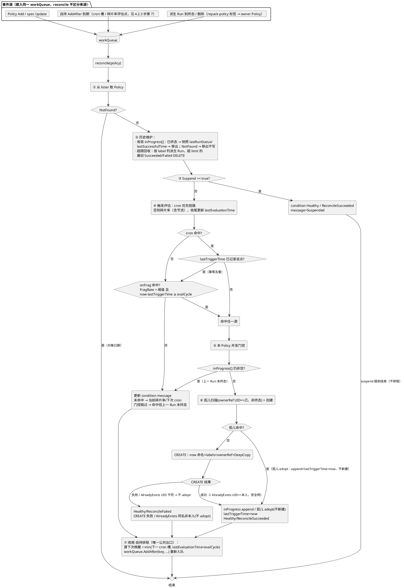

# RepackPolicy 实现方案设计

> 本文是对既有一次性碎片整理工单 `RepackRun` 的一次扩展——在用户手动触发 `RepackRun` 的现状基础上，引入碎片整理策略 `RepackPolicy`，支持周期性与碎片率阈值**自动触发** `RepackRun`，以实现碎片整理自动化。

## 1. Summary

## 2. Motivation

### 2.1 现有局限

常规装箱调度把 Pod 放到碎片最少、利用率最高的节点上之后，集群的碎片会随任务结束、扩缩容与滚动升级逐渐累积。为此，Volcano Repack 提供了 Node 级别的运行时碎片整理能力，能把零散占用收敛到部分节点，增加「完整空闲节点」的数量。

然而，当前碎片整理任务 RepackRun 是一次性任务，且需用户手动创建。因此，碎片整理尚缺乏自主巡检、根据集群资源使用情况主动触发整理的能力，严重依赖人工运维。

### 2.2 Goals

- 碎片整理自动触发：提供碎片整理策略 `RepackPolicy` CRD，内置 `RepackRun` 模板，支持**周期性**、**碎片率阈值**自动触发机制，减少人工运维成本。

### 2.3 Non-Goals

- 不支持排队水位触发和解救式触发：这两种方式需要模拟调度器逻辑，对控制器来说负担过重。

### 2.4 设计约束

暂无。

## 3. User Stories

作为集群管理员，我希望通过 `RepackPolicy` 策略来自动触发碎片整理，以实现碎片整理自动化，减少人工运维成本。

验收标准：
- 支持周期性触发 `RepackRun`
- 支持碎片率超阈值触发 `RepackRun`
- 同一 `RepackPolicy` 不会并发创建多个 `RepackRun`
- `RepackPolicy` 的 status 包含其触发的最后一个到达终态的 `RepackRun` 的 status

## 4. Detailed Design

### 4.1 RepackPolicy CRD 设计

```go
// RepackPolicy is a template-based RepackRun generator (CronJob→Job pattern).
// It is cluster-scoped and user-mutable.
//
// +genclient
// +genclient:nonNamespaced
// +k8s:deepcopy-gen:interfaces=k8s.io/apimachinery/pkg/runtime.Object
// +kubebuilder:object:root=true
// +kubebuilder:resource:path=repackpolicies,scope=Cluster,shortName=rpp;repackpolicy
// +kubebuilder:subresource:status
// +kubebuilder:printcolumn:name="SUSPEND",type=boolean,JSONPath=`.spec.suspend`
// +kubebuilder:printcolumn:name="STATUS",type=string,JSONPath=`.status.conditions[?(@.type=="Healthy")].reason`,description="Healthy condition reason"
// +kubebuilder:printcolumn:name="LAST-TRIGGER",type=date,JSONPath=`.status.lastTriggerTime`
// +kubebuilder:printcolumn:name="LAST-EVAL",type=date,JSONPath=`.status.lastEvaluationTime`
// +kubebuilder:printcolumn:name="AGE",type=date,JSONPath=`.metadata.creationTimestamp`
type RepackPolicy struct {
    metav1.TypeMeta   `json:",inline"`
    metav1.ObjectMeta `json:"metadata,omitempty"`
    Spec   RepackPolicySpec   `json:"spec"`
    Status RepackPolicyStatus `json:"status,omitempty"`
}

// +k8s:deepcopy-gen:interfaces=k8s.io/apimachinery/pkg/runtime.Object
// +kubebuilder:object:root=true
type RepackPolicyList struct {
    metav1.TypeMeta `json:",inline"`
    metav1.ListMeta `json:"metadata,omitempty"`
    Items           []RepackPolicy `json:"items"`
}

type RepackPolicySpec struct {
    // Trigger 何时触发（两种触发源，命中任一即触发）。
    // +kubebuilder:validation:Required
    // +kubebuilder:validation:XValidation:rule="(has(self.cronSchedule) && self.cronSchedule != '') || has(self.onFragAbovePercent)",message="trigger must set at least one of cronSchedule or onFragAbovePercent"
    Trigger RepackRunTrigger `json:"trigger"`

    // RunTemplate 派生 RepackRun 的模板（复用 RepackRunSpec）。
    // 生成的 Run 是 DryRun 还是 Execute 完全由 runTemplate.spec.mode 决定。
    // +kubebuilder:validation:Required
    RunTemplate RepackRunTemplateSpec `json:"runTemplate"`

    // Suspend 暂停触发（不影响已生成的 Run）。默认 false。
    // +optional
    // +kubebuilder:default=false
    Suspend *bool `json:"suspend,omitempty"`

    // SuccessfulRunsHistoryLimit 保留最近多少个成功的派生 Run（扁平，对齐 CronJob 的
    // successfulJobsHistoryLimit，默认 3）。
    // +optional
    // +kubebuilder:default=3
    // +kubebuilder:validation:Minimum=0
    SuccessfulRunsHistoryLimit *int32 `json:"successfulRunsHistoryLimit,omitempty"`

    // FailedRunsHistoryLimit 保留最近多少个失败的派生 Run（扁平）。默认 3（CronJob 的
    // failedJobsHistoryLimit 默认实为 1，此处统一取 3 与成功侧对称）。
    // +optional
    // +kubebuilder:default=3
    // +kubebuilder:validation:Minimum=0
    FailedRunsHistoryLimit *int32 `json:"failedRunsHistoryLimit,omitempty"`
}

// RepackRunTrigger 两种触发源，配了哪个就启用哪个，命中任一即触发。
// 反应式条件的评估周期是控制器级配置
type RepackRunTrigger struct {
    // CronSchedule 定时触发：标准 5 字段 cron 表达式。
    //
    // 格式：分钟 小时 日 月 星期（空格分隔）
    //
    //   字段     允许值（允许 , - * / ）
    //   分钟     0-59
    //   小时     0-23
    //   日       1-31
    //   月       1-12
    //   星期     0-6 (0=Sun) 或 SUN-SAT
    //
    // 示例：
    //   "0 */6 * * *"   每 6 小时一次
    //   "0 2 * * *"     每天凌晨 2 点
    //   "0 2 * * 1-5"   工作日凌晨 2 点
    //   "*/30 * * * *"  每 30 分钟一次
    //
    // 不设表示不启用定时触发。
    // 参考：https://en.wikipedia.org/wiki/Cron
    //
    // 控制器本地时区求值（无 timeZone 字段）：准入以 CEL 拒收 TZ=/CRON_TZ= 前缀
    // （见下方 marker 与 5.1）；完整 cron 语法（robfig/cron ParseStandard）无法在 CEL 内
    // 校验，格式错误会穿透准入、由控制器在步骤 4 显式报 ReconcileFailed（见 4.2.3 步骤 4）
    // +optional
    // +kubebuilder:validation:XValidation:rule="!self.contains('TZ')",message="cronSchedule cannot contain TZ or CRON_TZ (RepackPolicy has no timeZone field); a policy always runs in the controller's local time"
    CronSchedule *string `json:"cronSchedule,omitempty"`

    // OnFragAbovePercent 碎片率高于此百分比（0–100 整数）时触发（反应式）：
    // FragRate(R) > 阈值 即命中，相等不算；0 表示只要存在碎片（FragRate > 0）即触发。
    // 不设表示不启用碎片率触发。
    // +optional
    // +kubebuilder:validation:Minimum=0
    // +kubebuilder:validation:Maximum=100
    OnFragAbovePercent *int32 `json:"onFragAbovePercent,omitempty"`
}

// RepackRunTemplateSpec 派生 RepackRun 的模板。
type RepackRunTemplateSpec struct {
    // ObjectMeta 派生 Run 的 labels/annotations。
    // +optional
    ObjectMeta metav1.ObjectMeta `json:"metadata,omitempty"`

    // Spec 内嵌 RepackRun 的 spec 本体（单一事实来源，零 schema 漂移）。
    // +kubebuilder:validation:Required
    Spec RepackRunSpec `json:"spec"`
}

// 内嵌 marker 的继承说明：RepackRunSpec 内部的字段级校验（goals MaxItems=1、
// mode 枚举、resource contains('/') 等）随内嵌带进 runTemplate.spec——属预期，
// 模板在 Policy 上即按 Run 同规则预校验。但 Run 的不可变 transition 规则
// self==oldSelf 声明在根对象 RepackRun.Spec 字段上（repackrun_types.go），不属
// RepackRunSpec 类型，故不随内嵌继承——runTemplate.spec 保持可变，模板可随
// Policy 更新而演进。

// RepackPolicyStatus 对齐 CronJob 的 status 结构。
// 与 CronJob 不同：新增 conditions 表达 Policy 自身的健康状态（CronJob 纯
// 靠 active[] + lastScheduleTime）、lastEvaluationTime 记录反应式触发评估，以及
// lastRunStatus 镜像最近一次终态派生 Run 的 status——集群管理员只看 Policy
// 即可掌握最近一次整理的结果（碎片率前后对比），无需逐个查询 RepackRun。
type RepackPolicyStatus struct {
    // InProgress 尚未终态的派生 Run（Pending 或 Running）。
    // 一旦终态（Succeeded/Failed）即从此列表移除。
    // +optional
    InProgress []v1.ObjectReference `json:"inProgress,omitempty"`

    // LastTriggerTime 最近一次触发时间（因触发源多样，未沿用 lastScheduleTime）。
    // +optional
    LastTriggerTime *metav1.Time `json:"lastTriggerTime,omitempty"`

    // LastSuccessfulTime 最近一次派生 Run 成功完成的时间（Succeeded）。
    // +optional
    LastSuccessfulTime *metav1.Time `json:"lastSuccessfulTime,omitempty"`

    // LastRunStatus 最近一个到达终态（Succeeded/Failed）的派生 Run 的概要 + status 快照
    // （LastRunStatus 类型：含 Run 名、mode、触发方式、目标资源 + 嵌入的完整 status）。
    // 在 Run 转入终态的同一次 reconcile 中写入（见 4.2.3 步骤 2）：对同一个 Run，其
    // 快照写入后不再更新；后续 Run 到达终态时，会用新 Run 的快照覆盖本字段（只保留最近一次）。
    // 集群管理员只看 Policy 即可掌握最近一次整理的上下文与碎片率结果，无需逐个查 Run。
    // +optional
    LastRunStatus *LastRunStatus `json:"lastRunStatus,omitempty"`

    // LastEvaluationTime 最近一次反应式条件评估时间（onFragAbovePercent）。
    // +optional
    LastEvaluationTime *metav1.Time `json:"lastEvaluationTime,omitempty"`

    // Conditions are standard Kubernetes conditions. RepackPolicy uses a single
    // condition type "Healthy" to express whether the last reconcile succeeded.
    //
    // Healthy=True, Reason=ReconcileSucceeded — reconcile completed as expected
    //     (suspend, no trigger, or trigger+Run creation all count as success)
    // Healthy=False, Reason=ReconcileFailed — reconcile encountered an error
    //     (e.g. Run creation API error); operator attention needed
    //
    // +optional
    // +patchMergeKey=type
    // +patchStrategy=merge
    // +listType=map
    // +listMapKey=type
    Conditions []metav1.Condition `json:"conditions,omitempty" patchStrategy:"merge" patchMergeKey:"type"`
}

// LastRunStatus 最近一个到达终态的派生 Run 的概要 + RepackRun.status 快照。
// 关键上下文信息（Run 名、mode、触发方式、目标资源）使管理员在不查 Run 的前提下就能
// 判断该次整理针对谁、以何种方式触发、整理哪个资源；RepackRunStatus 匿名嵌入
// （json:",inline"）平铺展开，lastRunStatus 下直接并列 name/mode/trigger/resource 与
// phase/conditions/plan/result 等 RepackRun.status 字段。
type LastRunStatus struct {
    // Name 产生该快照的 RepackRun 名（命名 {policy}-{YYYYMMDDHHmmss}）。Run 被 TTL/GC
    // 删除后仍可据此追溯本次结果对应的 Run。
    // +kubebuilder:validation:Required
    Name string `json:"name"`

    // Mode 该 Run 的整理模式（DryRun/Execute，来自 runTemplate.spec.mode）。
    // +kubebuilder:validation:Required
    Mode RepackMode `json:"mode"`

    // Trigger 本次触发来源：cronSchedule 或 onFragAbovePercent（与派生 Run 上
    // RepackTriggerLabel 标签取值一致）。Policy 只在该源命中时才创建 Run，故必有值。
    // +kubebuilder:validation:Required
    Trigger string `json:"trigger"`

    // Resource 本次整理的目标加速资源（RepackRun.spec.goals[0].resource）；
    // 模板 goals 未设时为空（可选）。
    // +optional
    Resource v1.ResourceName `json:"resource,omitempty"`

    RepackRunStatus `json:",inline"`
}

// Labels for generated Runs.
const (
    // RepackPolicyLabel 标识派生此 Run 的 Policy 名，用于历史 GC 和并发门控的列表查询。
    RepackPolicyLabel = "repack.volcano.sh/repack-policy"
    // RepackTriggerLabel 记录触发方式：cronSchedule 或 onFragAbovePercent，
    // 便于事后统计和排查。
    RepackTriggerLabel = "repack.volcano.sh/repack-trigger"
)

// Condition type for RepackPolicy.
const (
    // CondHealthy expresses whether the last reconcile succeeded.
    // Healthy=True means the reconcile completed as expected.
    // Healthy=False means the reconcile encountered an error; see reason and message.
    CondHealthy = "Healthy"
)

// Healthy condition reasons — binary: reconcile succeeded or failed.
const (
    // ReasonReconcileSucceeded means the reconcile completed as expected.
    // Covers all expected outcomes: suspend, no trigger hit, or trigger+Run creation.
    ReasonReconcileSucceeded = "ReconcileSucceeded"
    // ReasonReconcileFailed means the reconcile encountered an error that needs attention.
    // Example: trigger matched but Run creation API call failed.
    ReasonReconcileFailed = "ReconcileFailed"
)
```

RepackPolicy的一个完整示例如下：
```yaml
apiVersion: repack.volcano.sh/v1alpha1
kind: RepackPolicy
metadata:
  name: a100-auto                  # Cluster-scoped
spec:
  trigger:                         # 两种触发源，命中任一即触发
    cronSchedule: "0 */6 * * *"    # 定时 cron
    onFragAbovePercent: 35           # 碎片率超阈值

  suspend: false                   # 暂停触发

  successfulRunsHistoryLimit: 3
  failedRunsHistoryLimit: 3

  runTemplate:                     # ← 内嵌一份 RepackRun 模板
    spec:                          # = RepackRunSpec（单一事实来源，零 schema 漂移）
      mode: Execute                # 派生 Run 是 DryRun 还是 Execute 由模板模式决定；此处为真实驱逐
      goals:
        - resource: nvidia.com/gpu
          minFragImprovementPercent: 5
      scope:
        nodes:
          include:
            selector:
              matchLabels:
                volcano.sh/node-pool: a100
      maxPerRun:
        podGroups: 10
        resources:
          nvidia.com/gpu: 64
      eviction:
        gracePeriodSeconds: 30
      ttlSecondsAfterFinished: 86400

status:
  conditions:
    - type: Healthy
      status: "True"
      reason: ReconcileSucceeded
      message: "Frag rate 28% below threshold 35%, next cron at 2026-08-16T18:00:00Z, last trigger 2026-08-16T12:00:00Z"
      lastTransitionTime: "2026-08-16T14:00:00Z"
      observedGeneration: 3
  inProgress:
    - kind: RepackRun
      apiVersion: repack.volcano.sh/v1alpha1
      name: "a100-auto-20260816120000"
      namespace: ""
  lastTriggerTime: "2026-08-16T12:00:00Z"
  lastSuccessfulTime: "2026-08-16T06:00:00Z"
  lastRunStatus:                # 最近一次终态 Run 的概要 + status（06:00 那轮 cron Execute 成功）
    name: a100-auto-20260816060000
    mode: Execute
    trigger: cronSchedule
    resource: nvidia.com/gpu
    phase: Succeeded
    completionTime: "2026-08-16T06:00:00Z"
    message: "Fragmentation reduced 45% -> 28%"
    plan:
      summary:
        fragBeforePercent: 45
        fragAfterPercent: 28
        freedNodeCount: 12
        movedCardCount: 64
    result:                       # Execute 实际观测结果（DryRun 无此字段）
      fragAfterPercent: 28
      freedNodeCount: 12
      movedCardCount: 64
      metricsVerified: true
  lastEvaluationTime: "2026-08-16T14:00:00Z"
```

### 4.2 RepackPolicy 控制器设计

#### 4.2.1 设计原则

1. **纯模板生成（CronJob→Job 式）**：Policy 只负责「按触发生成 RepackRun」，不承担集群级默认/硬护栏
2. **引擎不变**：`volcano-repack-engine` 只读 `RepackRun.spec`，Policy 引入后引擎零改动
3. **准入 = CEL（apiserver），无控制器 Admit、无继承补全**：对齐 `batch/v1 CronJob`——CronJob 的校验由 apiserver schema validation 完成，不走 webhook/admission controller；CronJob 生成 Job 时直接 DeepCopy `jobTemplate.spec`，默认值由 apiserver 在 Job CREATE 时填充。Policy 同理——校验由 CRD 上的 CEL/marker 完成，生成的 Run 直接 DeepCopy `runTemplate.spec`，默认值由 RepackRun CRD schema 在 CREATE 时自行填充；Policy 自身字段的默认（`suspend=false`、`successful/failedRunsHistoryLimit=3`）也由 Policy CRD schema 的 default marker 提供，控制器不兜底
4. **归属走 K8s 惯例**：生成的 Run 带 `ownerReferences → Policy`（级联删除）
5. **并发策略**：控制器默认「上一派生 Run 未结束则不新建」
6. **历史限制**：扁平 `successfulRunsHistoryLimit` / `failedRunsHistoryLimit`（对齐 CronJob）
7. **碎片率评估周期**：控制器级启动 flag（`--repack-policy-frag-eval-cycle`，默认 10min，对齐 Execute 冷静期），不进 CRD；它只是每个配置了 `onFragAbovePercent` 的 Policy 的自持调度间隔（见 4.2.3 步骤 7）

#### 4.2.2 Reconcile 触发时机

1. **RepackPolicy Add / spec Update**：Add，或 spec 变更（`Generation` 递增）时入队 reconcile。控制器自身的 status 写入**不触发**——本控制器频繁写自己的 status（步骤 4 每次评估都刷新 `lastEvaluationTime`、步骤 2 清理、创建时追加 `inProgress[]`/置 `lastTriggerTime`、condition 更新），若 Update 一律入队，会以「写 status → Update 事件 → 再 reconcile → 再写 status」自我驱动空转。`Generation` 只在 spec 变更时递增（status 写入、`deletionTimestamp` 设置都不递增），故以其作过滤依据；Policy 无 finalizer，删除期无需 reconcile 动作，级联删 Run 由 ownerRef 承担
2. **自持 AddAfter 到期**：每次 reconcile 收尾都重排该 Policy 的下一次唤醒（cron 槽或碎片率评估点 `lastEvaluationTime + evalCycle`，先到者醒），到期自动入队，自我维持直至 Policy 删除（suspend 分支整体停摆、不排程，见 4.2.3 步骤 3）。到期只负责唤醒，不预判结果，触发命中判断统一在 reconcile 中完成
   - workqueue `AddAfter` **不去重**：Policy 更新或多次 reconcile 会留下旧定时器，到期多触发一次无害 reconcile——重复创建由三层兜住：`lastTriggerTime` 记账拦正常重复、孤儿扫描/终态镜像兜崩溃窗口（4.2.3 步骤 6/2）、AlreadyExists 拦外部同名占用，与 CronJob controller 行为一致（Run 名取 now、不承载去重，见步骤 6）
   - `AddAfter` 随进程重启丢失：由启动时 Policy informer 回放 reconcile 统一重排，无需持久化
3. **派生 Run 到达终态 / 删除**：Policy 控制器也**响应派生 Run 的变化**——`status.lastRunStatus`/`lastSuccessfulTime` 需在 Run 到达终态时及时回写、`inProgress[]` 需及时清理，故派生 Run **到达终态（或删除）会入队其 owner Policy** 的 reconcile（现代 CronJob controller 同样对 Job 事件入队以更新其 status）。派生 Run 都带 `repack.volcano.sh/repack-policy: {policyName}` 标签，RepackRun event handler 直接以标签值作 key 入队，无需查 ownerRef。为避免空转，只注册 **Update + Delete** 两种 handler，非终态变迁一律不唤醒：
   - **Update**：仅当 Run 从非终态转入终态（→ Succeeded/Failed）时入队 owner Policy。`Pending→Running` 等非终态变迁不唤醒——policy 侧对此无需要做的事
   - **Delete**：始终入队 owner Policy——覆盖 TTL 到期、历史 GC、人工删除，以及删除前未及观测到终态的场景（配合步骤 2 的 NotFound 分支）
   - 无此源时，纯 cron Policy 要到下一次自持唤醒（下个 cron 槽）才感知到 Run 已结束，快照与并发门控会滞后一个调度周期。

**同 key 入队合并、处理单飞（workqueue 内建语义）**：三条来源可能邻接命中同一 Policy（如 spec 变更与派生 Run 终态同刻到达）。队列对 pending 的同 key 去重——worker 取出前重复入队只保留一个副本，同刻触发的同 key 只 reconcile 一次；同一 key 被取出处理期间也不会被并发取出，同 key reconcile 天然串行、不会双跑。但处理**期间**再入队不丢弃，会于本次结束后**顺序补跑一次**（at-least-once，非恰好一次）——故保证是「同 key 不并发、事件风暴至多合并为一次 + 一次补跑」，重复创建的兜底是 `lastTriggerTime` 记账（正常重复）+ 孤儿扫描/终态镜像兜崩溃窗口（步骤 6/2）+ AlreadyExists 拦外部同名（now 命名不承载去重，见步骤 6）。

**注意：不注册无意义的 RepackRun Add Handler。** 创建 Run 的 Add 事件不唤醒（reconcile 已在创建时同步 append `inProgress[]`），且若监听 Add，informer 启动回放会对全部存量 Run 空跑一遍 handler（workqueue 虽按 key 去重、每 Policy 至多入队一次，仍是无谓遍历），每次自建 Run 后还会多一次多余唤醒。控制器重启后存量 Policy 的状态回填由 Policy informer 自身的 Add 回放 reconcile 完成（步骤 2 会扫描 `inProgress[]` 中已终态的 Run）。Run informer 除事件监听外，仍供并发门控/历史 GC 以 lister 只读查询。

#### 4.2.3 Reconcile 处理流程

**流程总览**（对应下方步骤 1-7）：



1. 从 lister 获取 Policy（NotFound → 结束）
2. **历史维护**：对派生 Run 做一次终态收敛与超限回收。两者都只处理已终态/超限对象、不依赖触发判定，且**新创建的 Run 是全局最新、永不超限**，回收无需排在创建之后；统一前置到门控判定前，让「上一个 Run 刚终态」与「历史已回收」在同一次 reconcile 内一并完成。分两步：
   a. **收敛 inProgress[]**：扫描 `inProgress[]` 中每个 Run 的状态——Run 已 Succeeded 则更新 `lastSuccessfulTime`（取最新值）；无论 Succeeded/Failed，凡已终态即把该 Run 的概要（`name`、`spec.mode`、`repack-trigger` 标签、`spec.goals[0].resource`）连同 `.status` 全量覆盖写入 `status.lastRunStatus`（终态后该 Run 的 status 不再变化、快照即最终值；`lastRunStatus` 只保留最近一次终态 Run，后续 Run 到终态会覆盖之），随后把 Run 从列表中移除。若某 Run 在 runLister 中已 NotFound（被手动删除、或被 TTL/GC 先于终态观测删除），说明未能观测到其终态，直接移出 `inProgress[]` 且不写快照——无终态 status 可镜像，避免列表悬挂。
   b. **超限回收**：按 label `repack.volcano.sh/repack-policy={policyName}` 列出全部派生 Run，对 Succeeded/Failed 分别按 `creationTimestamp` 降序排列，超出 `successfulRunsHistoryLimit`/`failedRunsHistoryLimit` 的最旧者 DELETE
   先 a 后 b：终态 Run 先快照落盘、移出 `inProgress[]` 再整体回收——DELETE 目标是各类别最旧的超限者，而 `inProgress[]` 只装最新 Run，本不重叠，保持 a 在前仍保证任何终态 Run 都先留下快照。先收敛再做后续判断，保证并发门控看到的是最新状态
   **孤儿 Run 的终态镜像与记账（配套 now 命名，覆盖「宕机期已跑完」的恢复）**：b 的 label-list 顺带兜住「引擎在控制器宕机期间把孤儿 Run 跑完」的场景——该 Run 不在 `inProgress[]`、a 不会收敛它，now 命名又无法按名认领，若不处理会一直缺席 `lastRunStatus`，且其对应的 fire 在重启后会被步骤 4 再次判中、重复执行。故对 b 列表中 ownerRef UID == 本 Policy 的终态 Run，取 `Status.CompletionTime` **最大且晚于** `lastRunStatus` 当前记录（或 `lastRunStatus` 尚空）的那一个做镜像：写 `lastRunStatus` 快照（Succeeded 者同时更新 `lastSuccessfulTime`），并推进 `lastTriggerTime` = now（消耗那次未记账的触发）。**取最大值而非「逐条与可变快照比较」**——宕机期可能有多个孤儿先后终态，逐个比较、边镜像边更新快照会使结果依赖列表遍历顺序（若 b 实现改升序/分页即镜像错对象）；一次性取 CompletionTime 最大者与「只保留最近一次终态」语义一致、不依赖遍历顺序（CompletionTime 全局单调，重复 reconcile 幂等不重复写）；正常时序下终态 Run 已由 a 镜像、此处无新增，仅崩溃孤儿触发本分支
3. 若 `spec.suspend == true`：更新 condition 为 `Healthy=True, reason=ReconcileSucceeded, message="Suspended"` 后**直接结束，不进入步骤 7 排程、不做任何 AddAfter**（整体停摆：无外部事件时完全静默——不评估碎片率、不创建 Run、不自醒）。**suspend 只冻结主动动作，不停被动响应**——步骤 2 的历史维护与派生 Run 终态收敛先于本步执行，suspend 期间若派生 Run 到终态/被删（事件驱动 reconcile），仍会照常收敛回写 status、超限回收。评估时钟**不推进**：suspend 不做碎片率评估，拨 `lastEvaluationTime` 会让「上次评估时刻」说谎。解除 suspend 是一次 spec 变更（`Generation` 递增）必触发 reconcile，在该次 reconcile 重建节拍、补一次完整评估，并按步骤 7 的补建规则（补建不逐一）至多补一个 suspend 期错过的 cron 槽——补建在**解除时刻以 now 执行**（派生 Run 名取 now，非精确回放原槽位时间戳；`max(lastTriggerTime, creationTimestamp)` 作锚点落后多久，就相当于「恢复后立即补跑一次当前编排」）。本设计不设 `startingDeadlineSeconds` 式陈旧度上限（错过超过 X 的槽不再补），恢复即补一次是其当前语义，已知边界
4. 评估触发（**cron 优先、短路**；reconcile 无法区分唤醒来源，每次唤醒都须完整走一遍这个判定链）：
   - **cronSchedule**：以 `max(lastTriggerTime, creationTimestamp)` 为基准，用 cron 库计算 `Next()` 时间。若当前 ≥ nextFire 且该 fire 点未被 `lastTriggerTime` 记录 → **命中**，直接走创建（点触发，不受碎片率节奏约束）。若 cron 命中但该 fire 点已被记录（重复唤醒/幂等去重），本次不为 cron 创建，落入下方碎片率分支继续判定
   - **cronSchedule 解析失败 → 显式报错（可 parse 才谈命中）**：准入只在 CEL 层拒 `TZ=/CRON_TZ=` 前缀（无 timeZone 字段、无 webhook，完整 cron 语法无法在 CEL 内校验，见 4.1），真正无法 parse 的表达式会穿透到控制器且**永远不会 fire**。它不能并入「未命中成功」被静默吞掉（那会得到一只永远 Healthy 却永不触发的 Policy）——故当 cron 配置了解析失败、且本轮最终未创建（onFrag 未配/未命中/被节流）时：condition=`Healthy=False, reason=ReconcileFailed`、message 含 `invalid cronSchedule "…": <解析错误>`，随后照常走步骤 7；若 onFrag 本轮命中并创建则不受牵连（坏 cron 只杀死其自身源）。步骤 7 的 scheduleWakeup 对该表达式 `Next()` 同败、不武装自醒——该 Policy 此后只由外部事件（spec 修正的 spec-change reconcile）驱动，语法修复是唯一解药
   - **onFragAbovePercent**（仅当 cron 未实际创建时判定）：通过 Node + Pod informer 实时计算碎片率（详见 4.2.4），需**同时**满足以下两点才算命中：
     - `FragRate > onFragAbovePercent`（严格大于，相等不算）
     - `now - lastTriggerTime ≥ evalCycle`——**碎片率创建节流**（`lastTriggerTime` 为零时恒满足；锚点取「上次创建时刻」而非「上次评估时刻」：被节流挡住的 reconcile 不推进它，评估频率因此不影响节流节奏），说明见步骤 5 的注
   - 评估收尾更新 `status.lastEvaluationTime` = now——它是**最近一次评估时刻**，评估 = 对触发源做一次「是否该创建 Run」的判定，**含 cronSchedule 与 onFragAbovePercent 两种源**（cron 命中/未命中、碎片率命中/未命中，凡完成一次评估即刷新；**纯 cron 同样写**）。cron 与碎片率都未命中 → 更新 condition message 为当前碎片率/下次 cron 等评估结果，跳到步骤 7（自持排程）
5. **本 Policy 并发门控**：若 `status.inProgress[]` 仍非空（上一个 Run 尚未终态），跳过创建，跳到步骤 7（自持排程）
   - **注**：这是 policy 侧**唯一的并发门控**，对 DryRun 与 Execute 一视同仁，保证同一 Policy 不堆积多个未结束的派生 Run（对齐设计原则 5）。Execute 模式的全局串行（引擎级 K=1 槽位 + 冷静期）由**引擎**负责——并发到达的第二个 Execute Run 会被引擎置为 Pending 并等待，Policy 无需跨 Policy 扫描 Run 预判，也不必在冷静期内放弃创建
   - **为何碎片率需要节流（与 Run 终态事件相关）**：终态事件会在 Run 一结束就再触发一次 reconcile，把它移出 `inProgress[]` 并放行本步。碎片率是**电平触发**（只要当前 `FragRate > 阈值` 就成立），而 reconcile 来源不可知——若无节流，DryRun（不改变碎片率）会在每次结束后被**立即**重新触发，形成背靠背自循环，间隔只由 Run 执行时长决定（远快于 evalCycle）。步骤 4 碎片率分支的 `now - lastTriggerTime ≥ evalCycle` 把碎片率创建压到「至多每 evalCycle 一次」；节流锚点是 `lastTriggerTime`（仅在创建成功时更新），被挡住的 reconcile 不推进它，故评估频率不会把节奏越拖越慢。cron 是点触发且优先短路，天然按槽节流，不受此限
6. **创建 RepackRun**：
   - 命名：`{policy-name}-{YYYYMMDDHHmmss}`（**now、UTC、秒级**；只作可读标识与同秒幂等，**不编码触发语义**——碎片率无“槽位”概念，跨崩溃重启也不能靠名字重认领孤儿；孤儿恢复见下方孤儿扫描与步骤 2 的终态镜像）
   - DeepCopy `runTemplate.spec` 到新 Run（含 mode、scope、goals 等全部字段）
   - 合入 `runTemplate.metadata.labels/annotations`
   - 设置 `metadata.ownerReferences` → Policy（`controller=true, blockOwnerDeletion=false`）
   - 设置 labels：
     - `repack.volcano.sh/repack-policy: {policyName}`（供步骤 2b 超限回收按 label 列全部派生 Run）
     - `repack.volcano.sh/repack-trigger: {cronSchedule|onFragAbovePercent}`（记录触发来源）
   - **保留 key**：`repack-policy`/`repack-trigger` 是控制器保留 key——覆盖顺序为先合入模板 labels、后设保留 key，无论模板/继承 labels 是否同名，产物上恒以控制器刚设的值为准。模板同名值不得覆盖记账 label（否则触发来源记错、步骤 2b 的 label-list 串到别的 Policy 名、门控/GC 错乱）
   - CREATE 到 API
   - 成功：`inProgress[]` append 新 Run 的 ObjectReference，`lastTriggerTime` = now，condition 更新为 `Healthy=True, reason=ReconcileSucceeded`，message 包含触发摘要
   - **孤儿扫描（adopt 主路径，先于 CREATE 的崩溃恢复）**：判定命中、即将创建前，按 `repack.volcano.sh/repack-policy` label 列出本 Policy 全部 Run，筛 **ownerRef controller 引用 UID == 本 Policy UID、非终态、且不在 `inProgress[]`** 者。正常时序下步骤 5 门控已保证 `inProgress[]` 为空，此刻仍存在的属己非终态 Run 只可能是孤儿——「CREATE 成功、随后的 status append 未及落盘即崩溃/重启」，游离于 `inProgress[]` 之外、门控看不见，now 命名又无法按名重认领。命中孤儿 → **adopt 之、不再创建**：把其 ObjectReference append 进 `inProgress[]`、推进 `lastTriggerTime` = now（该 fire 已由孤儿消耗，记账防恢复后同一 fire 再触发一次）、置 condition=`Healthy=True, reason=ReconcileSucceeded`（message 注明孤儿 adopt），让重启恢复在**同一次 reconcile 内完成**、不残留待收敛条目。扫描与 CREATE 同处一次 reconcile，同 key 单飞保证其间无并发——不会两个 reconcile 都扫不到、各建一个
   - **AlreadyExists（次级防线，仅防外部同名占用）**：孤儿已被上方扫描接走，故 CREATE 返回 AlreadyExists 时理论上只剩非本 Policy 的同名 Run——(1) 预置/他人占用保留名（手工或其它创建者造的 `{policy}-{now}` 同名 Run）；(2) 同 Policy 名删除后重建的旧化身（label 与本 Policy 同名、label 查不出差异，ownerRef UID 是唯一判别）。fetch 该 Run 校验 `ownerReferences` 中 controller 引用 UID：**== 本 Policy**（扫描竞态之外的安全网，极罕见）→ 按上方孤儿 adopt 处理；**不符** → **不得 adopt**：置 condition=`Healthy=False, reason=ReconcileFailed`（message 注明同名 Run 已存在但非本 Policy 创建）、不 append、不推进 `lastTriggerTime`，跳到步骤 7——名字含 now 秒级，任何后续 fire 时间戳必不同 → 名字不同 → 创建照常，这一个被占用的 fire 显式报错而不再被静默吞掉或误 adopt。两条约束不变：**不得**把本人孤儿当失败处理（否则其游离于 Policy 之外、门控放空，后续触发会再造一个并发 Run）；**不得**在 adopt 时跳过记账（否则 `lastTriggerTime` 不推进，同一 fire 会被反复命中）
   - 失败：condition 更新为 `Healthy=False, reason=ReconcileFailed`，message 包含 API 错误详情
7. **收尾·自持排程**：唯一公共出口——门控跳过/触发未命中/创建完成等所有非删除路径（除 suspend 提前结束外）最后都汇入此处：算该 Policy 的下一次唤醒时间 `nextWake = min(下一 cron 槽, lastEvaluationTime + evalCycle)`，`workQueue.AddAfter(key, nextWake)` 重新入队，自我维持至 Policy 删除。两个候选都取**严格晚于当前时刻**的 future 点（未配置的源取 ∞；当前由 CEL「两源至少一者配置」保证活跃态至少一个有限候选，若未来新增触发源以「至少一个有限候选」为准）：
   - **cron 下一槽**：cron 库 `Next()` 的下一个 fire 点，且必须严格晚于当前——收尾排程排到 ≤ 当前时刻的槽会在阻塞窗口内（如某派生 Run 长时间未终态、多个 cron 槽被跳过）零延迟反复自唤醒；错过槽的补建只发生在阻塞解除后由其它事件自然触发的 reconcile 中（自持槽到期 / Policy 事件 / 派生 Run 终态事件；suspend 解除的 spec-change reconcile 即属此类），不逐一补建
   - **碎片率下次评估（周期候选）** = `status.lastEvaluationTime + evalCycle`，**仅当配置了 `onFragAbovePercent` 时本候选才成立**——碎片率是电平源、须周期重采样，故以 evalCycle 为节奏；纯 cron 无此源，本候选取 ∞、自醒只落 cron 槽。`lastEvaluationTime` 每次评估后都刷新（步骤 4，覆盖两源），故此候选即「自上次评估起每隔 evalCycle 重采样一次」；若该值已 ≤ 当前时刻，本候选视为 ∞，交给 cron 侧或下一次事件决定

两个以 evalCycle 为尺的时钟不混用：`lastEvaluationTime`（每次评估都刷新，记录评估时刻、覆盖两源）为**碎片率源**的周期重采样提供节拍基准（纯 cron 写但本步不消费它、自醒只落 cron 槽）；碎片率**创建**的节奏另以 `lastTriggerTime`（仅创建时刷新）为锚（步骤 4 的节流）——「何时允许再建」。二者解耦：评估频率不影响创建节奏，反之亦然。不经过本步的出口有二：步骤 1 的 NotFound（Policy 已删——残留的 `AddAfter` 之后到期也无妨，reconcile 因 lister NotFound 安全退出）与步骤 3 的 suspend 提前结束（不排程，见步骤 3）。此排程是碎片率触发 Policy 周期性评估的**唯一驱动**，任何活跃路径都不能绕过；且须在所有 status 变更之后执行——创建成功路径已推进 `lastTriggerTime`，下次 cron 槽须按新锚点计算

#### 4.2.4 碎片率实时计算口径（onFragAbovePercent）

**触发评估口径恒为该资源「全集群」碎片率，与 `runTemplate.scope` 无关**：`FragRate(R)` 的三个变量（`totalNodes`/`occupiedNodes`/`minPossibleNodes`）都按**集群内全部**提供 R 的节点与已绑定 Pod 统计，不按模板 scope 收窄——这与引擎 summary 口径一致（`RepackSummary` 注释「scope limits actions, not this cluster health metric」，见 `repackrun_types.go`）。scope 只限定派生 Run 的动作范围，不参与触发判定。若模板把 scope 收到某资源子集（如 a100 池），请自行保证该子集的碎片率能代表全集群水平——否则可能出现「池内已干净、池外碎片率高 → 周期性空转触发（每次整理对阈值无益）」或反向「池内极重、全集群指标低 → 不触发」。本设计把「触发恒为全集群」定为当前契约；若要让 trigger 感知 scope（按 scope 内节点集测 FragRate），须同步演进引擎口径并改 `RepackSummary` 语义，留作已知边界。

**碎片率计算**（与引擎一致）：

```
FragRate(R) = (occupiedNodes - minPossibleNodes) / totalNodes × 100%
```

- `totalNodes` = `Allocatable[R] > 0` 的节点数
- `occupiedNodes` = 正在使用资源 R 的节点数
- `minPossibleNodes` = 保持当前资源请求不变、紧凑装箱所需的最少节点数（实现按**下界**估计、非逐一求真实装箱最优——见下文等价说明；仅同构且请求/容量全为 2 的幂时下界恰为最优）

碎片率在控制器内按 ×100% 与 `onFragAbovePercent`（百分数）比较；引擎 `FragmentationRate()` 返回 [0,1] 分数、状态 `FragBeforePercent/FragAfterPercent` 经 `PercentagePoints()`（`round(×100)` 并钳 [0,100]）换算，二者仅缩放与取整不同。

> **设计说明**：碎片率在 Policy 控制器内部实时计算，**不读取历史 Run 的 `fragAfterPercent`**（集群碎片率持续变化，旧值不准）。
>
> 计算所需数据均来自标准 K8s API：
> - **Node** `status.allocatable[R]` → 得到 `ProvidingNodeCount`（哪些节点提供该资源、各节点容量多少）。K8s Node 对象 **只携带 allocatable，不记录当前已用量**。
> - **Pod** `spec.containers[*].resources.requests[R]` → 按 nodeName 聚合（**只统计已绑定 `spec.nodeName` 非空、且非终态 Succeeded/Failed 的 Pod**——与 scheduler cache `node.Tasks` 口径一致）得到 `OccupiedNodeCount`，同时收集逐 Pod 请求量作为 `resourceRequests[]`，输入下界算法求得 `OptimalOccupiedNodeCount`。
>
> **为什么两个 informer 缺一不可**：碎片率公式的三个变量中，Node 只能提供 `ProvidingNodeCount`；`OccupiedNodeCount`（哪些节点有 Pod 占用该资源）和 `OptimalOccupiedNodeCount`（紧凑装箱最少需要多少节点）都必须从 Pod requests 聚合得到。只靠 Node informer 算不出碎片率。**终态过滤不可省**：Succeeded/Failed 的 Pod 仍带 nodeName 与 requests，不剔除会让已完成的负载永远算作占用、碎片率恒高，onFrag 永不收敛。
>
> Policy 控制器通过 `NodeInformer` + `PodInformer` 获取这些数据，无需依赖 scheduler cache。`OptimalOccupiedNodeCount` 的计算逻辑与引擎的 `MeasureResourceFragmentation` 等价：同构集群经闭式公式，**仅当节点容量与各请求均为 2 的幂时精确（`Exact=true`）**，否则为下界、碎片率可能高估；异构集群按节点容量降序贪心求覆盖总需求的最少节点数（`Exact=false`）。并照引擎做防御性钳制——`OptimalOccupiedNodeCount` 不超过 `OccupiedNodeCount`，保证率值落在 [0,1]。参见 `pkg/repackengine/api/fragmentation.go`。
>
> **实现防漂移（前置：抽纯函数，否则本句落空）**：`fragmentation.go` 的 `MeasureResourceFragmentation` 入参是 scheduler-cache 的 `*api.NodeInfo`（携带 `Used`/`Tasks`），异构贪心与 clamp 内嵌未导出（`fragmentation.go:144-170`）——Policy 控制器只有裸 Node/Pod informer，**无法直接调用它**。「不另写一份」须由代码结构保证：实现期先把「由 requests + capacities 求最优占用节点数」抽成纯函数（同构走 `OptimalNodes` 闭式、异构按容量降序贪心、带 `exact` 标记），`MeasureResourceFragmentation` 与 Policy 控制器**共用**它；控制器侧只负责把 informer 数据聚合成 requests/capacities（取整卡即可，无需换算 milli——闭式与贪心对统一缩放不敏感，两调用方须固定同一单位约定，§5.1 黄金对照 UT 固化该等价）。clamp（最优 ≤ occupied）在两调用方各自做。顺带修正 `fragmentation.go:90-95` 与 `RepackSummary` 注释的矛盾：引擎测量实为全集群（调用方 `pkg/repackengine/actions/repack/repack.go` 传 `ssn.Nodes()` 全 session 快照），该文件头注释「already restricted to the run's scope by the caller」是过时残留。
>
> **数据管道说明**：引擎在 scheduler 单次 session 缓存快照上算，其 `node.Used` 已计入全节点上**所有调度器**绑定的在途 Pod（pod informer 的 `responsibleForPod` 在无一致哈希 `c==nil` 时放行全部已绑定 Pod），故与控制器全量 Pod 统计口径一致；控制器先后 list Node/Pod 两个 informer 的瞬时不同步可自愈、可忽略。仅当多 vc-scheduler 一致哈希/分片部署时引擎才是"该 scheduler 责任子集"，此时控制器也应按同一子集评估。

> **碎片率评估周期与 Execute 冷静期的关系**：`--repack-policy-frag-eval-cycle` 默认 10min，对齐 Execute 模式的冷静期（`--repack-execute-cooldown`，默认 10min）。若评估周期 < 冷静期，会在冷静期窗口内生成引擎暂时无法执行的 Run（卡在 Pending 状态等待冷静期结束），造成无意义的排队。保持两者默认值一致可避免此问题。运维调整时应确保评估周期 ≥ 冷静期。

#### 4.2.5 历史 GC 与 inProgress 管理

**设计选择**：Policy 历史限制由 Policy 控制器自行处理，**不修改现有 RunGC**。

理由：
- TTL（`ttlSecondsAfterFinished`）是 Run 级别的生命周期字段，由 repack-controller 的 Run GC（按 `CompletionTime + TTL` 删除终态 Run）处理
- `successfulRunsHistoryLimit` / `failedRunsHistoryLimit` 是 Policy 级别的字段，由 Policy 控制器处理
- 两者独立共存，互不冲突，先触达者先删

「收敛 inProgress[] + 超限回收」在 reconcile 中合并为一步执行（见 4.2.3 步骤 2），内部顺序：
1. 收敛 `status.inProgress[]`：已终态 / 已消失的 Run 引用（已 Succeeded 更新 `lastSuccessfulTime`；已终态写 `lastRunStatus` 快照后移出；runLister NotFound 则直接移出不写快照）
2. `runLister.List(labels.SelectorFromSet({"repack.volcano.sh/repack-policy": policy.Name}))`
3. 按 phase 分组（Succeeded / Failed），每组按 `creationTimestamp` 降序
4. 超出 limit 的最旧 Run DELETE
5. **终态孤儿镜像/记账**：对 2 的列表筛 ownerRef UID == 本 Policy 的终态 Run，取其中 `CompletionTime` 最大且晚于 `lastRunStatus` 记录者镜像一次并推进 `lastTriggerTime`（确定性选取，见 4.2.3 步骤 2 孤儿段；正常时序无新增、仅崩溃孤儿触发）

**label 判别够用、无需 ownerRef UID（对照步骤 6 adopt）**：回收按 label `repack-policy={name}` 列出会带上同 Policy 名删除后重建的**旧化身**残留（ownerRef UID 不同但 label 相同）。超限只删**最旧**者，而旧化身的 `creationTimestamp` 天然早于新化身一切 Run，故总先被清掉、新化身 Run 永不波及；新化身历史少于 limit 时旧残留仅暂占展示位、随后被顶出。GC 不必像 adopt 那样查 UID——adopt（步骤 6 孤儿扫描/步骤 2 终态镜像）防的是崩溃窗口留下的孤儿：它们与历史 Run 同 label、却游离于 `inProgress[]` 与快照之外，时间序无法自愈，须靠 ownerRef UID 判别本人；GC 只删各类别最旧者，时间序自愈，无需 UID。

**非终态 Run 不做超时回收（有意为之，无 Policy 侧兜底）**：一只卡死在 Running/Pending 的 Run（如引擎宕机）会一直留在 `inProgress[]`、占住并发门控；恢复交给引擎（重启续跑/终态收尾）或运维介入，Policy 不设超时踢出，以保住 ≤1 并发语义。

**已知边界：宕机期「终态 + TTL 先删」→ 最近一次结果可见性丢失（不影响 ≤1 并发与去重，运维可缓解）**。步骤 2 的收敛（2a）与终态镜像（2b）都以「Run 仍存在于 lister」为前提——若 repack-controller 的 Run GC（`CompletionTime + TTL`）在 policy 控制器宕机/重启前先把 Run 删了：对已记账 Run（在 `inProgress[]`、`lastTriggerTime` 已推进）会走 2a 的 NotFound 分支直接移出、不写快照 → `lastRunStatus`/`lastSuccessfulTime` 静默缺失，且 fire 已记账不会重跑；孤儿变体（append 未落盘）若未及镜像即被 TTL 删，则该 fire 未记账、重启后步骤 4 会重判一次并新建（重复执行一次该槽，可接受浪费）。重启期间的删除不回放 Delete 事件（Run informer 重启只做现状 LIST、不补历史删除），故此窗口 = 控制器宕机时长 > 该 Run 的 `ttlSecondsAfterFinished`。实现期勿当 bug 反复加固；运维建议 TTL 设得大于期望的 controller-manager 恢复时间。

#### 4.2.6 controller-manager 集成与依赖 informer

**controller-manager 接线（设计意图）**：Policy 控制器作为现有 repack 控制器（`pkg/controllers/repack`）内的一个新部件接入——与 run 控制器、nominator 并列启动于同一进程，复用同一套 informer factory 与 worker 模型。控制器专属启动参数经 `FlagProvider` 接口注册（controller-manager 在 `Initialize` 前调用 `AddFlags`），新增参数仅 `--repack-policy-frag-eval-cycle`（默认 10min、应 ≥ Execute 冷静期，见 4.2.4 末尾说明）；`successful/failedRunsHistoryLimit` 的默认值 3 由 RepackPolicy CRD schema 的 default marker 提供（见 4.2.1 原则 3），接线层不重复兜底。

**单一入口**：Policy 控制器只作为 repack 子树的一个部件运行在 volcano-controller-manager 内——实现落于 `pkg/controllers/repack/policy`，与 run 控制器、nominator 并列由 `pkg/controllers/repack/repack.go` 的 framework shim 拉起，共享同一套 `ControllerOption` factory 与 worker 模型，启动参数经 `FlagProvider` 注册。原先「独立部署入口 `vc-repack-controller` 二进制同步承载同一 leaf 实现、两入口须保持一致」的第二入口约定已随该二进制及其独立模块一并下线：repack 控制器不再脱离 controller-manager 部署。

**依赖 informer 一览**

Policy 控制器需要以下 informer：

| Informer | 用途 | 来源 |
|----------|------|------|
| `RepackPolicy` | 被 reconcile 的对象 | `VCSharedInformerFactory.Repack().V1alpha1().RepackPolicies()` |
| `RepackRun` | **注册 event handler**（phase 变迁/删除 → 按 `repack-policy` 标签入队 owner Policy）+ inProgress 清理 + 历史 GC | `VCSharedInformerFactory.Repack().V1alpha1().RepackRuns()` |
| `Node` | onFragAbovePercent 触发检测（计算碎片率：判断 totalNodes、节点容量）。仅评估时经 lister 读取、**不注册 event handler、不驱动入队** | `SharedInformerFactory.Core().V1().Nodes()` |
| `Pod` | onFragAbovePercent 触发检测（计算碎片率：判断 occupiedNodes、收集各 Pod 请求量）。仅评估时经 lister 读取、**不注册 event handler、不驱动入队** | `SharedInformerFactory.Core().V1().Pods()` |

这些 informer 在 controller-manager 中已全部可用。但整个 repack 子树**默认关闭**——默认 `--controllers` 名单即排除它（`defaultControllers = "*,-sharding-controller,-repack-controller"`），policy 控制器随 repack-controller 一起经 `--controllers` 名单显式启用。`--controllers` 是**整体覆盖**：`+repack-controller` 单独作为唯一值会把 job/queue/pg 等其余默认控制器一并关闭（`isControllerEnabled` 只在名单含 `*` 时放行未点名者，见 `cmd/controller-manager/app/server.go`），实际写法须保留 `*` 与排除项，形如 `--controllers=*,-sharding-controller,+repack-controller`（helm 部署即此形）。启用即假定 Repack 的 CRD 已随部署安装（理由与下方启动前置同源：可选 CRD 缺失会让共享 informer factory 同步失败、拖垮无关控制器）。RBAC 不再是需要额外安装的前提：repack 所需的全部权限（含 `repackruns` 的 create/delete、两个 status 子资源、`pods/status`）已并入 controller-manager 自身的 ClusterRole，随 `installer/helm/chart/volcano/templates/controllers.yaml` 无条件下发，不经 `repack_enable` 门控（CRD 不存在时该组规则本来就是惰性的）。

> **启动前置：policy 控制器自 sync，先 Start 后 WaitForCacheSync 再放行 worker（镜像 hypernode-controller 这类「自身 Run 内 Start 两把共享 factory + WaitForCacheSync」的既有控制器，见 `pkg/controllers/hypernode/hypernode_controller.go:70-84`）**。controller-manager **不提供集中** informer 启动/同步——只构造两个共享 factory，每个启用控制器在自身 Run 内 Start+sync；顶层 `frameworkController.Run` 是薄 shim，仅并发拉起 runCtrl/nominator/policyCtrl 三条 goroutine，彼此不能假设对方已 sync（shim 自身不 Start 任何 factory）。故 policy 控制器的 Run 须在启动自己 worker 前：对两个共享 factory 各调一次 `Start`（幂等——火山 factory 会被 runCtrl 的 Run 自启、核心 factory 被其它默认控制器启动），再对 `RepackPolicy`、`RepackRun`、`Node`、`Pod` 四个 informer 执行 `WaitForCacheSync`。**Start 一步不可省**：本控制器的四个 informer 都是自己注册的，而共享 factory 的 `Start` 只启动调用时刻已注册的 informer——并发下若其它控制器 Run 的 Start 早于本控制器的注册/自 Start，后注册的 informer 不会被那次 Start 覆盖，policy 只能自己再 Start 一次；否则任一 informer 未运行 → WaitForCacheSync 卡死 → policy 控制器静默失效。`Node` informer 并非无人使用（hypernode-controller 在同一核心 factory 注册 Node lister，默认启用并在自身 Run 内 Start+sync），但 policy **不能依赖**它的启用状态与启动时序（`--controllers` 可排除 hypernode、顺序亦不保证），自 Start 是唯一稳妥保证——顺带让「只显式启用 repack 子树」的单跑配置自足（runCtrl 的 Run 只自启火山 factory；nominator 的 Pod informer 在核心 factory、现状依赖其它默认控制器启动，若关掉全部默认控制器单跑 repack，现有子树本就可能有人挂起）。`RepackRun` 虽不注册 Add handler，但其 lister 是步骤 2/门控/历史 GC 的读取依赖，同样必须纳入 cache-sync 等待。原因不变：Policy informer 的 Add 回放（重启自愈的唯一驱动，见 4.2.2）可能与 Run informer 的首次 LIST 并发完成——若 reconcile 先于 runLister 填充运行，步骤 2 会把一个**其实仍活着**的在途 Run 在 lister 中查成 NotFound、误移出 `inProgress[]`，步骤 5 门控随即放空并对同一触发再建一个 Run，破坏 ≤1 并发。

## 5. 验证约束

测试作为「代码复核设计」的验收清单：每条用例对应第 4 章一条不变量，实现期以同描述实现断言，反向核对不遗漏。控制器 UT 用 fake clientset + 可控时钟（fake clock 固定 `now`）驱动 reconcile，碎片率测量直接喂构造好的 Node/Pod store；CRD 侧校验由 apiserver 执行（envtest 或并入 e2e 用真实集群断言拒绝）。

### 5.1 单元测试（UT）

**CRD / 准入（不依赖控制器）**
- 两触发源皆空 → CREATE 拒绝；只配任一源、两源并存 → 接受（CEL XValidation，见 4.1 Go 类型）
- cronSchedule 携带 `TZ=`/`CRON_TZ=` 前缀 → CREATE 拒绝（CEL `!self.contains('TZ')`，message 指明 Policy 无 timeZone 字段、恒以控制器本地时区求值）
- default marker 落库：缺省 `suspend=false`、`successful/failedRunsHistoryLimit=3`，读回非空（原则 3「控制器不兜底」的侧证）
- `onFragAbovePercent` 越界（<0 或 >100）→ 拒绝；边界 0 与 100 接受
- printcolumn 的 JSONPath 过滤表达式 `?()` 属受限子集、不同 apiserver/controller-gen 版本可能渲染空列——`make manifests` + envtest/真实集群断言 `STATUS` 列（`.status.conditions[?(@.type=="Healthy")].reason`）能渲染；不可用则退化为去掉 filter（如换 `.status.lastRunStatus.phase` 等稳定可达投影）
- 派生 Run 直接 DeepCopy `runTemplate.spec`，Run 侧默认由 RepackRun CRD schema 在 CREATE 填充

**入队 / 事件过滤（4.2.2）**
- Policy Add、spec Update（`Generation` 递增）入队；status-only Update（`Generation` 不变）不入队
- 派生 Run 非终态→终态（→Succeeded/Failed）Update 入队 owner Policy（以 `repack-policy` 标签值作 key）；`Pending→Running` 等非终态变迁不入队；Run Delete 一律入队
- Run informer 只注册 Update+Delete 两种 handler（断言 Add 不注册——防启动回放对存量 Run 空跑，见 4.2.2 末段）

**reconcile 主干（4.2.3 步骤 1-7；fake clock 固定 now）**
- 步骤 1：Policy 已删（lister NotFound）→ 静默返回，无创建、无 status 写、残留 AddAfter 到期安全退出
- 步骤 3 suspend（彻底停摆）：置 `Healthy=True/ReconcileSucceeded, message=Suspended` 后即结束——cron 槽已到且碎片率超标也不建 Run；**不推进** `lastEvaluationTime`；**不 AddAfter**。suspend 期派生 Run 终态事件仍照常收敛 inProgress/写快照、超限回收
- suspend 解除（spec 变更 reconcile）：当次评估至多补建一个错过槽（在解除时刻以 now 执行、非回放原槽位）；纯 cron 跨多个错过的槽只补一个、不逐一补建
- cron 命中创建（步骤 4/6）：命名 `{policy}-{YYYYMMDDHHmmss}`（**now、秒级、UTC**，不编码槽位；同秒两次 reconcile 同名）；labels `repack-policy`/`repack-trigger` 与 ownerRef（UID、`controller=true`、`blockOwnerDeletion=false`）正确；成功路径 inProgress append、`lastTriggerTime=now`、Healthy=True；模板自带 `repack-policy: other` 等同名 label → 产物上以控制器保留值（本 Policy 名 / 真实触发源）为准
- 同一 fire 点重复唤醒（重复自醒 + 终态事件撞车）幂等去重：全链路只产出一个 Run（`lastTriggerTime` 记账为主，now 命名仅同秒幂等、不承载去重，见 4.2.2 同 key 段）
- 崩溃孤儿（live）：模拟「CREATE 成功、status append 未落盘即重启」留下的非终态 Run（ownerRef UID==己、不在 `inProgress[]`、name 与本次将建者不同）→ 下一次命中 reconcile 步骤 6 孤儿扫描 adopt 之（append + 推进 `lastTriggerTime`、**不新建**），即使名字不同也不重复创建
- 崩溃孤儿（宕机期已终态）：引擎在控制器宕机期间把孤儿跑完 → 步骤 2 终态镜像兜住——取 `CompletionTime` 最大且晚于当前记录（或记录空）的孤儿补写 `lastRunStatus`/`lastSuccessfulTime` 并推进 `lastTriggerTime`（该 fire 不再被重复判中）；**宕机期有多个先后终态的孤儿只镜像最新一个**；重复 reconcile 幂等（不重复写、不依赖列表遍历顺序）
- AlreadyExists UID 不符（预置/他人/旧化身占用同名 `{policy}-{now}`）→ 拒绝 adopt：Healthy=False/ReconcileFailed、不 append、`lastTriggerTime` 不推进；下一秒/下一 fire 名不同 → 创建照常，本 fire 显式报错
- 新 Policy 的锚点取 `max(lastTriggerTime, creationTimestamp)`：不触发 creationTimestamp 之前的槽，只等下一未来槽
- onFrag 命中：严格大于（`==` 不算）；`onFrag=0` 时 `FragRate>0` 即触发；节流——距上次创建 < evalCycle 不建，且被挡 reconcile **不推进** `lastTriggerTime`；evalCycle 满后恢复可建
- 步骤 5 门控：inProgress 非空 → cron 与碎片率双命中均跳过创建，condition message=命中但上一 Run 未终态；DryRun 与 Execute 一视同仁
- DryRun 防背靠背自循环：碎片率电平触发、DryRun 不改碎片 → Run 终态事件放行门控后，节流仍拦下本次、创建间隔 ≥ evalCycle（4.2.3 步骤 5 注）
- 创建 API 失败：Healthy=False/ReconcileFailed、inProgress 不 append、不自旋重试风暴
- cronSchedule 已配置但 robfig/cron `ParseStandard` 无法解析（穿透 CEL 的完整语法错误，如 `bad schedule`）→ Healthy=False/ReconcileFailed（message 含 `invalid cronSchedule`）、不派生 Run、不武装自醒——该 Policy 只等 spec 修正事件（4.2.3 步骤 4）；解析失败但 onFrag 命中并创建则照常走创建路径（坏 cron 不拖累 onFrag 源）
- 步骤 7 自持排程：活跃路径结尾必有 AddAfter；**纯 cron 也刷新 `lastEvaluationTime`**（评估时刻含两源），但其 nextWake = 严格未来的最近 cron 槽——周期候选仅当配置 onFrag 才武装、纯 cron 不空转（被门控阻塞跨过若干槽后，排程不落到 ≤ 当前时刻、零延迟自醒）；纯碎片率 nextWake = `lastEvaluationTime + evalCycle`；创建成功后按新 `lastTriggerTime` 重算下一 cron 槽

**历史 GC / inProgress（4.2.5）**
- 终态收敛：Succeeded → 移出 inProgress + `lastSuccessfulTime`（多终态取最新）+ `lastRunStatus` 快照（name/mode/trigger/resource + 内嵌 status）；Failed → 移出 + 快照、`lastSuccessfulTime` 不变；新终态覆盖旧快照（只留最近一次）
- Run 在 runLister 已 NotFound（未及观测终态被 TTL/人工删）→ 直接移出、**不写**快照
- 超限回收：分 Succeeded/Failed 按 `creationTimestamp` 降序删最旧超限者；limit=0 该类别全部删；刚创建的 Run（全局最新）永不超限被误删
- 旧化身残留（同名 Policy 删除重建、ownerRef UID 不同但 label 相同）因 `creationTimestamp` 更早被先顶出，不波及新化身 Run——GC 不需查 UID（对照步骤 6 adopt）
- 卡死非终态 Run 不被超时回收：inProgress 常驻、门控保持关闭，无 Policy 侧兜底（恢复归引擎/运维）

**碎片率测量口径（4.2.4）**
- 黄金对照：同一合成集群喂控制器 wrapper 与引擎 `MeasureResourceFragmentation`，输出一致（同构且 2 的幂 Exact、异构贪心下界、clamp 到 [0,1]）
- 变量口径：`totalNodes`= `Allocatable[R]>0` 节点数；`occupiedNodes` 只计已绑定（`spec.nodeName` 非空）且非终态的 Pod 请求量
- 终态 Pod 过滤不省：Succeeded/Failed 带请求的 Pod 不计占用（否则 onFrag 永不收敛）
- 防御：无 Provider/空集群不 panic、视为不命中

**接线 / 启动（4.2.6）**
- `AddFlags` 注册 `--repack-policy-frag-eval-cycle` 且默认 10min
- Node/Pod informer 只注册 Policy/Run 两种 handler——仅有 Node/Pod 变化而无 Policy/Run 事件不触发 reconcile；碎片率命中检测的时效是「至多一个 evalCycle」的重采样，非事件驱动
- 启动自 sync：注入未 sync 的 informer 断言不处理 reconcile；store 就绪 + Policy 回放后正常处理（Add 回放是重启自愈与自持排程重排的唯一驱动）

### 5.2 e2e 用例

前提：controller-manager 以 `--controllers=*,-sharding-controller,+repack-controller` 显式启用 repack 子树（默认关，且 `+repack-controller` 不能单独作值，见 4.2.6）；引擎与 repack CRD 随 e2e 环境就位。

- **周期触发闭环**：cron Execute Policy 每周期派生 Run → 引擎执行 → Succeeded → inProgress 清空、`lastRunStatus` 更新为最近终态；跑够轮数后最旧的超限 Run 被回收（历史收敛到 limit）
- **碎片率阈值触发 + 收敛**：人为铺开 Pod 制造碎片 → onFrag 自动触发 Execute → 整理后碎片率下降、低于阈值后不再自动触发（无自循环）
- **DryRun 闭环（不搬移、仍记账）**：DryRun Policy 在碎片率超标时派生 DryRun Run → 引擎空跑（产出 plan、不搬移 Pod）→ Succeeded 后 inProgress 收敛、写快照、占并发门控与历史额；电平触发但节流不背靠背——Run 结束放行门控后两次触发间隔 ≥ evalCycle
- **阈值边界**：碎片率恰好 == 阈值不触发
- **suspend**：置 true 后即便碎片率持续超标也不再派生；suspend 期在途 Run 结束仍照常收敛 inProgress/写快照（冻结主动动作、被动响应不停）；解除后恢复，至多补建一次
- **≤1 并发不变量**：引擎 Execute 串行（槽位/冷静期）期间 Policy 不叠加第二个派生 Run；Run 结束后才派生下一个
- **双源并存**：cron 与碎片率各自触发，派生 Run 的 `repack-trigger` 标签正确标记本次来源
- **删除级联**：删除 Policy → ownerRef 级联删除其派生 Run
- **崩溃窗口自愈（可选 chaos）**：派生 Run 创建后立即终止 controller-manager、重启 → 孤儿被步骤 6 扫描 adopt（或宕机期已跑完则由步骤 2 终态镜像兜住），不出现同源第二个并发 Run、`lastRunStatus` 最终反映结果
- **TTL 与历史 GC 独立共存（4.2.5）**：派生 Run 设 `ttlSecondsAfterFinished` → TTL 到期在 Policy 侧 limit 未触达前先被 Run GC 删除；先触先删、互不破坏——同轮次内 Policy 侧超限回收在 limit 触达时仍正常

## 6. 架构总览（占位）

## 7. 代码优化项
